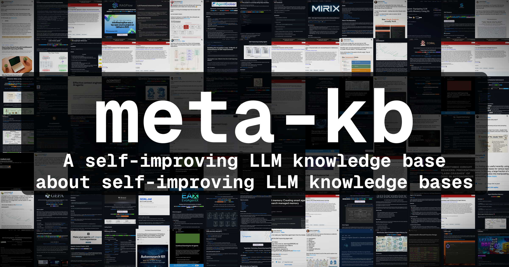
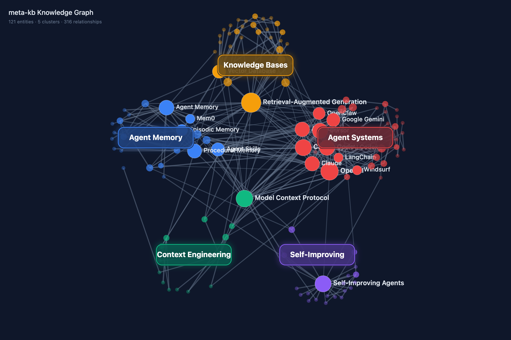
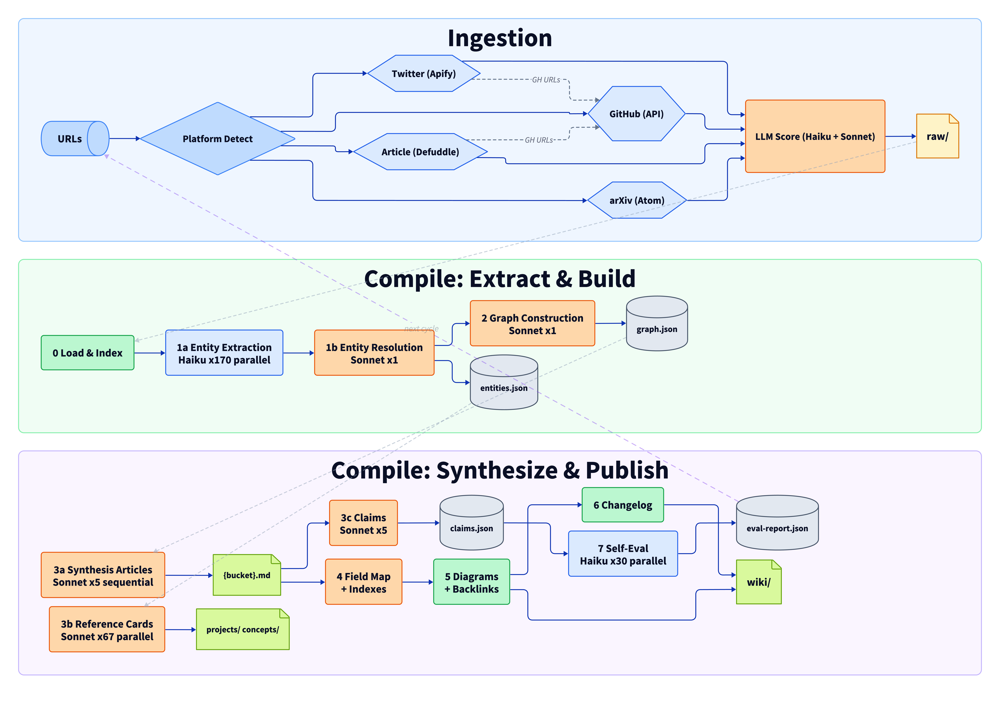
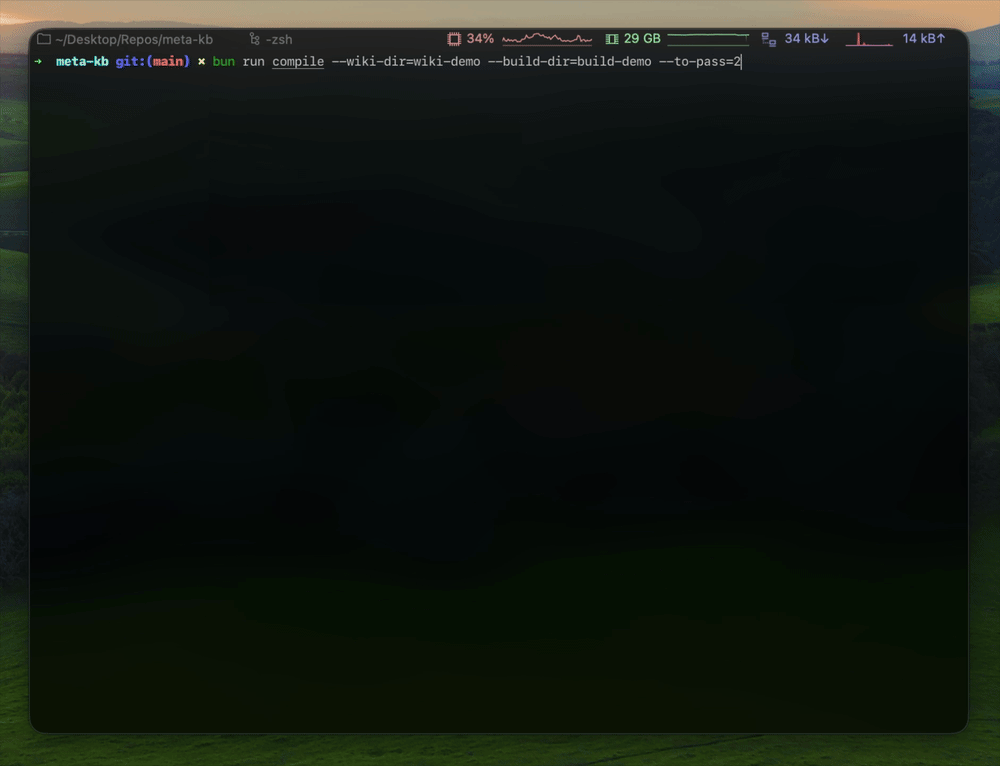

# meta-kb

A self-improving LLM knowledge base about self-improving LLM knowledge systems.

[](LICENSE) [](LICENSE) [](https://bun.sh) [](#stats) [](#stats)



## Browse the wiki

**Start here:** [The Landscape of LLM Knowledge Systems](wiki/field-map.md)

|                                                                 |                                                             |
| --------------------------------------------------------------- | ----------------------------------------------------------- |
| [The State of LLM Knowledge Bases](wiki/knowledge-bases.md)     | [The State of Agent Memory](wiki/agent-memory.md)           |
| [The State of Context Engineering](wiki/context-engineering.md) | [The State of Agent Systems](wiki/agent-systems.md)         |
| [The State of Self-Improving Systems](wiki/self-improving.md)   | [Landscape Comparison Table](wiki/comparisons/landscape.md) |

<table>
<tr>
<th width="50%" align="center">Knowledge Graph</th>
<th width="50%" align="center">Compilation Pipeline</th>
</tr>
<tr>
<td align="center"><a href="https://chappyasel.com/meta-kb-graph.html"></a></td>
<td align="center"><a href="wiki/field-map.md"></a></td>
</tr>
</table>

## How it works

Inspired by [Andrej Karpathy's tweet](https://x.com/karpathy/status/2039805659525644595) about using LLMs to compile and maintain markdown wikis from raw sources. This repo applies that pattern to the topic of LLM knowledge systems itself, then adds a self-improvement loop. The repo IS the demo.

- **Self-improving** — the compiler extracts atomic claims, verifies each against its cited source, and auto-fixes source attribution errors without human intervention.
- **Deep research** — the pipeline clones repos, reads 15-25 source files, fetches docs, and synthesizes architecture-level analysis.
- **Dual compilation** — both a deterministic script pipeline and an agent-native skill graph produce the same output.
- **Neutral** — all projects (including the author's own) receive the same depth and the same criticism.



**How it was built:** [METHODOLOGY.md](METHODOLOGY.md) | [System Design](DESIGN.md)

## Fork this for your own topic

This is a general-purpose knowledge compiler. To build your own wiki on any topic:

1. **Fork this repo** and clear `raw/` and `wiki/`
2. **Edit one file** — [`config/domain.ts`](config/domain.ts) defines your topic, audience, taxonomy buckets, and scoring calibration
3. **Add sources** — `bun run ingest <url>` scores automatically, or add `.md` files manually
4. **Compile** — `bun run compile` generates the full wiki

Both compilation paths read from `config/domain.ts`, so they adapt automatically to your topic.

Example topics: ML papers survey, security research tracker, startup playbook, programming language ecosystem map, open-source alternatives directory.

## Contributing

The easiest contribution is a new source — PR a `.md` file into `raw/` or open an issue with a URL. See [CONTRIBUTING.md](CONTRIBUTING.md) for details.

## Setup

```bash
bun install
cp .env.example .env  # add your ANTHROPIC_API_KEY
```

Environment variables:

- `ANTHROPIC_API_KEY` — for compilation and scoring
- `APIFY_API_TOKEN` — for Twitter scraping (ingestion only)
- `GITHUB_TOKEN` — for GitHub API (ingestion only)
- `XQUIK_API_KEY` — for X article extraction (optional, ingestion only)

## Adding sources

```bash
bun run ingest <url1> [url2] ...       # ingest sources (auto-detects platform)
bun run research <url1> [url2] ...     # deep-research specific repos or papers
bun run research --all                 # deep-research all unresearched sources
```

The ingestion script detects platform (GitHub, arXiv, X/Twitter, general articles), supports awesome-list detection and X article extraction via Xquik. Each source gets taxonomy tags (via Haiku), a 4-dimension relevance score (via Sonnet), and a key insight extraction automatically. To re-score all sources (e.g., after changing `config/domain.ts`), run `bun run rescore`.

Deep research goes further — cloning repos, reading 15-25 key source files, fetching documentation, then synthesizing structured analysis (architecture, design tradeoffs, failure modes, benchmarks) into `raw/deep/`. See the [deep-research skill](.claude/skills/deep-research/SKILL.md) for the full methodology.

## Two ways to compile

### Path A: Skill graph (agent-native)

Ask any AI coding agent: **"Compile the wiki from raw sources."**

The [compile-wiki skill](.claude/skills/compile-wiki/SKILL.md) orchestrates a 6-phase pipeline using subagents — each phase has its own skill with focused context. Synthesis articles and reference cards compile in parallel via subagents. Works with Claude Code, Codex, Cursor, or any agent that can read `.claude/skills/`.

### Path B: Script pipeline (deterministic)

```bash
bun run compile       # raw/ → build/ → wiki/
bun run lint          # verify structural integrity
bun run diagrams      # generate D2 + D3 visualizations
```

Both paths produce the same output structure. Run both for a comparison diff between agent-native and deterministic compilation.

<!-- stats:start (auto-updated by bun run compile) -->
## Stats

- **Sources:** 121 curated (24 tweets, 63 repos, 13 papers, 21 articles) + 51 deep research files
- **Wiki:** 89 articles (5 synthesis, 45 project cards, 38 concept explainers, field map, indexes)
- **Deep research:** 134K words of source-code-level analysis
- **Self-eval:** 0 atomic claims extracted, sampled and verified against sources each compilation
- **Compiled by:** 3 independent systems (script pipeline, Claude Code skill graph, Codex skill graph), best-of-three merged
<!-- stats:end -->

## Roadmap

- [ ] **Incremental recompilation** — track source→claim→article dependencies, recompile only what changed
- [ ] **GitHub Actions auto-compile** — recompile wiki on PR merge, enabling community contributions
- [ ] **Eval-driven prompt evolution** — feed self-eval failure reasons back into compilation prompts (the Karpathy loop applied to itself)
- [ ] **Temporal claim decay** — auto-expire time-sensitive claims (star counts, benchmarks) and flag articles for refresh
- [ ] **Source acquisition loop** — detect coverage gaps, generate search queries, discover and ingest new sources semi-autonomously

See [DESIGN.md](DESIGN.md) for the full architectural vision.

## License

Code: MIT. Wiki content: CC-BY-SA 4.0. See [LICENSE](LICENSE).
