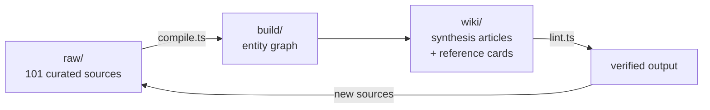

# meta-kb

A living, LLM-compiled knowledge base about building LLM knowledge bases.

Inspired by [Andrej Karpathy's tweet](https://x.com/karpathy/status/2039805659525644595) about using LLMs to compile and maintain markdown wikis from raw sources. This repo applies that exact pattern to the topic of LLM knowledge systems itself. The repo IS the demo.

## How it works



Raw sources (tweets, repos, papers, articles) go into `raw/`. The compiler extracts entities, builds a knowledge graph, then generates synthesis articles and reference cards. Every claim cites its source. Every answer compounds the knowledge base.

## Browse the wiki

**Start here:** [The Landscape of LLM Knowledge Systems](wiki/field-map.md)

**Deep dives:**
- [The State of LLM Knowledge Bases](wiki/knowledge-bases.md)
- [The State of Agent Memory](wiki/agent-memory.md)
- [The State of Context Engineering](wiki/context-engineering.md)
- [The State of Agent Systems](wiki/agent-systems.md)
- [The State of Self-Improving Systems](wiki/self-improving.md)

**Compare tools:** [Landscape Comparison Table](wiki/comparisons/landscape.md)

## Two ways to compile

### Path A: API pipeline (deterministic)

```bash
cp .env.example .env  # add your ANTHROPIC_API_KEY
bun install
bun run compile       # raw/ → build/ → wiki/
bun run lint          # verify structural integrity
```

### Path B: Agent session (editorial)

Give any AI coding agent the [SKILL.md](SKILL.md) and point it at `raw/`. The agent reads all sources, reasons about them, and writes the wiki directly. Works with Claude Code, Codex, Cursor, or any agent that supports the SKILL.md standard.

Both paths produce the same output structure. Run multiple agents and cherry-pick the best articles from each.

## Ingesting new sources

```bash
# Auto-detect platform from URL
bun run ingest <url1> [url2] ...

# Platform-specific
bun run ingest:twitter [urls...]
bun run ingest:github [urls...]
bun run ingest:arxiv [urls...]
bun run ingest:article [urls...]

# Re-score all sources for relevance
bun run rescore
```

Each source gets taxonomy tags (via Haiku), a 4-dimension relevance score (via Sonnet), and a key insight extraction.

## Fork this for your own topic

This is a general-purpose knowledge compiler. To build your own wiki on any topic:

1. Fork this repo
2. Replace `raw/` with your own sources
3. Update `compile/taxonomy.md` with your categories
4. Run `bun run compile`

## Stats

- **Sources:** 101 curated (17 tweets, 53 repos, 12 papers, 19 articles)
- **Wiki:** 79 articles (5 synthesis, 27 project cards, 40 concept explainers, field map, indexes)
- **Graph:** 107 entities, 194 relationships across 5 topic areas
- **Compiled by:** 3 independent systems (API pipeline, Claude Code, Codex), best-of-three merged

## Contributing

PR a `.md` file into `raw/{tweets,repos,papers,articles}/` with YAML frontmatter:

```yaml
---
url: https://...
type: tweet | repo | paper | article
author: Name
date: YYYY-MM-DD
tags: [knowledge-bases, agent-memory, ...]
key_insight: "Why this source matters"
---

[Source content]
```

See [compile/quality.md](compile/quality.md) for standards.

## Setup

```bash
bun install
cp .env.example .env
```

Environment variables:
- `ANTHROPIC_API_KEY` — for compilation and scoring
- `APIFY_API_TOKEN` — for Twitter scraping (ingestion only)
- `GITHUB_TOKEN` — for GitHub API (ingestion only)

## License

Code: MIT. Wiki content: CC-BY-SA 4.0.
