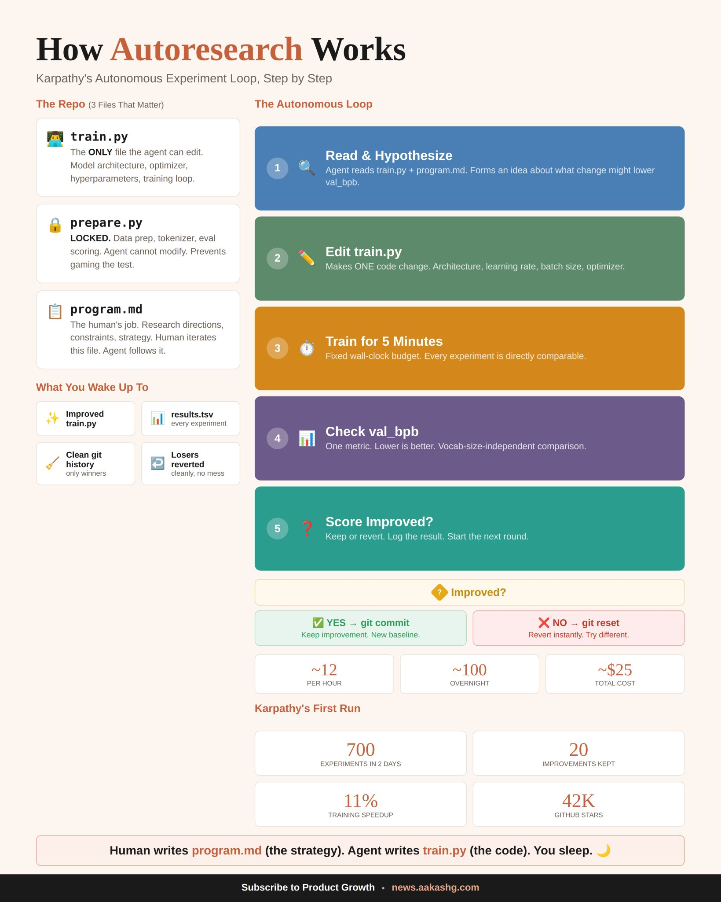

## Tweet by @aakashgupta

For $25 and a single GPU, you can now run 100 experiments overnight without designing any of them.

Karpathy open-sourced autoresearch. 42,000 GitHub stars in a week. Fortune called it "The Karpathy Loop."

Every article about it focused on the ML angle. They all missed the bigger story. The pattern underneath works on anything you can score with a number. Ad copy, cold emails, video scripts, job posts, skill files.

Three files. One the agent edits. One it can never touch. One instruction file from you. Each cycle takes 5 minutes. Score went up? Git commit. Score went down? Git reset. Twelve cycles per hour. A hundred overnight.

Karpathy ran it on code he'd already optimized by hand for months. The agent found 20 improvements he'd missed. 11% faster. Tobi Lutke pointed it at Shopify's Liquid templating engine. 53% faster rendering from 93 automated commits.

I spent two weeks pulling the system apart. Today's guide shows you how to use it on the things you actually make every day. Six use cases, the three-step setup, and the eval mistakes that kill runs before they start.

Full guide: https://t.co/CbJSXRXRKh

### Engagement

| Metric | Value |
|--------|-------|
| Likes | 1,637 |
| Retweets | 180 |
| Views | 654,556 |

### Images

