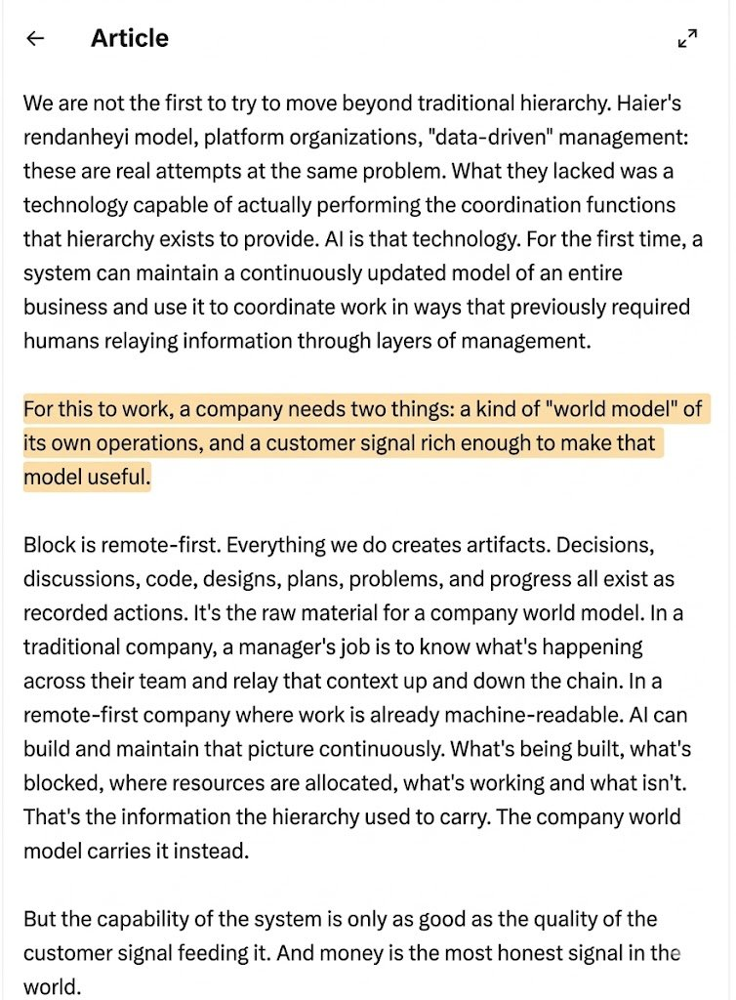

## Tweet by @akoratana

Context graphs will be to the 2030s what databases were to the 2000s.

Within a year, every frontier lab will be building one and here's why:

At 10 people, coordination is free. Everyone knows what everyone else is doing. You never hold a meeting to "align."

At 100 people, you spend maybe 20% of your payroll on coordination. Managers, syncs, standups, planning sessions, status reports.

At 10,000 people, that number approaches 60%. The majority of your headcount exists not to produce anything but to make sure the people who produce things are producing the right things in the right order.

This is the dirty secret of large organizations: output scales linearly with headcount, but coordination cost scales exponentially. Every person you add creates new information pathways that must be maintained. The hierarchy is the protocol that manages this, and it's brutally expensive.

Hierarchy is a compression algorithm for organizational knowledge. At every layer, a manager compresses the reality of their team into a summary that fits in a 30-minute meeting with their boss. Their boss compresses eight of those summaries into one for their boss. By the time information reaches the CEO, it's been lossy-compressed through five or six layers of human interpretation.

This is why CEOs make bad decisions.  The information they receive has been compressed, filtered, and distorted at every layer. The hierarchy is high-latency, low-bandwidth, and lossy.

Jack didn't fire 4,000 producers but cut 4,000 compression nodes. Block's "world model" is a replacement algorithm. Zero latency, high bandwidth, lossless. Every person at the edge gets the full picture without waiting for information to travel through human relays.

The infrastructure that makes this possible is the context graph. A living, continuously updated representation of how the organization actually works. Not just data, but decision traces: the reasoning connecting observations to actions. Not what's true now, but why it became true.

The shift from "give agents memory" to "give agents organizational judgment" will define the next platform war

### Quoted Tweet

> **@jack:**
> https://t.co/jgZkBvYOPt

### Engagement

| Metric | Value |
|--------|-------|
| Likes | 1,725 |
| Retweets | 211 |
| Views | 381,242 |

### Images

