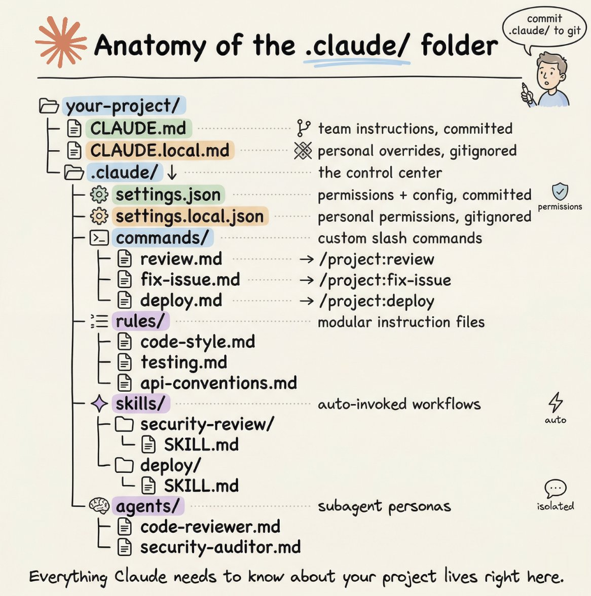

## Tweet by @akshay_pachaar

How to setup your Claude code project?

TL;DR

Most developers skip the setup and just start prompting. That's the mistake.

A proper Claude Code project lives inside a .𝗰𝗹𝗮𝘂𝗱𝗲/ folder. Start with 𝗖𝗟𝗔𝗨𝗗𝗘.𝗺𝗱 as Claude's instruction manual. Split it into a 𝗿𝘂𝗹𝗲𝘀/ folder as it grows. Add 𝗰𝗼𝗺𝗺𝗮𝗻𝗱𝘀/ for repeatable workflows, 𝘀𝗸𝗶𝗹𝗹𝘀/ for context-triggered automation, and 𝗮𝗴𝗲𝗻𝘁𝘀/ for isolated subagents. Lock down permissions in 𝘀𝗲𝘁𝘁𝗶𝗻𝗴𝘀.𝗷𝘀𝗼𝗻.

There are two .𝗰𝗹𝗮𝘂𝗱𝗲/ folders: one committed with your repo, one global at ~/.𝗰𝗹𝗮𝘂𝗱𝗲/ for personal preferences and auto-memory across projects.

The .𝗰𝗹𝗮𝘂𝗱𝗲/ folder is infrastructure. Treat it like one.

The article below is a complete guide to 𝗖𝗟𝗔𝗨𝗗𝗘.𝗺𝗱, custom commands, skills, agents, and permissions, and how to set them up properly.

### Quoted Tweet

> **@akshay_pachaar:**
> https://t.co/SSSIK3BX4z

### Engagement

| Metric | Value |
|--------|-------|
| Likes | 12,222 |
| Retweets | 1,547 |
| Views | 2,027,361 |

### Images

