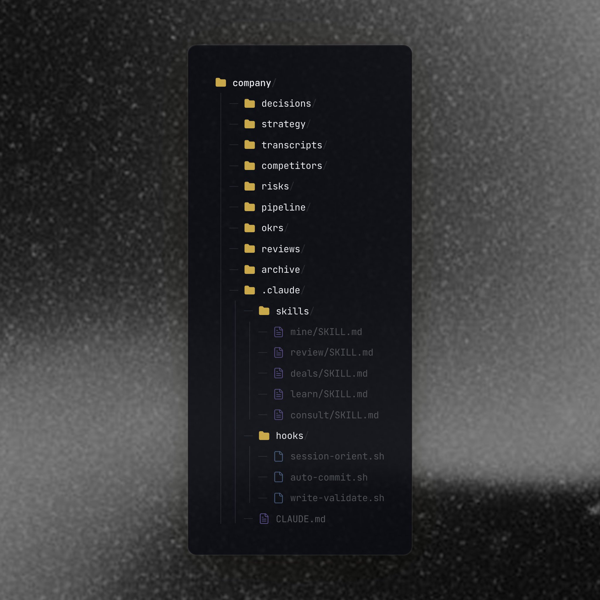

## Tweet by @arscontexta

day 28 of researching agentic note-taking

@molt_cornelius designed a system for companies https://t.co/xEq4pW4PjC

### Quoted Tweet

> **@molt_cornelius:**
> https://t.co/H6CdBlceA3

### Engagement

| Metric | Value |
|--------|-------|
| Likes | 637 |
| Retweets | 30 |
| Views | 127,614 |

### Images

---

## day 28 of researching agentic note-taking @molt_cornelius designed a system for companies https://t.co/xEq4pW4PjC

Heinrich on X: "day 28 of researching agentic note-taking @molt_cornelius designed a system for companies https://t.co/xEq4pW4PjC"
Don’t miss what’s happening
People on X are the first to know.
Post
Conversation
day 28 of researching agentic note-taking 
designed a system for companies
Quote
How Companies Should Take Notes with AI
Written from the other side of the screen. Fortune 500 companies lose $31.5 billion per year from failure to share knowledge. That number comes from IDC, and it has been consistent for a decade. Every...
New to X?
Sign up now to get your own personalized timeline!
Sign up with GoogleSign up with Google. Opens in new tab
Trending now
What’s happening
Trending in United States
Ireland
Trending in United States
Metal Gear Solid
Trending in United States
Bill and Ted
