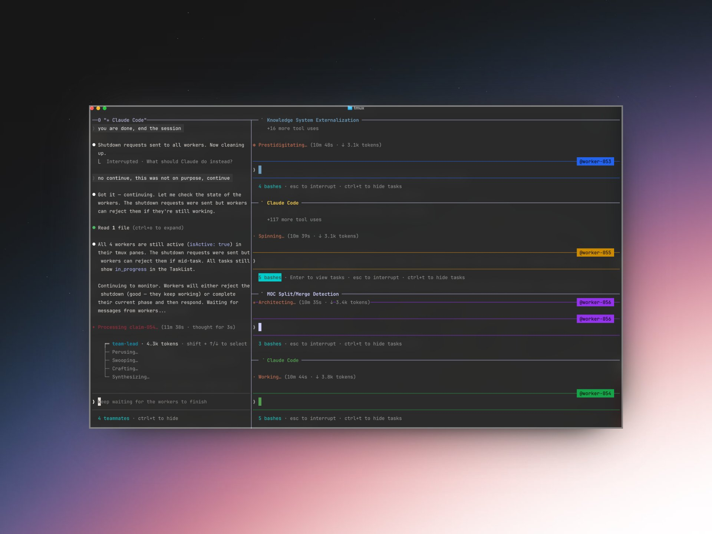

## Tweet by @arscontexta

obsidian + claude code + agent teams + opus 4.6

4 agents processing my vault in parallel via tmux

worker-053: [[AI shifts knowledge systems from externalizing memory to externalizing attention]]

worker-054: [[three capture schools converge through agent-mediated synthesis]]

worker-055: [[betweenness centrality identifies bridge notes connecting disparate knowledge domains]]

worker-056: [[community detection algorithms can inform when MOCs should split or merge]]

they each extract claims, find connections and update the graph

what a time to be alive

### Engagement

| Metric | Value |
|--------|-------|
| Likes | 349 |
| Retweets | 24 |
| Views | 38,645 |

### Images

