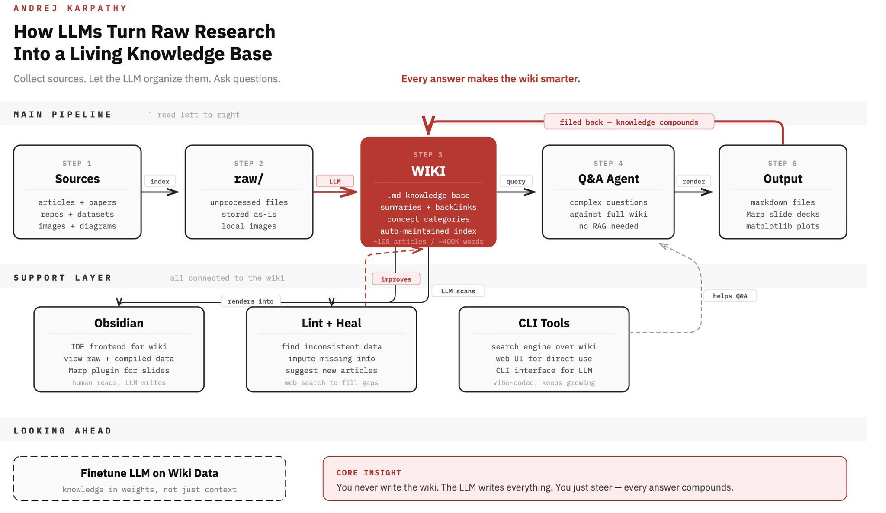

## Tweet by @DataChaz

🚨 Karpathy’s new set-up is the ultimate self-improving second brain, and it takes zero manual editing 🤯

It acts as a living AI knowledge base that actually heals itself.

Let me break it down.

Instead of relying on complex RAG, the LLM pulls raw research directly into an @Obsidian Markdown wiki. It completely takes over:

✦ Index creation
✦ System linting
✦ Native Q&A routing

The core process is beautifully simple:

→ You dump raw sources into a folder
→ The LLM auto-compiles an indexed .md wiki
→ You ask complex questions
→ It generates outputs (Marp slides, matplotlib plots) and files them back in

The big-picture implication of this is just wild.

When agents maintain their own memory layer, they don’t need massive, expensive context limits.

They really just need two things:

→ Clean file organization
→ The ability to query their own indexes

Forget stuffing everything into one giant prompt.

This approach is way cheaper, highly scalable... and 100% inspectable!

### Quoted Tweet

> **@karpathy:**
> LLM Knowledge Bases
> 
> Something I'm finding very useful recently: using LLMs to build personal knowledge bases for various topics of research interest. In this way, a large fraction of my recent token throughput is going less into manipulating code, and more into manipulating knowledge (stored as markdown and images). The latest LLMs are quite good at it. So:
> 
> Data ingest:
> I index source documents (articles, papers, repos, datasets, images, etc.) into a raw/ directory, then I use an LLM to incrementally "compile" a wiki, which is just a collection of .md files in a directory structure. The wiki includes summaries of all the data in raw/, backlinks, and then it categorizes data into concepts, writes articles for them, and links them all. To convert web articles into .md files I like to use the Obsidian Web Clipper extension, and then I also use a hotkey to download all the related images to local so that my LLM can easily reference them.
> 
> IDE:
> I use Obsidian as the IDE "frontend" where I can view the raw data, the the compiled wiki, and the derived visualizations. Important to note that the LLM writes and maintains all of the data of the wiki, I rarely touch it directly. I've played with a few Obsidian plugins to render and view data in other ways (e.g. Marp for slides).
> 
> Q&A:
> Where things get interesting is that once your wiki is big enough (e.g. mine on some recent research is ~100 articles and ~400K words), you can ask your LLM agent all kinds of complex questions against the wiki, and it will go off, research the answers, etc. I thought I had to reach for fancy RAG, but the LLM has been pretty good about auto-maintaining index files and brief summaries of all the documents and it reads all the important related data fairly easily at this ~small scale.
> 
> Output:
> Instead of getting answers in text/terminal, I like to have it render markdown files for me, or slide shows (Marp format), or matplotlib images, all of which I then view again in Obsidian. You can imagine many other visual output formats depending on the query. Often, I end up "filing" the outputs back into the wiki to enhance it for further queries. So my own explorations and queries always "add up" in the knowledge base.
> 
> Linting:
> I've run some LLM "health checks" over the wiki to e.g. find inconsistent data, impute missing data (with web searchers), find interesting connections for new article candidates, etc., to incrementally clean up the wiki and enhance its overall data integrity. The LLMs are quite good at suggesting further questions to ask and look into.
> 
> Extra tools:
> I find myself developing additional tools to process the data, e.g. I vibe coded a small and naive search engine over the wiki, which I both use directly (in a web ui), but more often I want to hand it off to an LLM via CLI as a tool for larger queries. 
> 
> Further explorations:
> As the repo grows, the natural desire is to also think about synthetic data generation + finetuning to have your LLM "know" the data in its weights instead of just context windows.
> 
> TLDR: raw data from a given number of sources is collected, then compiled by an LLM into a .md wiki, then operated on by various CLIs by the LLM to do Q&A and to incrementally enhance the wiki, and all of it viewable in Obsidian. You rarely ever write or edit the wiki manually, it's the domain of the LLM. I think there is room here for an incredible new product instead of a hacky collection of scripts.

### Engagement

| Metric | Value |
|--------|-------|
| Likes | 1,299 |
| Retweets | 165 |
| Views | 192,636 |

### Images

