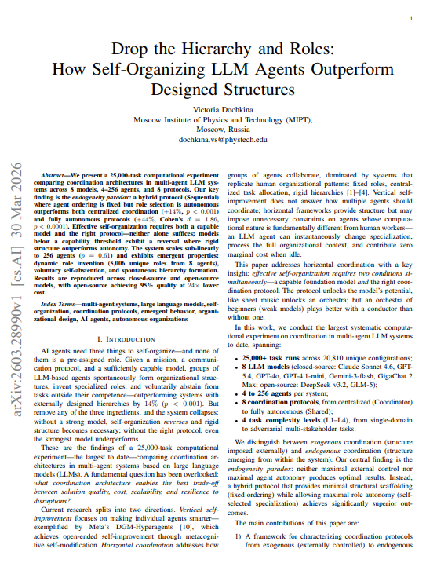

## Tweet by @godofprompt

🚨 BREAKING: MIPT just ran the largest AI agent coordination experiment ever

25,000 tasks, 8 models, 4 to 256 agents and found that how agents coordinate matters 3x more than which model you use.

Protocol choice explains 44% of quality variation. Model choice explains 14%. And the best protocol gives agents no roles at all.

> The entire field of multi-agent AI has been built on one assumption: assign roles before the task starts. Manager agent. Researcher agent. Coder agent. Reviewer agent. ChatDev, MetaGPT, AutoGen, AgentVerse every major framework pre-assigns specializations and fixes them for the duration.

MIPT ran 25,000 tasks across 20,810 unique configurations to test whether that assumption is correct. It isn't.

The best-performing protocol gives agents a mission, a fixed processing order, and zero role assignments.

The agents invent their own specializations for each task from scratch, voluntarily abstain when they have nothing to contribute, and spontaneously form shallow hierarchies without anyone designing them.

> The system that looks least like a human organization outperforms every system that was designed to look like one.

> The experiment tested four coordination protocols on identical tasks with identical models.

Coordinator: one agent analyzes the task and assigns roles to everyone else, who execute in parallel.

Sequential: agents process in a fixed order, each observing what predecessors actually produced, and each choosing their own role independently.

Broadcast: agents first signal their intended roles simultaneously, then make final decisions.

Shared: agents access a shared memory of past role assignments and make all decisions in parallel.

The quality gap between the best and worst protocol is 44%, with Cohen's d = 1.86 a massive effect size. That gap is larger than the quality difference between the best and worst model in the experiment.

The protocol you choose matters more than whether you use Claude, GPT, or DeepSeek.

> The paradox is why Sequential wins. It is neither the most controlled protocol nor the most autonomous.

Coordinator gives maximum control and fails because one agent's judgment limits the whole system.

Shared gives maximum autonomy and fails because agents don't know what others are doing in real time they duplicate roles and miss gaps.

Sequential gives agents exactly one thing: the completed outputs of every agent who went before them. Not intentions. Not history. Not a plan. Actual results from this specific task.

Each agent sees the factual record of what has already been done and chooses a role that complements it. The analogy in the paper is a sports draft: each pick is informed by every previous selection, so the team naturally fills complementary positions without anyone coordinating it.

The numbers across 25,000 tasks and 20,810 configurations:

→ Sequential vs. Shared protocol: +44% quality, Cohen's d = 1.86, p < 0.0001
→ Sequential vs. Coordinator: +14% quality, p < 0.001 confirmed across Claude Sonnet 4.6, DeepSeek v3.2, and GLM-5
→ Protocol choice explains 44% of quality variation among strong models
→ Model choice explains ~14% of quality variation on the same protocol
→ Scaling from 64 to 256 agents: zero statistically significant quality change, p = 0.61
→ Cost growth from 8 to 64 agents: only 11.8% despite 8x more agents
→ 8 agents generated 5,006 unique role names across tasks RSI converges to zero, agents reinvent specialization every task
→ At 256 agents: ~45% voluntarily abstain through self-assessment, not coordinator direction
→ Claude Sonnet 4.6 voluntary abstention rate: 8.6% models below capability threshold show near-zero abstention and worse outcomes
→ DeepSeek v3.2: 95% of Claude's quality at 24x lower API cost
→ Shock resilience: random agent removal, hub removal, and 25% model substitution all recover within 1 iteration

> The capability threshold finding is the one that changes how you think about model selection. Self-organization is not universally beneficial.

When MIPT tested Claude Sonnet 4.6 in free-form self-organization, quality improved over fixed roles.

When they tested GLM-5, quality dropped 9.6%. The reversal effect is real: weaker models perform better with rigid structure than with autonomy.

The threshold requires three capabilities self-reflection to assess your own competence, deep reasoning for multi-step logic, and precise instruction following.

Claude's voluntary abstention rate of 8.6% versus GLM-5's 0.8% shows the gap directly. An agent that cannot accurately assess when it has nothing to contribute will keep contributing badly.

The conductor analogy in the paper is exact: an orchestra of beginners plays better with a conductor. An orchestra of professionals plays better without one.

> The emergent hierarchy result is the finding that should change how teams think about scaling.

MIPT scaled from 4 to 256 agents without pre-designing any organizational structure. As the group grew, agents spontaneously formed two-layer hierarchies.

Unique role specialization increased from 75% at 4 agents to 91% at 64 agents. Adaptation speed after shocks improved from 0.7 to 3.0 as the group grew larger.

The system gets more resilient and more specialized at scale not because anyone designed it that way, but because Sequential coordination with capable models naturally produces those properties.

Nobody told the agents to form a hierarchy.
Nobody told them to specialize.

They did it because the information structure of Sequential coordination made it the rational thing to do.

The recipe is three ingredients: a mission, a protocol, and a capable model.

Pre-assigned roles are a fourth ingredient that makes everything worse.

### Engagement

| Metric | Value |
|--------|-------|
| Likes | 252 |
| Retweets | 37 |
| Views | 24,507 |

### Images

