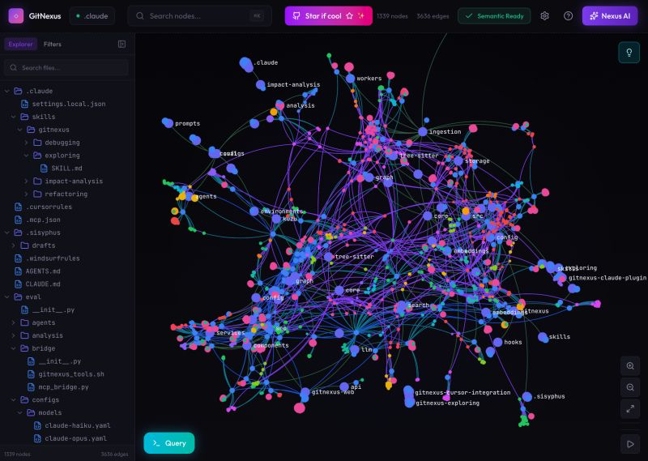

## Tweet by @heygurisingh

🚨Breaking: Someone open sourced a knowledge graph engine for your codebase and it's terrifying how good it is.

It's called GitNexus. And it's not a documentation tool.

It's a full code intelligence layer that maps every dependency, call chain, and execution flow in your repo -- then plugs directly into Claude Code, Cursor, and Windsurf via MCP.

Here's what this thing does autonomously:

→ Indexes your entire codebase into a graph with Tree-sitter AST parsing
→ Maps every function call, import, class inheritance, and interface
→ Groups related code into functional clusters with cohesion scores
→ Traces execution flows from entry points through full call chains
→ Runs blast radius analysis before you change a single line
→ Detects which processes break when you touch a specific function
→ Renames symbols across 5+ files in one coordinated operation
→ Generates a full codebase wiki from the knowledge graph automatically

Here's the wildest part:

Your AI agent edits UserService.validate().

It doesn't know 47 functions depend on its return type.

Breaking changes ship.

GitNexus pre-computes the entire dependency structure at index time -- so when Claude Code asks "what depends on this?", it gets a complete answer in 1 query instead of 10.

Smaller models get full architectural clarity. Even GPT-4o-mini stops breaking call chains.

One command to set it up:
`npx gitnexus analyze`

That's it. MCP registers automatically. Claude Code hooks install themselves.

Your AI agent has been coding blind. This fixes that.

9.4K GitHub stars. 1.2K forks. Already trending.

100% Open Source.

(Link in the comments)

### Engagement

| Metric | Value |
|--------|-------|
| Likes | 3,416 |
| Retweets | 363 |
| Views | 326,812 |

### Images

