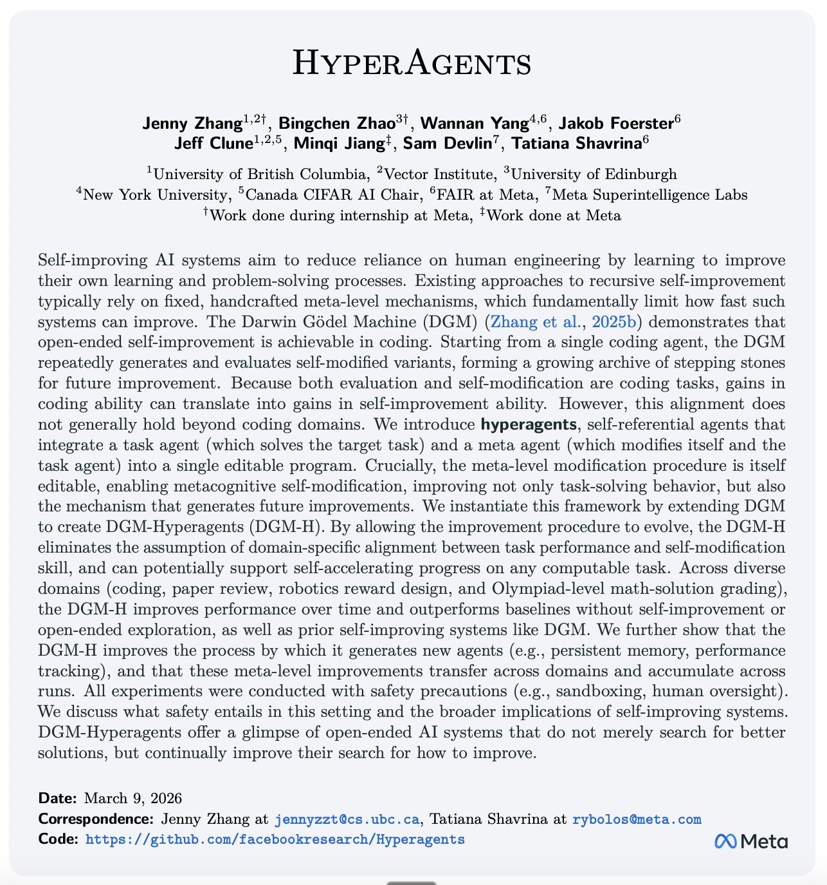

## Tweet by @jennyzhangzt

Introducing Hyperagents: an AI system that not only improves at solving tasks, but also improves how it improves itself.

The Darwin Gödel Machine (DGM) demonstrated that open-ended self-improvement is possible by iteratively generating and evaluating improved agents, yet it relies on a key assumption: that improvements in task performance (e.g., coding ability) translate into improvements in the self-improvement process itself. This alignment holds in coding, where both evaluation and modification are expressed in the same domain, but breaks down more generally. As a result, prior systems remain constrained by fixed, handcrafted meta-level procedures that do not themselves evolve.

We introduce Hyperagents – self-referential agents that can modify both their task-solving behavior and the process that generates future improvements. This enables what we call metacognitive self-modification: learning not just to perform better, but to improve at improving.

We instantiate this framework as DGM-Hyperagents (DGM-H), an extension of the DGM in which both task-solving behavior and the self-improvement procedure are editable and subject to evolution. Across diverse domains (coding, paper review, robotics reward design, and Olympiad-level math solution grading), hyperagents enable continuous performance improvements over time and outperform baselines without self-improvement or open-ended exploration, as well as prior self-improving systems (including DGM). DGM-H also improves the process by which new agents are generated (e.g. persistent memory, performance tracking), and these meta-level improvements transfer across domains and accumulate across runs.

This work was done during my internship at Meta (@AIatMeta), in collaboration with Bingchen Zhao (@BingchenZhao), Wannan Yang (@winnieyangwn), Jakob Foerster (@j_foerst), Jeff Clune (@jeffclune), Minqi Jiang (@MinqiJiang), Sam Devlin (@smdvln), and Tatiana Shavrina (@rybolos).

### Engagement

| Metric | Value |
|--------|-------|
| Likes | 3,622 |
| Retweets | 661 |
| Views | 490,159 |

### Images

