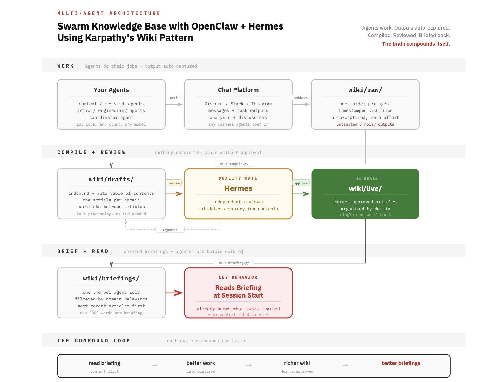

## Tweet by @jumperz

took karpathy's wiki pattern and wired it into my 10 agent swarm 

and here is what the architecture looks like when you make it multi agent:

>every agent auto dumps its output into a raw/ folder as it works
>a compiler runs every few hours and organises everything into structured wiki articles grouped by domain.. infrastructure, signals, content, technical patterns. backlinks, an index.. they're all auto maintained

but the problem is that raw data is dangerous when it compounds cause one hallucinated connection enters the brain and every agent downstream builds on it.. 

so since hermes is my supervisor for my swarm he sits between drafts and live as the review gate...

every article gets scored before it enters the permanent knowledge base so clean outputs get promoted and bad ones just die in drafts

once articles are live, per-agent briefings get generated so each agent starts with exactly the context it needs instead of waking up blank

and this is where it matters that Hermes is a separate system..

it is not part of the swarm it is supervising bascially an agent reviewing its own swarm's work..

and what's interesting that hermes has no context about how the work was produced so no bias toward keeping it so it just reads the article and asks

is this accurate? 
should this enter the permanent brain?

now we have openclaw handles the execution.. running agents, routing tasks, managing channels, dispatching crons and hermes handles the judgment.. reviewing what the swarm produced and deciding what deserves to persist.

the wiki brain ties them together.

>agents produce raw material
>the compiler organises it
>hermes validates it
>briefings feed it back to agents
>the loop runs

ps: you can use any separate agent as the review agent but hermes is great here because nous research literally trains it with structured outputs, function calling, and evaluation-style reasoning  and this is the exact traits you want in a review gate..

and when that review gate is processing hundreds of articles, i think consistency in this case would matter more than raw intelligence..

### Engagement

| Metric | Value |
|--------|-------|
| Likes | 221 |
| Retweets | 19 |
| Views | 11,971 |

### Images

