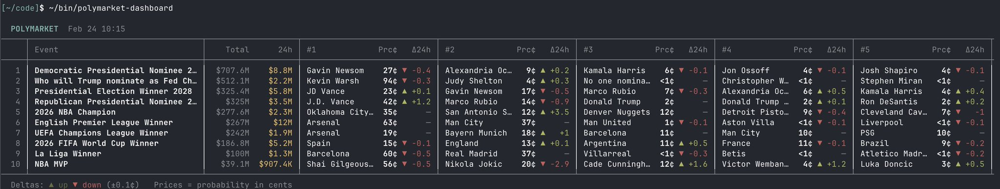

## Tweet by @karpathy

CLIs are super exciting precisely because they are a "legacy" technology, which means AI agents can natively and easily use them, combine them, interact with them via the entire terminal toolkit.

E.g ask your Claude/Codex agent to install this new Polymarket CLI and ask for any arbitrary dashboards or interfaces or logic. The agents will build it for you. Install the Github CLI too and you can ask them to navigate the repo, see issues, PRs, discussions, even the code itself.

Example: Claude built this terminal dashboard in ~3 minutes, of the highest volume polymarkets and the 24hr change. Or you can make it a web app or whatever you want. Even more powerful when you use it as a module of bigger pipelines.

If you have any kind of product or service think: can agents access and use them?

- are your legacy docs (for humans) at least exportable in markdown?
- have you written Skills for your product?
- can your product/service be usable via CLI? Or MCP?
- ...

It's 2026. Build. For. Agents.

### Quoted Tweet

> **@SuhailKakar:**
> introducing polymarket cli - the fastest way for ai agents to access prediction markets
> 
> built with rust. your agent can query markets, place trades, and pull data - all from the terminal
> 
> fast, lightweight, no overhead https://t.co/Q67wGD9pWW

### Engagement

| Metric | Value |
|--------|-------|
| Likes | 11,752 |
| Retweets | 1,102 |
| Views | 2,114,773 |

### Images

