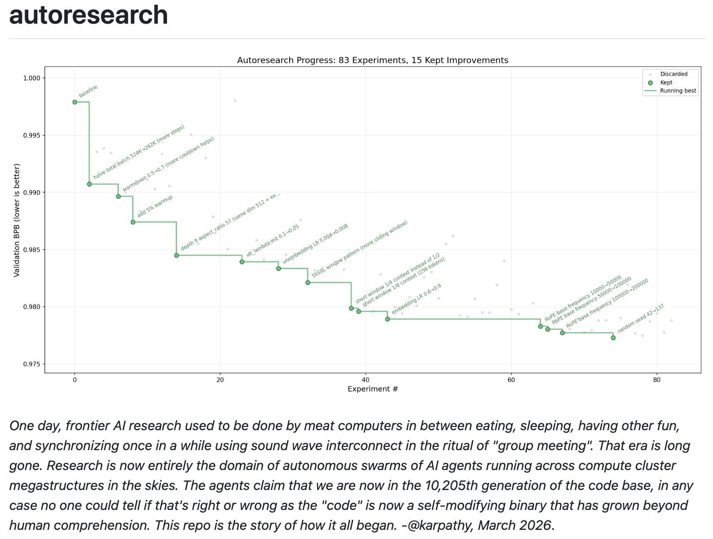

## Tweet by @karpathy

I packaged up the "autoresearch" project into a new self-contained minimal repo if people would like to play over the weekend. It's basically nanochat LLM training core stripped down to a single-GPU, one file version of ~630 lines of code, then:

- the human iterates on the prompt (.md)
- the AI agent iterates on the training code (.py)

The goal is to engineer your agents to make the fastest research progress indefinitely and without any of your own involvement. In the image, every dot is a complete LLM training run that lasts exactly 5 minutes. The agent works in an autonomous loop on a git feature branch and accumulates git commits to the training script as it finds better settings (of lower validation loss by the end) of the neural network architecture, the optimizer, all the hyperparameters, etc. You can imagine comparing the research progress of different prompts, different agents, etc.

https://t.co/YCvOwwjOzF
Part code, part sci-fi, and a pinch of psychosis :)

### Engagement

| Metric | Value |
|--------|-------|
| Likes | 28,330 |
| Retweets | 3,663 |
| Views | 10,944,695 |

### Images

