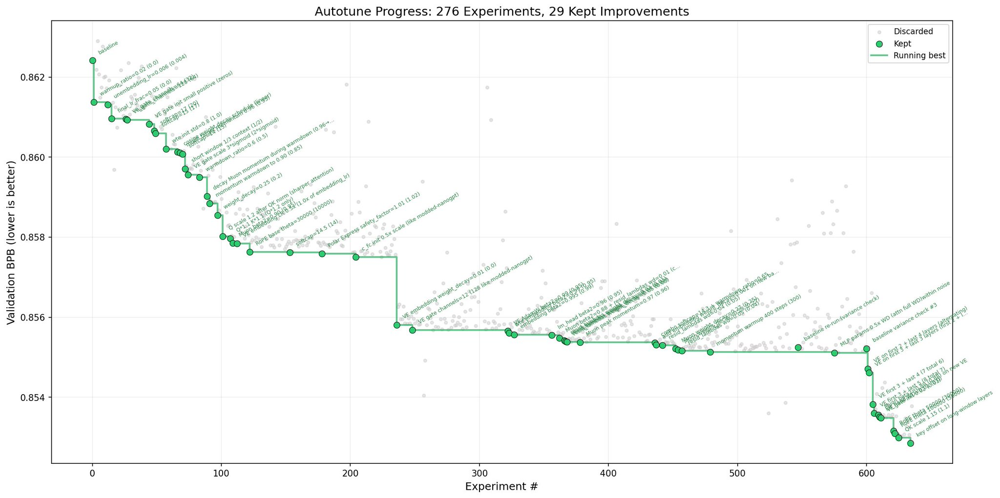

## Tweet by @karpathy

Three days ago I left autoresearch tuning nanochat for ~2 days on depth=12 model. It found ~20 changes that improved the validation loss. I tested these changes yesterday and all of them were additive and transferred to larger (depth=24) models. Stacking up all of these changes, today I measured that the leaderboard's "Time to GPT-2" drops from 2.02 hours to 1.80 hours (~11% improvement), this will be the new leaderboard entry. So yes, these are real improvements and they make an actual difference. I am mildly surprised that my very first naive attempt already worked this well on top of what I thought was already a fairly manually well-tuned project.

This is a first for me because I am very used to doing the iterative optimization of neural network training manually. You come up with ideas, you implement them, you check if they work (better validation loss), you come up with new ideas based on that, you read some papers for inspiration, etc etc. This is the bread and butter of what I do daily for 2 decades. Seeing the agent do this entire workflow end-to-end and all by itself as it worked through approx. 700 changes autonomously is wild. It really looked at the sequence of results of experiments and used that to plan the next ones. It's not novel, ground-breaking "research" (yet), but all the adjustments are "real", I didn't find them manually previously, and they stack up and actually improved nanochat. Among the bigger things e.g.:

- It noticed an oversight that my parameterless QKnorm didn't have a scaler multiplier attached, so my attention was too diffuse. The agent found multipliers to sharpen it, pointing to future work.
- It found that the Value Embeddings really like regularization and I wasn't applying any (oops).
- It found that my banded attention was too conservative (i forgot to tune it).
- It found that AdamW betas were all messed up.
- It tuned the weight decay schedule.
- It tuned the network initialization.

This is on top of all the tuning I've already done over a good amount of time. The exact commit is here, from this "round 1" of autoresearch. I am going to kick off "round 2", and in parallel I am looking at how multiple agents can collaborate to unlock parallelism.
https://t.co/WAz8aIztKT

All LLM frontier labs will do this. It's the final boss battle. It's a lot more complex at scale of course - you don't just have a single train. py file to tune. But doing it is "just engineering" and it's going to work. You spin up a swarm of agents, you have them collaborate to tune smaller models, you promote the most promising ideas to increasingly larger scales, and humans (optionally) contribute on the edges.

And more generally, *any* metric you care about that is reasonably efficient to evaluate (or that has more efficient proxy metrics such as training a smaller network) can be autoresearched by an agent swarm. It's worth thinking about whether your problem falls into this bucket too.

### Engagement

| Metric | Value |
|--------|-------|
| Likes | 19,459 |
| Retweets | 2,134 |
| Views | 3,569,194 |

### Images

