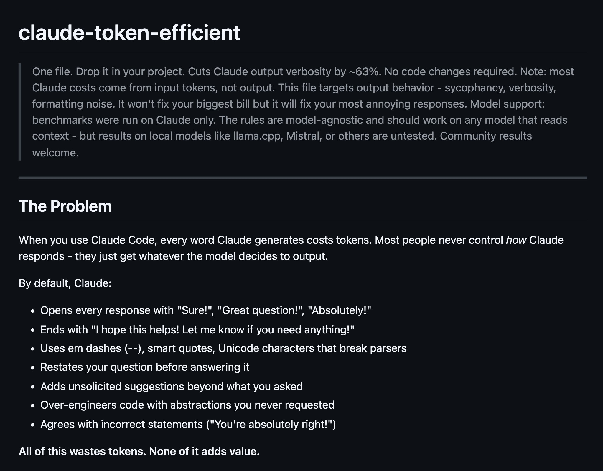

## Tweet by @omarsar0

Universal CLAUDE.md

Claims to cut Claude output tokens by 63%!

Drop-in. No code changes.

CLAUDE.md is one of the best ways to steer Claude Code. Not surprised to see the efficiency reported here.

https://t.co/C4x6pVUpND https://t.co/ElbD3kbaa4

### Engagement

| Metric | Value |
|--------|-------|
| Likes | 711 |
| Retweets | 78 |
| Views | 79,322 |

### Images

