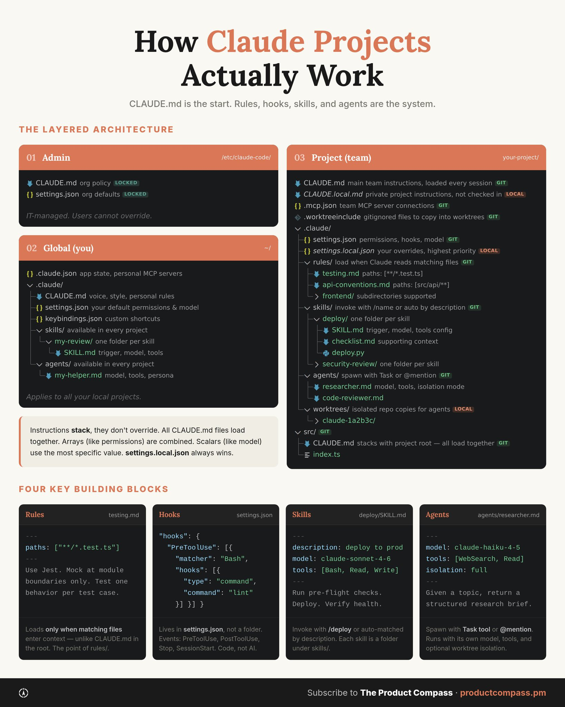

## Tweet by @PawelHuryn

Your CLAUDE.md is doing jobs that rules, hooks, and agents were built for. Claude Code has four mechanisms to take things off your CLAUDE.md:

1. Rules fire by file path — testing rules when Claude reads test files. 
2. Hooks run deterministic code on events. Not AI.
3. Skills — folders with their own instructions, tools, and constraints.
4. Agents — their own model, their own tools. Optional worktree isolation.

Three scopes stack: Admin, Global, Project. Arrays combine. Settings use the most specific value. Files in subdirectories load automatically.

### Engagement

| Metric | Value |
|--------|-------|
| Likes | 107 |
| Retweets | 12 |
| Views | 8,802 |

### Images

