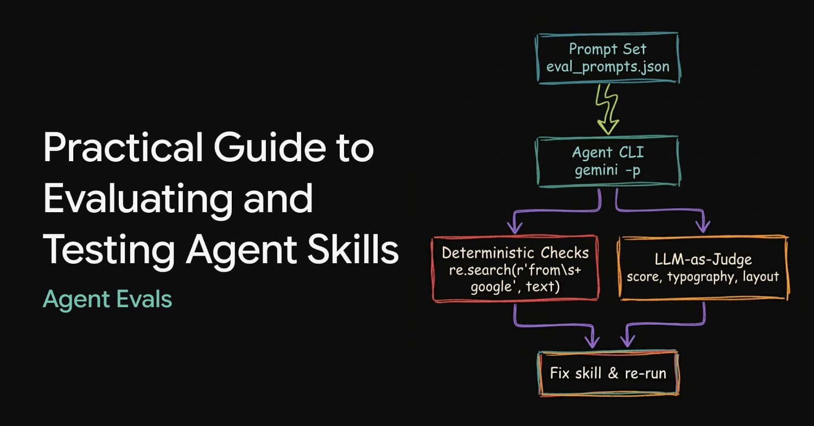

## Tweet by @_philschmid

Agent skills are powerful but they are often AI-generated and not tested. Here is a practical guide to evaluating agent skills with code, prompts, and real results.

📋 Define success criteria (outcome, style, and efficiency).
🧪 Create 10-12 prompts with deterministic checks.
🤖 Add LLM-as-judge with for qualitative checks.
🔁 Iterate on the skill using eval failures.

### Engagement

| Metric | Value |
|--------|-------|
| Likes | 695 |
| Retweets | 82 |
| Views | 40,691 |

### Images

