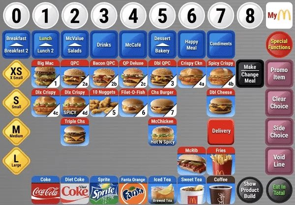

## Tweet by @steveruizok

Some of you aren't soldier-proofing your agent skills and it shows.

Ask your best model to: write the skill, spawn a subagent (same model) to complete the skill, and then iterate on the skill until the subagent can do the task perfectly.

Then repeat with a smaller model. https://t.co/EEgU6xf6yV

### Engagement

| Metric | Value |
|--------|-------|
| Likes | 214 |
| Retweets | 6 |
| Views | 12,474 |

### Images

