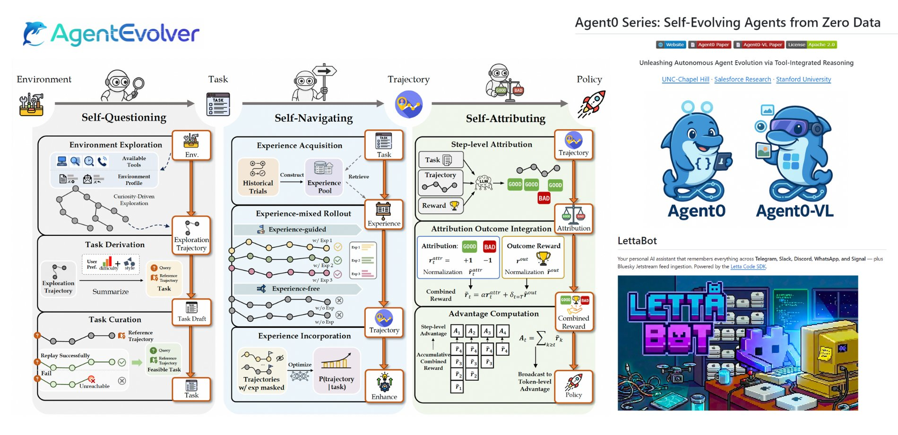

## Tweet by @TheTuringPost

9 open agents that can improve themselves (a collection inspired by Hermes Agent)

▪️ HyperAgents
▪️ Agent0
▪️ EvoAgentX
▪️ AgentEvolver
▪️ Agent Zero
▪️ Letta Code
▪️ LettaBot
▪️ LangGraph Reflection
▪️ SuperAGI

Save this list and check it out for links and to explore how these agents self-evolve: https://t.co/j4SrkS11MI

### Engagement

| Metric | Value |
|--------|-------|
| Likes | 125 |
| Retweets | 25 |
| Views | 4,650 |

### Images

