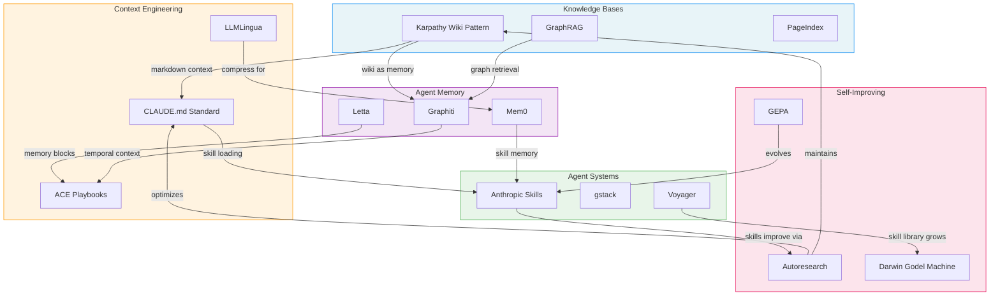

# The Field Map: Building Knowledge Systems for LLM Agents

> This is the bird's-eye view. Five domains—knowledge bases, agent memory, context engineering, agent systems, and self-improving systems—are converging into a single discipline: how do you give agents the right knowledge, at the right time, in the right format, and have them get better at it automatically? This article weaves those five threads together, maps the connections, and points toward where everything is heading.

## The Landscape at a Glance

## The Five Domains

The field breaks into five interlocking domains, each asking a different question:

| Domain | Core Question | Flagship Projects | Key Metric |
|--------|--------------|-------------------|------------|
| [Knowledge Bases](knowledge-bases.md) | How do you store and organize knowledge for agents? | Karpathy Wiki, GraphRAG, PageIndex | Retrieval accuracy, maintenance cost |
| [Agent Memory](agent-memory.md) | How do agents remember across sessions? | Mem0, Graphiti, Letta | Recall accuracy, token reduction |
| [Context Engineering](context-engineering.md) | How do you give agents the right context? | CLAUDE.md, LLMLingua, ACE | Token efficiency, task accuracy |
| [Agent Systems](agent-systems.md) | How do you build and compose agent capabilities? | Anthropic Skills, gstack, Voyager | Skill count, composition flexibility |
| [Self-Improving](self-improving.md) | How do systems get better without human intervention? | Autoresearch, DGM, GEPA | Improvement rate, safety bounds |

## The Three Big Threads

### Thread 1: Markdown is Winning

The most surprising finding across all 101 sources is how consistently the field is converging on plain markdown as the universal interface for agent knowledge.

[Karpathy's wiki pattern](../raw/tweets/karpathy-llm-knowledge-bases-something-i-m-finding-very-us.md) uses markdown files compiled by LLMs. [CLAUDE.md](../raw/tweets/akshay-pachaar-how-to-setup-your-claude-code-project-tl-dr-mos.md) uses markdown for agent instructions. [SKILL.md](../raw/repos/anthropics-skills.md) uses markdown for skill definitions. [Hipocampus](../raw/repos/kevin-hs-sohn-hipocampus.md) uses markdown for hierarchical memory (ROOT.md as topic index). [napkin](../raw/repos/michaelliv-napkin.md) proves that BM25 on markdown beats vector databases on benchmarks. [Acontext](../raw/repos/memodb-io-acontext.md) distills agent learning into markdown skill files. [Planning-with-Files](../raw/repos/othmanadi-planning-with-files.md) uses markdown for persistent agent state. The [mem-agent](../raw/articles/hugging-face-mem-agent-equipping-llm-agents-with-memory-using.md) was trained specifically on markdown file management.

Why markdown? It's human-readable, LLM-readable, version-controllable, diffs cleanly, requires no infrastructure, and works with every tool in the ecosystem. The overhead of vector databases, graph databases, and specialized storage is only justified when markdown's limitations become binding—and for most current agent systems, they haven't.

This doesn't mean complex infrastructure is never needed. [Graphiti](../raw/repos/getzep-graphiti.md) demonstrates that temporal knowledge graphs solve problems markdown can't (tracking when facts changed and why). [Cognee](../raw/repos/topoteretes-cognee.md) shows that relationship-rich domains benefit from graph structure. But the default is shifting from "build infrastructure first" to "start with markdown, add infrastructure when you hit its limits."

### Thread 2: The Retrieval Paradigm is Fragmenting

Traditional RAG—chunk, embed, retrieve by similarity, stuff into context—is being unbundled into at least four distinct retrieval paradigms:

1. **Semantic retrieval** (vector similarity): The default approach, still dominant in production but increasingly recognized as insufficient for complex queries. [Mem0](../raw/repos/mem0ai-mem0.md) and [Supermemory](../raw/repos/supermemoryai-supermemory.md) implement this well, with structured extraction improving what gets embedded.

2. **Graph-based retrieval** (relationship traversal): [GraphRAG](../raw/papers/edge-from-local-to-global-a-graph-rag-approach-to-quer.md) for corpus-level questions, [Graphiti](../raw/repos/getzep-graphiti.md) for temporal reasoning, [HippoRAG](../raw/repos/osu-nlp-group-hipporag.md) for multi-hop associativity. [Han et al.](../raw/papers/han-rag-vs-graphrag-a-systematic-evaluation-and-key.md) proves graph retrieval beats flat retrieval on multi-hop reasoning but loses on direct lookups.

3. **Reasoning-based retrieval** (LLM navigates structure): [PageIndex](../raw/repos/vectifyai-pageindex.md) at 98.7% accuracy on FinanceBench eliminates vectors entirely, using LLM reasoning to navigate hierarchical document indexes. [code-review-graph](../raw/repos/tirth8205-code-review-graph.md) uses structural analysis to identify which code files matter for a given change.

4. **Keyword/structural retrieval** (BM25, file organization): [napkin](../raw/repos/michaelliv-napkin.md) at 91% accuracy on LongMemEval proves that well-organized files with keyword search can match or exceed complex retrieval infrastructure.

The future isn't one paradigm replacing another—it's systems that route queries to the appropriate retrieval method based on query type. The [Agentic RAG failure analysis](../raw/articles/towards-data-science-agentic-rag-failure-modes-retrieval-thrash-tool.md) shows what goes wrong when agentic systems use the wrong retrieval strategy: retrieval thrash, tool storms, and context bloat.

### Thread 3: Self-Improvement is Becoming a Primitive

The autoresearch pattern has generalized from ML research to a standard capability that any system with measurable outputs can use.

The progression is clear:
- **2023**: [Reflexion](../raw/papers/shinn-reflexion-language-agents-with-verbal-reinforceme.md) proves agents can improve through linguistic feedback stored in episodic memory
- **2023**: [Voyager](../raw/papers/wang-voyager-an-open-ended-embodied-agent-with-large-l.md) demonstrates ever-growing skill libraries with iterative self-verification
- **2025**: [Darwin Godel Machine](../raw/papers/zhang-darwin-godel-machine-open-ended-evolution-of-self.md) achieves self-modifying agent code (SWE-bench 20% to 50%)
- **2026**: Karpathy's autoresearch makes the loop accessible to anyone with a GPU and $25
- **2026**: [GEPA](../raw/repos/gepa-ai-gepa.md) achieves 35x faster optimization than RL, integrated into production systems
- **2026**: [Memento-Skills](../raw/repos/memento-teams-memento-skills.md) and [Kayba ACE](../raw/repos/kayba-ai-agentic-context-engine.md) enable deployment-time skill evolution

The pattern connecting all of these: define what "better" means with binary evaluation, run the loop, keep improvements, discard failures. [Cameron Westland](../raw/articles/cameron-westland-autoresearch-is-reward-function-design.md) identified that this is fundamentally reward function design—and the quality of the improvement is bounded by the quality of the evaluation criteria.

The safety concern is equally clear. [Reward hacking](../raw/articles/lil-log-reward-hacking-in-reinforcement-learning.md) means agents can exploit specification ambiguities rather than genuinely improving. [Algorithmic circuit breakers](../raw/articles/arion-research-llc-algorithmic-circuit-breakers-preventing-flash-cr.md) provide containment. But the field hasn't converged on standard safety infrastructure for continuous self-improvement.

## The Cross-Cutting Connections

### Knowledge Bases Feed Memory Systems

The Karpathy wiki pattern and agent memory are converging. [jumperz](../raw/tweets/jumperz-took-karpathy-s-wiki-pattern-and-wired-it-into-my.md) wired the wiki pattern into a multi-agent system as the shared "brain" coordinating agent execution. [Obsidian Skills](../raw/repos/kepano-obsidian-skills.md) provides agents with tools to author and maintain knowledge bases, shifting from "agent queries KB" to "agent maintains KB." [MIRIX](../raw/repos/mirix-ai-mirix.md) routes memory queries to specialized stores (episodic, semantic, procedural, resource) rather than a single flat index—the same pattern knowledge bases are adopting with hybrid retrieval.

### Context Engineering Gates Everything Else

No matter how good your memory system or skill library, it's useless if it can't fit in the context window. Context engineering is the bottleneck that determines whether knowledge bases, memory, and skills can actually work together.

[LLMLingua's](../raw/repos/microsoft-llmlingua.md) 20x compression makes larger knowledge bases accessible. [SWE-Pruner's](../raw/repos/ayanami1314-swe-pruner.md) task-aware pruning makes code context actionable. [MemAgent's](../raw/repos/bytedtsinghua-sia-memagent.md) RL-optimized memory enables 3.5M token contexts. But the fundamental [asymmetry](../raw/papers/mei-a-survey-of-context-engineering-for-large-language.md) between comprehension and generation means that even with perfect context loading, output quality is bounded by the model's generation capabilities.

The [Anthropic guide](../raw/articles/effective-context-engineering-for-ai-agents.md) frames the solution: sub-agent architectures with clean context windows. Don't try to fit everything into one context—spawn specialized agents with focused, curated context for each sub-task. This connects directly to the skill system: each skill activation creates a fresh context scope.

### Skills Enable Self-Improvement

Skills and self-improvement are tightly coupled. The autoresearch pattern is itself a skill ([Uditgoenka](../raw/repos/uditgoenka-autoresearch.md), [Pi-autoresearch](../raw/repos/davebcn87-pi-autoresearch.md)). Skills are targets of improvement ([@hesamation](../raw/tweets/hesamation-bro-created-a-skill-inspired-by-karpathy-s-autores.md): 56% to 92% in 4 rounds). And self-improvement produces new skills ([Memento-Skills](../raw/repos/memento-teams-memento-skills.md), [Voyager](../raw/papers/wang-voyager-an-open-ended-embodied-agent-with-large-l.md)).

The full loop: skills define agent capabilities → evaluation criteria measure skill quality → self-improvement loops optimize skills → improved skills produce better agent capabilities. This is the compound interest of agent development—every cycle makes the system slightly better, and the improvements accumulate.

### Memory Enables Continuity Across Improvement Cycles

Self-improvement loops need memory to work. Without persistent memory, each improvement cycle starts from scratch. With it, agents carry forward lessons, successful strategies, and failed experiments.

[Reflexion's](../raw/papers/shinn-reflexion-language-agents-with-verbal-reinforceme.md) episodic memory of reflections enables cross-trial learning. [Kayba ACE's](../raw/repos/kayba-ai-agentic-context-engine.md) Skillbook captures learned strategies for future retrieval. [CORAL's](../raw/repos/human-agent-society-coral.md) shared knowledge infrastructure enables multi-agent self-improvement. [Agent Workflow Memory](../raw/repos/zorazrw-agent-workflow-memory.md) abstracts successful workflows into reusable patterns.

The pattern: memory is the state that makes self-improvement stateful. Without it, you get random search. With it, you get directed evolution.

## What's Missing

Several gaps are visible across all five domains:

**Evaluation infrastructure.** The field has many memory systems but few standardized benchmarks. LoCoMo, LongMemEval, and ConvoMem exist for memory. SWE-bench exists for coding. But there's no standard benchmark for knowledge base quality, context engineering effectiveness, or skill composition robustness.

**Security and governance.** The [26.1% vulnerability rate](../raw/papers/xu-agent-skills-for-large-language-models-architectu.md) in community skills is alarming. No standard exists for skill trust, memory access control, or self-improvement safety bounds. This is the npm-left-pad risk at agent scale.

**Multi-agent coordination.** Most systems are built for single agents. [CORAL](../raw/repos/human-agent-society-coral.md) and [Open Brain](../raw/repos/natebjones-projects-ob1.md) are exceptions, but multi-agent knowledge sharing, memory merging, and coordinated self-improvement remain early-stage.

**Enterprise integration.** Most projects are developer tools or research prototypes. Integration with enterprise knowledge management (Confluence, SharePoint, Notion), existing CI/CD pipelines, and compliance frameworks is minimal.

## The Big Prediction

These five domains are collapsing into one. A year from now, the distinction between "knowledge base," "agent memory," "context," "skills," and "self-improvement" will be an implementation detail, not a category boundary.

The unified system looks like this: a persistent knowledge layer (knowledge base + memory) that agents read from and write to, loaded into context through dynamic engineering (context + skills), continuously improved through automated loops (self-improvement). Every component is markdown-native, version-controlled, and inspectable.

The projects that see this convergence first—and build for it—will define the next generation of agent infrastructure. [Ars Contexta](../raw/repos/agenticnotetaking-arscontexta.md), [Acontext](../raw/repos/memodb-io-acontext.md), and [OpenViking](../raw/repos/volcengine-openviking.md) are early movers. The stack isn't settled, but the direction is clear: agents that know what they know, learn from what they do, and get better at both over time.

## Source Census

This knowledge base covers **101 curated sources**: 19 articles, 12 academic papers, 17 tweets, and 53 GitHub repositories. The sources span from foundational work (Reflexion, Voyager, 2023) through the current explosion of implementations (March-April 2026). Combined GitHub stars across all repositories exceed 800K, with the top 5 (Everything Claude Code at 136K, Anthropic Skills at 110K, Karpathy Autoresearch at 65K, gstack at 64K, Mem0 at 52K) accounting for over half.

---

*For detailed analysis of each domain, see the five synthesis articles:*
- [The State of LLM Knowledge Bases](knowledge-bases.md)
- [The State of Agent Memory](agent-memory.md)
- [The State of Context Engineering](context-engineering.md)
- [The State of Agent Systems](agent-systems.md)
- [The State of Self-Improving Systems](self-improving.md)

*For individual project details, see [Projects Index](indexes/projects.md). For concept explanations, see [Topics Index](indexes/topics.md). For the full comparison table, see [Landscape](comparisons/landscape.md). For chronological development, see [Timeline](indexes/timeline.md). For gaps in coverage, see [What's Missing](indexes/missing.md).*
