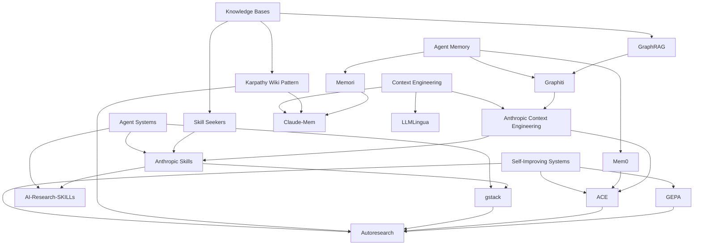

# Field Map

> The five buckets in this repo are not five separate markets. They are five layers of the same emerging stack: knowledge bases shape what can persist, memory decides what stays relevant, context engineering decides what gets surfaced now, agent systems decide how capabilities are packaged, and self-improving loops decide how the whole stack evolves. [Karpathy](../raw/tweets/karpathy-llm-knowledge-bases-something-i-m-finding-very-us.md) [Anthropic](../raw/articles/effective-context-engineering-for-ai-agents.md) [Xu & Yan](../raw/papers/xu-agent-skills-for-large-language-models-architectu.md)

The fastest way to get lost in this field is to study each bucket in isolation. If you do that, markdown wikis look like a storage fad, skills look like prompt packaging, and self-improvement looks like a separate research thread. Read the corpus as a whole and a different picture appears: the field is standardizing around inspectable external artifacts that agents can load, mutate, validate, and feed back into future work. [knowledge-bases](knowledge-bases.md) [agent-memory](agent-memory.md) [context-engineering](context-engineering.md) [agent-systems](agent-systems.md) [self-improving](self-improving.md)

## The New Default Stack

The old default stack for LLM products was simple: prompt plus tools plus maybe RAG. The new default stack is more layered:

1. Raw sources are ingested into a durable substrate: markdown files, graph stores, SQL memory, or packaged documentation assets. [Karpathy](../raw/tweets/karpathy-llm-knowledge-bases-something-i-m-finding-very-us.md) [Graphiti](projects/graphiti.md) [Skill Seekers](projects/skill-seekers.md)
2. An agent-facing memory layer decides what should persist as episodic traces, semantic facts, procedural lessons, or temporal relations. [Mem0](projects/mem0.md) [Memori](projects/memori.md) [Graphiti](projects/graphiti.md)
3. A context layer decides what gets loaded now, in what order, and at what token cost. [Claude-Mem](projects/claude-mem.md) [OpenViking](projects/openviking.md) [LLMLingua](projects/llmlingua.md)
4. A skills or workflow layer packages specialized capabilities and routes work to the right procedure. [Anthropic Skills](projects/anthropic-skills.md) [gstack](projects/gstack.md) [AI-Research-SKILLs](projects/ai-research-skills.md)
5. A verification and improvement loop observes failures, proposes changes, and promotes only validated updates back into the system. [Autoresearch](projects/autoresearch.md) [ACE](projects/ace.md) [GEPA](projects/gepa.md)

That stack is visible across the strongest sources. Karpathy’s markdown wiki pattern is not just a knowledge-base idea. It is already a context-engineering strategy, a self-improvement loop, and a workflow substrate. [Jumpers](../raw/tweets/jumperz-took-karpathy-s-wiki-pattern-and-wired-it-into-my.md) adds the missing review gate, showing where a permanent knowledge base needs a separate validator if it is going to compound safely. [Jumperz](../raw/tweets/jumperz-took-karpathy-s-wiki-pattern-and-wired-it-into-my.md)

## The Three Big Shifts

### From Retrieval To Maintenance

The field used to ask: how do we retrieve the right chunk? It is now asking: how do we maintain the right artifact? That is a more powerful question. Once a wiki, memory graph, or skill registry becomes the maintained object, retrieval quality improves as a side effect of better curation, better compression, and better review loops. [Karpathy](../raw/tweets/karpathy-llm-knowledge-bases-something-i-m-finding-very-us.md) [Graphiti](projects/graphiti.md) [Skill Seekers](projects/skill-seekers.md)

### From Monolithic Prompts To Layered Context

The field has also outgrown the fantasy that one giant system prompt can carry an agent. The current best practice is layered context: project guidance, scoped rules, lazily loaded skills, just-in-time file retrieval, compressed history, external memory, and sometimes separate subagents with clean windows. Context engineering is turning into architecture. [Anthropic](../raw/articles/effective-context-engineering-for-ai-agents.md) [Martin Fowler](../raw/articles/martinfowler-com-context-engineering-for-coding-agents.md) [planning-with-files](projects/planning-with-files.md)

### From Static Workflows To Evolving Systems

Finally, the most forward-looking projects assume the system will keep rewriting itself. Not by magical self-awareness, but by ordinary loops: evaluate, reflect, mutate, verify, promote. This is why self-improvement now touches every bucket. Memory systems store the lessons. Context systems expose them. Skills systems package them. Knowledge bases absorb them. [Autoresearch](projects/autoresearch.md) [ACE](projects/ace.md) [Reflexion](../raw/papers/shinn-reflexion-language-agents-with-verbal-reinforceme.md) [Darwin Godel Machine](../raw/papers/zhang-darwin-godel-machine-open-ended-evolution-of-self.md)

## How A Mature Stack Handles One Task

The easiest way to see the buckets as one system is to walk through a concrete task.

Imagine a coding agent dropped into a new repository. It does not start from raw documents alone. First it reads a durable knowledge layer: a compiled wiki, a project guide, a set of notes, or a skill registry. That is the knowledge-base bucket at work. It gives the agent a curated map before the agent starts improvising. [Karpathy](../raw/tweets/karpathy-llm-knowledge-bases-something-i-m-finding-very-us.md) [Skill Seekers](projects/skill-seekers.md)

Next, the system checks memory. Has this repo been touched before? Are there durable notes about conventions, prior failures, or known traps? Should the agent load a user preference, a task timeline, or a previously learned strategy? That is the memory layer deciding what from the past deserves influence in the present. [Mem0](projects/mem0.md) [Claude-Mem](projects/claude-mem.md) [Graphiti](projects/graphiti.md)

Then context engineering takes over. Even if the system has rich memory and a large knowledge base, it still cannot dump everything into the active window. It needs to choose the minimum viable context: maybe a short repo guide, one skill, two files, and a small set of tool descriptions. The rest stays latent until evidence justifies expansion. [Anthropic](../raw/articles/effective-context-engineering-for-ai-agents.md) [planning-with-files](projects/planning-with-files.md)

Only after those layers are set does the capability system matter. The agent decides whether to load a review skill, a QA skill, a debugging workflow, or a research subagent. At that point the system is no longer “the model plus tools.” It is a routed execution graph over packaged capabilities. [Anthropic Skills](projects/anthropic-skills.md) [gstack](projects/gstack.md) [AI-Research-SKILLs](projects/ai-research-skills.md)

Finally, after the task runs, the self-improvement layer asks what should persist. Did the run reveal a reusable lesson, a better context policy, a stronger skill, or a new benchmark case? If yes, the system proposes a durable update. If not, the trace remains ephemeral. This last step is what turns a one-off agent into a compounding system. [Autoresearch](projects/autoresearch.md) [ACE](projects/ace.md) [Memento](projects/memento.md)

Read that sequence carefully and the buckets stop looking like a taxonomy exercise. They become the stages of a single control loop.

## Why External Artifacts Keep Winning

Across almost every source, the most reliable improvements come from moving important state outside the opaque model context and into explicit artifacts. Those artifacts may be markdown files, skill folders, graph edges, SQL rows, traces, workflow manifests, or benchmark suites. The exact substrate differs, but the move is the same: make the system’s operating knowledge inspectable and editable. [Martin Fowler](../raw/articles/martinfowler-com-context-engineering-for-coding-agents.md) [Xu & Yan](../raw/papers/xu-agent-skills-for-large-language-models-architectu.md)

This is not just about debuggability. It is also about collaboration. Human operators can review a wiki page, a skill definition, or a stored reflection in a way they cannot review latent weights or a tangled multi-turn prompt history. External artifacts create handoff surfaces between humans and agents. They let teams decide which layers should be machine-maintained, which should be human-authored, and which should be jointly edited. [Anthropic](../raw/articles/effective-context-engineering-for-ai-agents.md) [Jumperz](../raw/tweets/jumperz-took-karpathy-s-wiki-pattern-and-wired-it-into-my.md)

They also create portability. A learned lesson kept only inside a giant system prompt is fragile. The same lesson stored as a skill, note, benchmark case, or memory entry can move across agents and runtimes. This is one reason skill registries and packaging systems feel so important right now: they are turning ephemeral procedure into durable infrastructure. [Skill Seekers](projects/skill-seekers.md) [Anthropic Skills](projects/anthropic-skills.md)

## Boundary Failures Are The Real Failure Modes

Most serious failures in the corpus happen at the boundaries between buckets.

One common failure is letting raw retrieval do the job of curation. Teams pull more chunks because they lack a maintained knowledge layer. The result is not richer understanding but noisier prompts. The fix is not usually “better embeddings.” It is often “better artifacts.” [Han et al.](../raw/papers/han-rag-vs-graphrag-a-systematic-evaluation-and-key.md) [Karpathy](../raw/tweets/karpathy-llm-knowledge-bases-something-i-m-finding-very-us.md)

Another common failure is letting memory do the job of context engineering. A system may store many relevant facts but still fail because it has no good policy for what to surface now. Memory quality and active-context quality are related but not interchangeable. This is why projects like [OpenViking](projects/openviking.md) and [Claude-Mem](projects/claude-mem.md) combine memory storage with explicit staged retrieval. [OpenViking](../raw/repos/volcengine-openviking.md) [Claude-Mem](../raw/repos/thedotmack-claude-mem.md)

Another failure is letting skills do the job of orchestration. A team may accumulate a large registry of capabilities and still have poor results because it has not solved routing, sequencing, or evaluation. Skills answer “what can the system do?” Workflow graphs answer “what should happen in this run?” Treating those as the same problem leads to sprawling but unreliable harnesses. [Yue et al.](../raw/papers/yue-from-static-templates-to-dynamic-runtime-graphs-a.md) [AI-Research-SKILLs](projects/ai-research-skills.md)

The last major failure is letting self-improvement bypass governance. A system that can rewrite its wiki, skills, or prompts without a meaningful promotion gate will eventually optimize for the wrong proxy. The recurring lesson from Karpathy, OpenAI, LangSmith, Arion, and Jumperz is that improvement loops need separate evaluators, explicit budgets, and rollback paths. [OpenAI cookbook](../raw/articles/developers-openai-com-self-evolving-agents-a-cookbook-for-autonomous-a.md) [Arion circuit breakers](../raw/articles/arion-research-llc-algorithmic-circuit-breakers-preventing-flash-cr.md)

## The Most Important Fault Lines

There are still real disagreements in the field.

The first is human legibility versus machine structure. Markdown-first systems like [Napkin](projects/napkin.md), [Claude-Mem](projects/claude-mem.md), and the Karpathy wiki pattern optimize for inspectability. Graph-heavy systems like [Graphiti](projects/graphiti.md) optimize for relations and temporality. Both are right about different failure modes. [Napkin](../raw/repos/michaelliv-napkin.md) [Claude-Mem](../raw/repos/thedotmack-claude-mem.md) [Graphiti](../raw/repos/getzep-graphiti.md)

The second is open distribution versus governed distribution. Agent skills are exploding because they are useful, but the security survey is already telling the field that community abundance is not enough. Portable capabilities need provenance, testing, and permission models. [Anthropic Skills](projects/anthropic-skills.md) [claude-skills](projects/claude-skills.md) [Xu & Yan](../raw/papers/xu-agent-skills-for-large-language-models-architectu.md)

The third is offline optimization versus online improvement. Benchmark-driven loops are easier to trust; trace-driven loops fit product reality better. The likely end state is hybrid: offline regression suites to set the floor, online traces to discover the next problem, and human gates for high-impact promotions. [OpenAI cookbook](../raw/articles/developers-openai-com-self-evolving-agents-a-cookbook-for-autonomous-a.md) [LangSmith trace article](../raw/articles/langchain-com-the-agent-improvement-loop-starts-with-a-trace.md)

## Practical Build Order For Teams

One reason this field feels chaotic is that many teams try to adopt all five layers at once. The corpus suggests a better order.

Start by building a clean artifact layer. That can be a markdown wiki, a note vault, or a packaging pipeline, but it should make the domain legible. This gives the team a durable source of truth that agents and humans can both inspect. [Karpathy](../raw/tweets/karpathy-llm-knowledge-bases-something-i-m-finding-very-us.md) [Ars Contexta](projects/ars-contexta.md)

Then add the thinnest memory layer that solves a real continuity problem. If you do not need relational or temporal reasoning yet, file-based or structured-layer memory is often enough. Overbuilding graph memory too early is as real a mistake as underbuilding it too late. [Mem0](projects/mem0.md) [planning-with-files](projects/planning-with-files.md) [Graphiti](projects/graphiti.md)

Then harden context engineering. This is where many teams discover that their real problem was not missing memory but weak selection policy. Tighten the always-on guide, move specialized procedures into skills, and add progressive disclosure before chasing bigger windows. [Anthropic](../raw/articles/effective-context-engineering-for-ai-agents.md) [Pawel Huryn](../raw/tweets/pawelhuryn-your-claude-md-is-doing-jobs-that-rules-hooks-an.md)

Only then does it make sense to grow the agent system layer aggressively. Skills, roles, and subagents pay off once there is enough context discipline to keep them from becoming a new monolith. [Anthropic Skills](projects/anthropic-skills.md) [gstack](projects/gstack.md)

Finally, add self-improvement loops after the first four layers are stable enough to evaluate. Improvement systems do not rescue bad foundations. They amplify whatever objective and governance structure already exists. [Autoresearch](projects/autoresearch.md) [Cameron Westland](../raw/articles/cameron-westland-autoresearch-is-reward-function-design.md)

## Practical Mental Model

For practitioners, the shortest useful mental model is:

- A knowledge base is your durable artifact layer.
- Memory is your persistence policy.
- Context engineering is your selection policy.
- Agent systems are your capability packaging and routing layer.
- Self-improvement is your mutation and promotion layer.

Most failures happen at the boundaries, not inside the layers. Teams stuff too much into context because they have weak memory. They build giant harnesses because they have weak skill packaging. They let agent outputs persist directly because they have weak review gates. The sources in this corpus are effectively different attempts to harden those boundaries. [Anthropic](../raw/articles/effective-context-engineering-for-ai-agents.md) [Jumperz](../raw/tweets/jumperz-took-karpathy-s-wiki-pattern-and-wired-it-into-my.md) [Xu & Yan](../raw/papers/xu-agent-skills-for-large-language-models-architectu.md)

## Research Agenda Hiding In Plain Sight

The next wave of work is not likely to produce one dominant architecture that replaces the rest. More likely, it will improve the interfaces between layers. Better promotion policies between memory and context. Better provenance for skills. Better ways to export knowledge into multiple agent surfaces without drift. Better evaluation harnesses for self-improving systems. Better graph abstractions that remain legible to human operators. [Xu & Yan](../raw/papers/xu-agent-skills-for-large-language-models-architectu.md) [Rasmussen et al.](../raw/papers/rasmussen-zep-a-temporal-knowledge-graph-architecture-for-a.md) [OpenAI cookbook](../raw/articles/developers-openai-com-self-evolving-agents-a-cookbook-for-autonomous-a.md)

The deepest unanswered question is governance. The technical stack is advancing quickly, but the trust stack is still immature. Who is allowed to author memory? Who is allowed to publish skills? Who is allowed to promote a learned strategy into the default context? The sources increasingly imply that the next frontier is not just smarter agents, but safer interfaces for letting those agents shape the systems around them. [Arion circuit breakers](../raw/articles/arion-research-llc-algorithmic-circuit-breakers-preventing-flash-cr.md) [Jumperz](../raw/tweets/jumperz-took-karpathy-s-wiki-pattern-and-wired-it-into-my.md) [Xu & Yan](../raw/papers/xu-agent-skills-for-large-language-models-architectu.md)

## What The Likely Winners Share

Even though the projects in this repo disagree on storage model, runtime architecture, and evaluation style, the strongest ones share a small number of traits.

They expose inspectable artifacts. The artifact may be a wiki page, a memory timeline, a context playbook, a skill folder, or a benchmark case. But the system does not hide the important state inside an opaque prompt if it can avoid it. [Karpathy](../raw/tweets/karpathy-llm-knowledge-bases-something-i-m-finding-very-us.md) [Anthropic Skills](../raw/repos/anthropics-skills.md) [Autoresearch](projects/autoresearch.md)

They stage access. The system does not assume the model should always see everything. Strong systems earn detail through retrieval, graph traversal, summary expansion, or skill loading. [Anthropic](../raw/articles/effective-context-engineering-for-ai-agents.md) [OpenViking](projects/openviking.md) [Claude-Mem](projects/claude-mem.md)

They separate proposal from promotion. This appears in explicit eval harnesses, blind review loops, circuit breakers, or curated registries. The system can generate new candidate knowledge or behavior quickly, but it does not let those candidates silently become the new default without a gate. [OpenAI cookbook](../raw/articles/developers-openai-com-self-evolving-agents-a-cookbook-for-autonomous-a.md) [Jumperz](../raw/tweets/jumperz-took-karpathy-s-wiki-pattern-and-wired-it-into-my.md)

And they optimize for compounding reuse rather than one-off brilliance. A good skill is valuable because it can be reused. A good memory entry is valuable because it prevents repeated mistakes. A good context playbook is valuable because it keeps future runs tighter. A good wiki page is valuable because future synthesis starts one layer higher. [ACE](projects/ace.md) [Skill Seekers](projects/skill-seekers.md) [Mem0](projects/mem0.md)

## What To Avoid

The negative synthesis is just as useful.

Avoid monolithic prompts that are trying to act as a knowledge base, a memory store, a style guide, a workflow registry, and a self-improvement log at the same time. That pattern keeps reappearing in weaker systems, and the field is steadily decomposing away from it. [Pawel Huryn](../raw/tweets/pawelhuryn-your-claude-md-is-doing-jobs-that-rules-hooks-an.md) [Martin Fowler](../raw/articles/martinfowler-com-context-engineering-for-coding-agents.md)

Avoid unlabeled persistence. If the system can write durable knowledge, memory, or skills, it needs provenance and review. Otherwise it is building future errors into its own substrate. [Jumperz](../raw/tweets/jumperz-took-karpathy-s-wiki-pattern-and-wired-it-into-my.md) [Xu & Yan](../raw/papers/xu-agent-skills-for-large-language-models-architectu.md)

Avoid optimizing a proxy without protecting the boundary around the proxy. Self-improvement systems become dangerous when “improved score” and “improved behavior” are allowed to drift apart. [Cameron Westland](../raw/articles/cameron-westland-autoresearch-is-reward-function-design.md) [Reward hacking article](../raw/articles/lil-log-reward-hacking-in-reinforcement-learning.md)

Avoid premature complexity in the knowledge and memory layers. Several of the strongest sources are effectively warnings that teams often add structure before they add discipline. A clean compiled wiki, a small external memory, or a narrow skill registry can outperform a more ambitious architecture that nobody can maintain. [Karpathy](../raw/tweets/karpathy-llm-knowledge-bases-something-i-m-finding-very-us.md) [planning-with-files](projects/planning-with-files.md)

## A Shared Vocabulary Is Emerging

Another important signal from the corpus is linguistic. The field is settling on a shared vocabulary for externalized intelligence: memory, skills, context, traces, playbooks, graphs, registries, and compiled knowledge. That vocabulary matters because it lets builders separate concerns that used to be collapsed into “prompting.” Once those terms harden, teams can reason more clearly about where a failure belongs and which artifact should change in response. [Mei et al.](../raw/papers/mei-a-survey-of-context-engineering-for-large-language.md) [Xu & Yan](../raw/papers/xu-agent-skills-for-large-language-models-architectu.md) [Yue et al.](../raw/papers/yue-from-static-templates-to-dynamic-runtime-graphs-a.md)

The shared vocabulary also creates interoperability pressure. If one project calls something memory, another calls it context, and a third calls it a skill, the real question becomes whether those are genuinely different artifacts or different names for the same operational layer. The best systems in this repo are valuable partly because they clarify these distinctions in practice. Anthropic separates context surfaces. Graphiti separates temporal memory from retrieval. Agent Skills separates reusable capabilities from always-on instructions. Autoresearch separates the editable artifact from the evaluator. The field is learning to modularize not just code, but concepts. [Anthropic](../raw/articles/effective-context-engineering-for-ai-agents.md) [Graphiti](projects/graphiti.md) [Anthropic Skills](projects/anthropic-skills.md) [Autoresearch](projects/autoresearch.md)

That conceptual modularity is likely what makes the whole stack composable. Once the artifacts are named clearly, they can be swapped, upgraded, or governed independently. A team can keep its skill registry and swap its memory layer. It can keep its compiled wiki and replace its compaction policy. It can keep its eval harness and change the thing being optimized. This is how the field stops being a collection of clever demos and starts becoming an engineering discipline. [OpenAI cookbook](../raw/articles/developers-openai-com-self-evolving-agents-a-cookbook-for-autonomous-a.md) [Martin Fowler](../raw/articles/martinfowler-com-context-engineering-for-coding-agents.md)

Just as important, a shared vocabulary makes comparison possible without flattening everything into a leaderboard. Builders can ask better questions: is this project offering a new memory substrate, a better context policy, a richer capability package, or a stronger improvement loop? Once the question is specific, the tradeoffs become legible. That is part of what this repo is really for. [Mei et al.](../raw/papers/mei-a-survey-of-context-engineering-for-large-language.md) [Yue et al.](../raw/papers/yue-from-static-templates-to-dynamic-runtime-graphs-a.md)

That is also why the five-bucket structure is more than filing. It is a way to keep the field intellectually navigable while the projects themselves keep blending together. If the taxonomy works, it should help practitioners decide what layer of the system to change first when something breaks. If a team has retrieval thrash, it may have a context problem more than a knowledge problem. If a team keeps repeating mistakes, it may have a memory or self-improvement problem more than a model problem. If a team’s agent feels “smart but unreliable,” it may actually have an agent-systems problem: poor packaging, weak routing, or no trustworthy review surface. [Anthropic](../raw/articles/effective-context-engineering-for-ai-agents.md) [LangSmith trace article](../raw/articles/langchain-com-the-agent-improvement-loop-starts-with-a-trace.md) [Xu & Yan](../raw/papers/xu-agent-skills-for-large-language-models-architectu.md)

That diagnostic value is the practical payoff of synthesis. The best outcome from a repo like this is not memorizing project names. It is gaining a better instinct for where a failure lives and which artifact deserves intervention. That is what turns a landscape map into an engineering tool. [Martin Fowler](../raw/articles/martinfowler-com-context-engineering-for-coding-agents.md) [OpenAI cookbook](../raw/articles/developers-openai-com-self-evolving-agents-a-cookbook-for-autonomous-a.md)

That matters a lot.

## Where The Field Is Likely Headed

The next year likely belongs to systems that combine:

- inspectable artifacts instead of opaque hidden state,
- progressive disclosure instead of context stuffing,
- skills and workflow graphs instead of monolithic prompts,
- explicit review gates instead of direct self-promotion,
- and measured improvement loops instead of intuition-driven tweaking.

That is the synthesis line running through nearly every high-signal source in this repo. [Karpathy](../raw/tweets/karpathy-llm-knowledge-bases-something-i-m-finding-very-us.md) [Anthropic Skills](../raw/repos/anthropics-skills.md) [ACE paper](../raw/papers/zhang-agentic-context-engineering-evolving-contexts-for.md)

## Knowledge Graph

## Sources

- [Landscape Comparison](comparisons/landscape.md)
- [Project Index](indexes/projects.md)
- [Topic Index](indexes/topics.md)
- [Timeline](indexes/timeline.md)
- [Missing Coverage](indexes/missing.md)
- [The State of LLM Knowledge Bases](knowledge-bases.md)
- [The State of Agent Memory](agent-memory.md)
- [The State of Context Engineering](context-engineering.md)
- [The State of Agent Systems](agent-systems.md)
- [The State of Self-Improving Systems](self-improving.md)
- [Karpathy knowledge-base tweet](../raw/tweets/karpathy-llm-knowledge-bases-something-i-m-finding-very-us.md)
- [Anthropic context engineering article](../raw/articles/effective-context-engineering-for-ai-agents.md)
- [Agent Skills for Large Language Models](../raw/papers/xu-agent-skills-for-large-language-models-architectu.md)
- [Workflow optimization survey](../raw/papers/yue-from-static-templates-to-dynamic-runtime-graphs-a.md)
- [OpenAI self-evolving agents cookbook](../raw/articles/developers-openai-com-self-evolving-agents-a-cookbook-for-autonomous-a.md)
