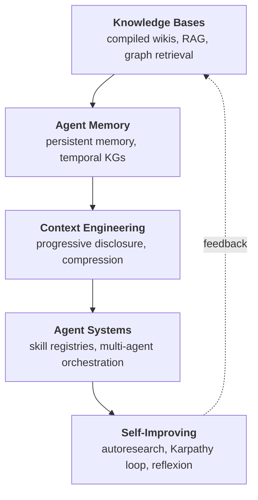

# The Landscape of LLM Knowledge Systems

Five years of building on top of LLMs has produced something unexpected: a coherent stack. Not a planned one, but one that emerged from practitioners hitting the same walls in different orders. A knowledge base builder discovers her retrieval system needs to understand how facts change over time. An agent developer finds his agent can't improve because it has no persistent memory of what worked. A context engineer learns that the LLM's 200K token window is worthless if the agent can't decide what belongs in it.

These problems are the same problem, approached from different angles.

This knowledge base covers five areas. [Knowledge Bases](knowledge-bases.md) addresses how you structure and store information for LLM consumption, with the central engineering problem being retrieval quality versus infrastructure cost. [Agent Memory](agent-memory.md) covers how agents retain, organize, and reason over what they've encountered across sessions, where the hard part is temporal consistency, not storage. [Context Engineering](context-engineering.md) examines how you fill the context window at inference time, with the core tension between eager loading (always available, expensive) and on-demand retrieval (cheap, but requires the agent to know what it doesn't know). [Agent Systems](agent-systems.md) surveys orchestration patterns, tool use, and multi-agent coordination, where the frontier is self-directed improvement rather than just task completion. [Self-Improving Systems](self-improving-systems.md) documents the emerging practice of agents that modify their own prompts, memory, and even code based on measured outcomes, where the bottleneck is defining what "better" means well enough that an agent can optimize for it without gaming the metric.

---

## The Stack

## The Unifying Insight

Every area in this stack is solving the same architectural problem: **how do you give a stateless model a reliable sense of what it knows, what it has done, and what to do next?**

The LLM itself has no memory. It has weights that encode general knowledge and a context window that holds the current session. Every system in this knowledge base is an attempt to compensate for those two limitations, either by curating what goes into the window or by building infrastructure that persists state across windows.

The surprise is that "infrastructure" keeps losing to "good curation." Karpathy's wiki with 400K words of markdown outperforms three-year-old RAG pipelines not because file-based retrieval is architecturally superior, but because the LLM can reason over well-structured text more reliably than over embedding-retrieved chunks that were never written to cohere. The graph-backed systems that do win (Graphiti, Zep) win on *temporal reasoning*, the one thing flat files genuinely can't do. The rest of the RAG industry built plumbing for a problem that better-formatted text could solve.

This insight cuts across all five buckets. Memory that agents can read as text beats memory that requires API calls to retrieve. Context that stays in files beats context that requires a running vector database. Skills encoded as markdown can be inspected, edited, and versioned with git. The medium matters: LLMs are text machines, and the practitioners who stopped fighting that fact made faster progress.

---

## Integration Points

### Knowledge Bases feed Context Engineering

A knowledge base is static structure. Context engineering is the runtime problem of deciding which parts of that structure to load for a given query.

The interface between them is the index. Karpathy's pattern puts the index in `SUMMARY.md` files and cross-links that the LLM navigates directly. [OpenViking](projects/openviking.md) formalizes this with L0 abstracts (~100 tokens per document), L1 overviews (~2K tokens), and L2 full content, addressed by `viking://` URIs. The LLM reads L0s first, scores directories, then drills into relevant content. The knowledge base defines the structure; context engineering defines the traversal policy.

When this integration breaks, you get silent retrieval degradation. The knowledge base grows past the point where its index accurately represents its content, the LLM loads the index, finds pointers to sections that no longer exist or have been superseded, and returns confident answers drawn from outdated material. No error is raised. The failure is invisible until someone checks an answer against ground truth.

The fix is [progressive disclosure](concepts/progressive-disclosure.md) with automatic health checks. Karpathy runs a scheduled job that asks the LLM to flag articles where the index summary no longer matches the article content. The knowledge base and the context loading policy have to co-evolve or they drift apart.

### Context Engineering feeds Agent Systems

An agent system is a loop: perceive, plan, act, observe, repeat. Context engineering determines what the agent perceives at each step of that loop.

The interface here is the system prompt plus any tool-retrieved context. Static system prompts (CLAUDE.md files, project instructions) set the agent's baseline understanding. Dynamic retrieval fills in task-specific context. The interaction between them determines whether the agent can execute a multi-step task without losing track of what it has already done.

When this integration breaks, you get the "unknown unknowns" problem. The agent has relevant knowledge somewhere in its memory store, but it doesn't search for it because it doesn't know to look. [Hipocampus](projects/hipocampus.md) addresses this by always loading a ~3K token ROOT.md that gives the agent a topic map of everything it knows. The agent can't retrieve what it hasn't indexed, but it at least knows what topics have been indexed. Without that eager-loaded map, on-demand retrieval is blind.

The broader point: agent behavior is context-determined. The same model, given different context loading policies, will produce fundamentally different behavior on multi-step tasks. Context engineering is not a retrieval optimization problem; it is the core of agent design.

### Agent Systems feed Self-Improving Systems

An agent system that can execute tasks can, given the right scaffolding, execute the meta-task of improving itself. Self-improving systems are agent systems with measurement and persistence added.

The interface between them is the trace. Every agent run produces a trace: the sequence of decisions, tool calls, and outputs that led to the result. Self-improving systems read those traces, score them, and propose modifications to the agent's prompts, memory, or code.

The meta-agent project makes this explicit. The agent (Haiku 4.5) executes tasks and produces traces. A separate proposer (Opus 4.6) reads the traces, scores them with an LLM judge, and writes targeted updates to the agent's harness. The team improved TAU-bench holdout accuracy from 67% to 87% with no changes to the base model.

When this integration breaks, you get overfitting. The proposer reads a batch of traces, identifies patterns in the failures, and writes updates that address those specific patterns. On the training distribution, accuracy improves. On holdout, it degrades. The meta-agent team's fix: require the proposer to state changes as behavioral rules rather than responses to specific traces. "If you can only justify it by pointing to these traces, it's too narrow."

### Agent Memory spans the full stack

Agent memory is not cleanly between two buckets; it connects all of them. A knowledge base is a kind of memory. Context loading is memory retrieval. Self-improvement requires memory of what worked.

The specific integration point that most practitioners miss: memory needs a temporal model. Storing the fact that a user's shipping address is "123 Main St" is useless if you don't also store when that fact became true and when it stopped being true. [Zep](projects/zep.md) beat [Letta](projects/letta.md) on the LongMemEval benchmark by 18.5 percentage points not because its retrieval was better, but because it tracked validity windows on facts. Letta stored memories as static assertions. Zep stored them as time-bounded claims.

This pattern needs to propagate through the entire stack. Knowledge bases need to track document versions and supersede relationships. Context loading needs to prefer current facts over outdated ones. Agent systems need to reason about what was true "at the time" of a past decision, not just what is true now.

---

## Paradigm Fragmentation

Several areas have multiple valid approaches with no clear winner. The routing logic matters more than the choice.

**File-based vs. graph-based knowledge storage:** Use file-based systems when your corpus fits in roughly 1M tokens, you need human-readable inspection, you want zero infrastructure, and your facts don't change frequently. Use graph-based systems when you need temporal reasoning (facts that were true last month but aren't now), multi-hop queries across hundreds of thousands of entities, or multi-tenant deployments where multiple users share a knowledge base. [Graphiti](projects/graphiti.md) is the production-grade choice in the second case. [napkin](projects/napkin.md) or Karpathy's raw wiki pattern is the right choice in the first. The failure mode of choosing graph-based for a small static corpus is spending three weeks on infrastructure to answer questions that BM25 on markdown would have answered correctly in three hours.

**Eager loading vs. on-demand retrieval:** Eager loading solves the unknown unknowns problem: the agent knows what it knows because the index is always in context. On-demand retrieval saves tokens but requires the agent to know what to search for. Use eager loading for the index (ROOT.md, CLAUDE.md, L0 abstracts) and on-demand retrieval for full content. The hybrid is the right answer. Pure eager loading fails when the index grows past its token budget. Pure on-demand retrieval fails on tasks where the agent doesn't know which domain a question falls in.

**Skill-based vs. RL-trained self-improvement:** Skill-based approaches (Acontext, Memento-Skills, ACE Framework) store what worked as human-readable markdown procedures. They win when you need human oversight, portability across frameworks, and the ability to inspect and edit what the agent has learned. RL-trained approaches (Mem-α) win when you can afford training compute, need the agent to make autonomous decisions about what to encode, and have a clear reward signal. Most production systems should start with skill-based and move to RL only when they have enough trajectory data to justify it.

**Locked vs. open evaluation metrics in self-improving loops:** Lock the metric (agent cannot modify the scoring code) when you don't trust the agent's judgment about what "better" means. Open the metric when you want the agent to sharpen its own measurement instrument. GOAL.md's dual-score approach is the practical middle ground: one score for the target artifact, one score for the measurement tool itself. The agent can improve the measurement tool up to a threshold, after which any changes require human review.

---

## Implementation Maturity

**Production-ready:**
- [Mem0](projects/mem0.md) (51,880 stars): multi-level memory API, commercially deployed, independent benchmark results exist alongside the team's own claims
- [Graphiti](projects/graphiti.md) (24,473 stars): temporal knowledge graphs, production deployments at Zep, concrete performance numbers in a published paper
- [OpenViking](projects/openviking.md) (20,813 stars): tiered context loading with concrete LoCoMo benchmark numbers, backed by Volcengine
- [Letta](projects/letta.md) (21,873 stars): stateful agent framework, formerly MemGPT, commercially deployed
- CLAUDE.md / skills pattern: Anthropic's own skills repository (110,064 stars), in production with Claude Code

**Production-ready with caveats:**
- Acontext (3,264 stars): skill-as-memory pattern is solid; benchmark numbers are self-reported
- Cognee (14,899 stars): graph plus vector combination works, but setup complexity is high
- [Hipocampus](projects/hipocampus.md) (145 stars): ROOT.md pattern is proven; MemAware benchmark is self-constructed and unverified externally

**Research-grade, not production:**
- [Darwin Gödel Machine](projects/darwin-godel-machine.md): SWE-bench improvement from 20% to 50% is compelling, but open-ended agent evolution at scale remains a research problem
- Mem-α (193 stars): RL-trained memory construction works in controlled settings; production deployment is uncharted
- [HippoRAG](projects/hipporag.md) (3,332 stars): PageRank-based retrieval over knowledge graphs is academically interesting but operationally complex
- [CORAL](projects/coral.md) (120 stars): multi-agent shared state via git worktrees is clever; too early to call production-ready
- [AutoResearch](projects/autoresearch.md): Karpathy's demo is real, the numbers are real, but "leave it running over a weekend" is not a deployment pattern yet

---

## What the Field Got Wrong

The field assumed that retrieval quality was the bottleneck.

Three years of RAG development optimized embedding models, chunking strategies, rerankers, and hybrid search algorithms. The underlying assumption: if you could retrieve the right chunk at query time, the LLM would produce the right answer. The infrastructure built on this assumption is substantial: vector databases, embedding pipelines, chunk stores, retrieval orchestration layers.

Karpathy's wiki demolished this assumption by outperforming it with markdown files and an index. The insight isn't that retrieval doesn't matter, it's that *retrieval quality is downstream of document quality*. A well-structured markdown document that was written to cohere, with clear headings and cross-references, is more useful to an LLM than a perfectly retrieved 512-token chunk cut from a longer document mid-sentence. The RAG pipeline optimized for finding the right chunk; the wiki approach optimized for writing documents that are worth finding.

The replacement assumption: **LLM comprehension quality, not retrieval precision, is the primary bottleneck in knowledge systems.** This shifts investment from retrieval infrastructure toward document quality, index structure, and the practices by which LLMs write for other LLMs. It doesn't mean retrieval is irrelevant. Graph-based systems with temporal reasoning clearly outperform flat files for certain query types. But the order of investment has reversed. Document quality first, retrieval infrastructure second.

---

## The Practitioner's Flow

You're building a research assistant for a team that accumulates notes, papers, and decisions over time. Here's how a mature stack handles a real query: "What did we decide about the authentication architecture, and has anything changed since then?"

**Step 1: Context loading ([OpenViking](projects/openviking.md) or CLAUDE.md pattern).** The agent starts with a session that includes the project's CLAUDE.md or ROOT.md, a ~3K token overview that tells it the project has sections on architecture, decisions, and meeting notes. It knows to look in the decisions directory before answering.

**Step 2: Index traversal (file-based retrieval with L0/L1 loading).** The agent reads the decisions directory's L0 abstracts (100 tokens each), scores them for relevance, and identifies two files: `auth-decision-2024-03.md` and `auth-revision-2024-11.md`. It loads the L1 overviews (~2K tokens each) to confirm relevance before loading full content.

**Step 3: Temporal resolution ([Graphiti](projects/graphiti.md) or Zep if deployed; Membrane for lighter-weight setups).** The system checks whether the facts in those files have validity windows. `auth-decision-2024-03.md` contains a fact ("we use JWT tokens with 24-hour expiry") that [Graphiti](projects/graphiti.md) has flagged as superseded by a newer episode from `auth-revision-2024-11.md` ("reduced expiry to 1 hour after incident"). Without temporal resolution, the agent might surface the outdated fact confidently.

**Step 4: Skill lookup (Acontext or Anthropic skills pattern).** If this query type has been asked before, the agent checks its skill library for a procedure titled "synthesize-decision-with-revisions." If it exists, it loads the skill's instructions and follows them, producing a consistent output format that the team has seen before.

**Step 5: Answer generation with provenance.** The agent writes its answer citing specific documents and dates. Because the knowledge base stores which episode produced each claim, the answer includes links back to source documents. A human can check the chain.

**Step 6: Memory update (Mem0 or hipocampus).** If the query surfaced something genuinely new (a synthesis neither document contained explicitly), the agent proposes adding a new entry to the knowledge base. A supervisor agent (or a human reviewer) approves it before it enters the permanent store. This is the poisoning prevention step that practitioners learned the hard way.

The full loop runs in roughly one agent turn with three tool calls. No vector database was queried. The only external service is the LLM itself.

---

## Cross-Cutting Themes

**Markdown as universal interchange.** Across all five buckets, markdown is the format that everything reads and writes. CLAUDE.md, SKILL.md, ROOT.md, wiki articles, compaction nodes, skill files, harness update proposals: all markdown. This is not accidental. Markdown is human-readable, diff-able, writable by LLMs, and parseable by anything. It is the lingua franca of the emerging stack. Systems that deviate from this (proprietary binary formats, graph-only storage) pay an interoperability tax.

**Git as infrastructure.** Git provides version history, provenance, rollback, and collaboration for every file-based system in this stack. Karpathy's wiki is a git repo. CORAL uses git worktrees for multi-agent shared state. SKILL.md files are tracked in git. Self-improving systems that modify their own harness can diff before and after any change. Teams that skip git for their agent's knowledge base lose the ability to debug when knowledge degrades silently.

**Context window as the governing constraint.** Every architectural decision in this stack is downstream of the context window. Progressive disclosure exists because context is finite. Compaction exists because conversation history exceeds context. Tiered loading exists because you can't fit the full knowledge base in context. As context windows expand, some of these patterns become less urgent. But finite attention remains a constraint at scale: even a 2M token window can't hold a 10-million-token knowledge base, and loading everything regardless of relevance degrades model performance on the task at hand.

**Agents writing for agents.** The LLM that answers your query is often not the LLM that wrote the documents it's reading. Karpathy's wiki is maintained by LLMs writing for other LLMs. Skill files are distilled by one agent run and consumed by the next. Compaction nodes are written by a compacting agent and read by a retrieval agent. This creates a new kind of document quality problem: not "is this readable by humans?" but "is this navigable by an LLM that has no context beyond what's in this document?" The answer is usually: shorter is better, structure beats prose, and explicit cross-references beat implicit relationships.

**Forgetting as a feature.** Every memory system in this stack has to decide what to discard. Hipocampus compacts old conversation logs into summaries and archives the raw logs. Graphiti invalidates outdated facts rather than deleting them. Mem-α learns when to encode versus when to discard. The practitioners who built systems without forgetting discovered that stale knowledge accumulates, generates confident wrong answers, and is harder to remove than it was to add. Intentional forgetting, or more precisely, intentional obsolescence with preserved history for auditability, is a design requirement, not an afterthought.

**Binary evaluation brittleness.** Most of the benchmarks in this space are binary pass/fail. LongMemEval asks questions with single correct answers. TAU-bench scores task completion as 0 or 1. SWE-bench marks patches as passing or failing. These metrics are tractable but they reward overfitting: an agent that learns the benchmark's failure modes improves its score without improving on the real-world task the benchmark was meant to proxy. The meta-agent team saw this directly when their proposer improved training accuracy while degrading holdout. GOAL.md saw it when an agent "improved" documentation to satisfy a broken linter. Every practitioner in this space needs a second evaluation signal that the optimizing agent cannot touch.

---

## Reading Guide

**You're building a knowledge base for an LLM to query:** Start with [Knowledge Bases](knowledge-bases.md). Read the sections on file-based versus graph-based tradeoffs, then look at [napkin](projects/napkin.md) for the minimal-infrastructure end and [Graphiti](projects/graphiti.md) for the temporal-reasoning end. Come back to [Context Engineering](context-engineering.md) once you've decided on your storage model.

**You're building an agent that works across sessions:** Start with [Agent Memory](agent-memory.md). The temporal consistency section is the part most practitioners skip and later regret. Then read [Context Engineering](context-engineering.md) for the eager loading versus on-demand tradeoffs. [Mem0](projects/mem0.md) and [Graphiti](projects/graphiti.md) are the two projects worth deploying and comparing against your workload.

**You're building context loading and prompt management:** Start with [Context Engineering](context-engineering.md). The progressive disclosure patterns are well-developed; [OpenViking](projects/openviking.md) and [Hipocampus](projects/hipocampus.md) are the two most concrete implementations. Then read [Agent Systems](agent-systems.md) to understand how your context loading decisions constrain agent behavior.

**You're building multi-agent systems or orchestration:** Start with [Agent Systems](agent-systems.md). The sections on skill packaging (Anthropic skills, Acontext) and multi-agent coordination (CORAL) are the most practically useful. Then read [Self-Improving Systems](self-improving-systems.md) for patterns that let the system tune itself over time.

**You're building systems that improve from their own outputs:** Start with [Self-Improving Systems](self-improving-systems.md). The metric design section is the one most teams underinvest in. GOAL.md and the meta-agent trace-analysis pattern are the two most transferable ideas. Then read [Agent Memory](agent-memory.md) to ensure the improvements your system discovers actually persist across runs.

**You're trying to understand the whole stack before committing to any part of it:** You just finished the right document.
