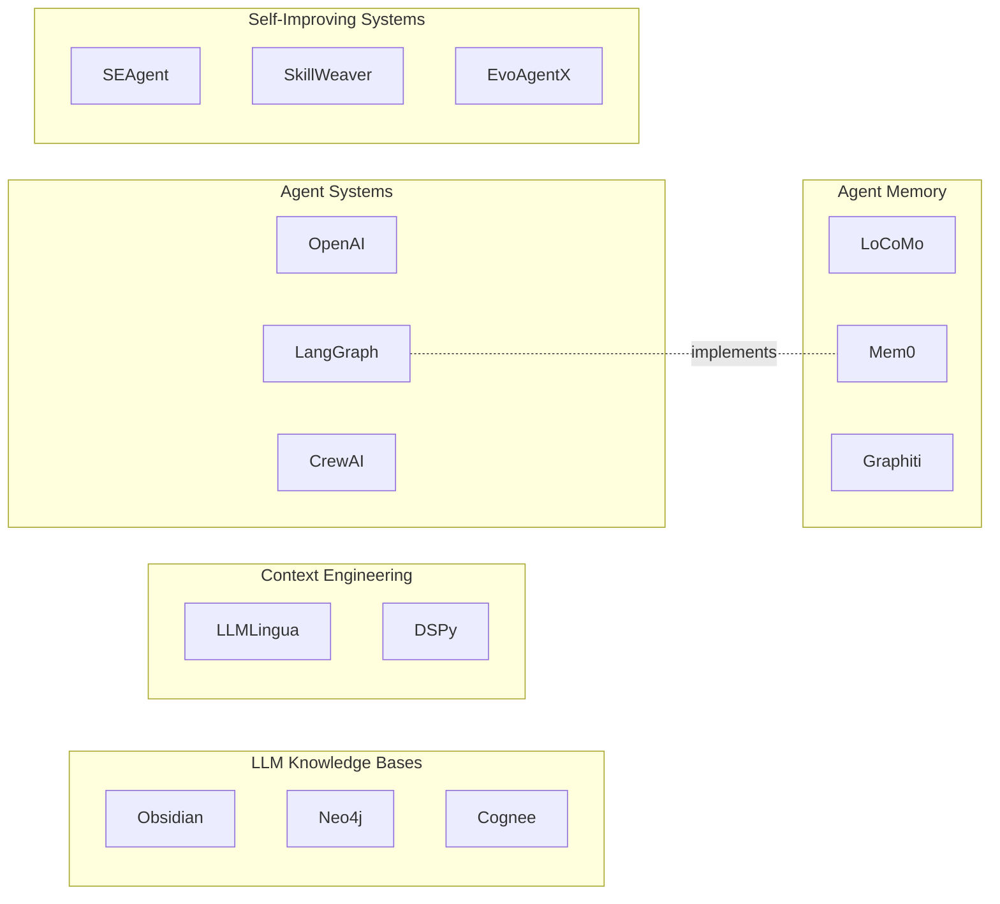

# The Landscape of LLM Knowledge Systems

Five areas of engineering — knowledge bases, agent memory, context engineering, agent systems, and self-improving systems — look like separate topics until you build something that spans all of them. Then you see they're five layers of the same stack. Knowledge feeds memory, memory shapes context, context enables agent skills, and skills compound through self-improvement. The boundaries between them are interfaces, not walls, and most production failures happen at those interfaces.

[Knowledge bases](knowledge-bases.md) address the question of how you give an LLM access to information it wasn't trained on. The central engineering problem is retrieval architecture: what format you store information in, how you find it again, and whether the structure you chose lets agents reason over facts or just look them up. [Agent memory](agent-memory.md) asks what persists across sessions and who decides what to keep. The central problem there is selectivity: storing everything is as bad as storing nothing, and current systems disagree sharply on whether a neural policy, a temporal graph, or a hierarchical filesystem should make that call. [Context engineering](context-engineering.md) covers the finite window that sits between stored knowledge and the model's attention. The central problem is discoverability: an agent working on payment flow won't search for "rate limiting," so retrieval systems that require a query will miss three-week-old architectural decisions. [Agent systems](agent-systems.md) examines how agents coordinate across roles, sessions, and tools. The central problem shifted from orchestration topology to compounding: how do you build a system that's measurably better at the end of the week than at the start? [Self-improving systems](self-improving.md) takes that question to its logical end: agents that modify their own scaffolding, skill libraries, or model weights based on observed performance. The central problem is the fitness function — you need a scalar signal that's hard to game and actually measures what you care about.

---

## Knowledge Graph

## The Unifying Idea

These five layers form a stack with a specific property: each layer writes outputs that the layer above it consumes as inputs. Knowledge bases produce structured, retrievable facts. Memory systems decide which facts survive across sessions. Context assembly decides which surviving facts enter the current window. Agent systems decide which skills to invoke given that context. Self-improving systems update the entire stack based on outcomes.

The implication is that optimizing any single layer in isolation produces diminishing returns. A graph-based knowledge base with sophisticated temporal tracking gives you nothing if the context assembly layer can't surface its facts efficiently. A powerful multi-agent system degrades if memory poisoning corrupts the knowledge it reasons over. Self-improvement loops that don't write back into the knowledge and memory layers spin in place, improving one session without transferring gains to the next.

The field is only beginning to engineer these layers as a connected system rather than five separate product categories.

---

## Integration Points

**Knowledge base → memory**: The interface is extraction. When an agent processes a document, conversation, or execution trace, something must decide what's worth encoding into persistent memory and what can be discarded. [Mem0](projects/mem0.md) runs an LLM pass over conversations to extract discrete facts before storing them in a vector database. [Graphiti](projects/graphiti.md) does the same but writes into a temporal graph, tagging each extracted fact with validity windows. The failure mode when this interface breaks: memory fills with raw, undifferentiated content. Retrieval degrades because every chunk looks equally relevant. Semantic compression — turning "the user mentioned they moved to Berlin in April and now prefer German time zones" into a single structured fact — is what makes retrieval tractable at scale.

**Memory → context**: The interface is selection. Given a query (or no query), which facts from persistent memory enter the active context window? Vector search, BM25, graph traversal, and hierarchical indexing all answer this differently. [Hipocampus](projects/hipocampus.md) keeps a ROOT.md topic index in every session, giving agents O(1) awareness of what exists without requiring a query. [Napkin](projects/napkin.md) uses BM25 over markdown files with progressive disclosure: a 200-token overview, then ranked search results, then full file reads on demand. The failure mode when this interface breaks: unknown unknowns. An agent completing a task never searches for the fact that would change its approach because it doesn't know that fact exists. Hipocampus reports 21.6x improvement over no memory on implicit recall questions — questions where the agent doesn't know to look for the answer.

**Context → agent skills**: The interface is loading order. Skills — SKILL.md files in Anthropic's formalization, strategy registries in ACE, GOAL.md fitness functions in self-improving systems — need to be in context when the agent reasons, not after. [Acontext](projects/acontext.md) routes to skill files using explicit tool calls (`get_skill`, `get_skill_file`) rather than semantic search, which avoids the retrieval problem but requires the agent to know which skill to request. The failure mode when this interface breaks: skill collision. Without intentional loading order, an agent working with an outdated skill that contradicts a newer one will produce inconsistent behavior across runs. ACE's SkillManager addresses this with active curation — deleting and refining strategies, not just adding them.

**Agent skills → self-improvement**: The interface is feedback. Self-improving systems need to observe what happened and route learnings back into skills, memory, and knowledge bases. [Memento-Skills](projects/memento-skills.md) updates utility scores for skill files after each execution. CORAL writes shared state into `.coral/public/` so parallel agents can see each other's failed attempts before duplicating them. The failure mode when this interface breaks: improvement without transfer. Karpathy's autoresearch loop discovered 700 changes and an 11% training speedup, but those learnings lived in git commits. A system that doesn't write improvements back into its skill library or knowledge base forces the next agent to rediscover the same things.

---

## Paradigm Fragmentation

Three storage paradigms for knowledge and memory coexist, and all three are production-viable in different conditions.

**Flat vector stores** (Mem0, LanceDB, most RAG pipelines): Use when queries are well-formed, knowledge changes infrequently, and you're serving many users at scale. Vector search is fast, scalable, and requires minimal infrastructure beyond a vector database. It breaks when users update facts over time — stale embeddings for "works at Acme Corp" keep surfacing after the user changes jobs — and when queries have no lexical or semantic overlap with the relevant content.

**Temporal knowledge graphs** (Graphiti, Cognee, HippoRAG): Use when facts change over time and you need to track what was true when, or when multi-hop reasoning matters ("who worked at company X before it merged with Y?"). The Zep paper backing Graphiti reports 94.8% on Deep Memory Retrieval versus MemGPT's 93.4%, and 18.5% accuracy improvement on LongMemEval with 90% latency reduction — self-reported, not independently verified, but backed by a published arXiv preprint. The tradeoff is setup complexity: Graphiti requires Neo4j, FalkorDB, Kuzu, or Amazon Neptune. Entity resolution is a persistent problem — when the same entity appears as "OpenAI," "OAI," and "the company," graph construction splits it into multiple nodes, and queries about one miss facts attached to the others.

**Filesystem hierarchies** (Hipocampus, Napkin, OpenViking): Use when human readability matters, your corpus fits under ~100K tokens, and you want zero infrastructure overhead. Napkin claims 83% on LongMemEval's M split versus 72% for the prior best system using only BM25 on markdown files. Hipocampus scores 21% on MemAware versus 3.4% for BM25 plus vector search alone, using a compaction tree with a ROOT.md index. Both sets of numbers are self-reported. These approaches break when corpora grow beyond LLM context limits, when latency matters, or when you need semantic similarity across large document sets. BM25 fails on terminology drift: a document about "context windows" won't surface for a query about "token limits" unless both terms appear.

The routing logic in practice: start with filesystem approaches during development and at small scale. Move to vector stores when you hit retrieval latency requirements or corpus size limits. Add temporal graphs when users start updating facts that need to contradict previous versions rather than append to them.

---

## Implementation Maturity

**Production-ready**: Mem0 (51,880 stars, pip-installable, LLM-agnostic), Graphiti (24,473 stars, published paper, Neo4j backend), Letta (21,873 stars, managed platform available), OpenViking (20,813 stars, filesystem paradigm with benchmark numbers). These have community adoption, active maintenance, and documented failure modes.

**Production-viable but specialized**: Cognee (14,899 stars, six-line API, graph-vector hybrid), HippoRAG (3,332 stars, NeurIPS '24, multi-hop retrieval via Personalized PageRank), Acontext (3,264 stars, skill-file-as-memory approach), CORAL (120 stars, multi-agent git worktree coordination). These work, but require more integration effort or have narrower applicability.

**Promising research**: Mem-α (193 stars, RL-trained 4B model for dynamic memory routing), Darwin Gödel Machine (self-modifying code, SWE-bench improvement from 20% to 50% — self-reported, should be treated as upper-bound until independently verified), Hipocampus (145 stars, strong benchmark numbers but not yet widely deployed), GOAL.md (112 stars, dual-score fitness function for domains without natural metrics).

**Research-only or unverified**: The LongMemEval and MemAware benchmark numbers from Napkin and Hipocampus are self-reported against non-standardized baselines. DGM's SWE-bench claims are plausible but unverified. Treat all self-reported benchmarks in this space as directional rather than definitive.

---

## What the Field Got Wrong

The field assumed retrieval was the bottleneck.

The early RAG literature treated context engineering as an optimization problem: better chunking, better embeddings, better reranking, higher recall on benchmark datasets. Teams spent months tuning cosine similarity thresholds and chunk sizes.

The wrong assumption was that the agent knows what to look for. Vector search requires a query. A query requires suspecting that relevant context exists. Agents working on complex tasks don't know which three-week-old architectural decision they're about to violate, so they don't search for it.

Hipocampus's MemAware benchmark exposed this directly: BM25 scores 2.8% on implicit context recall — questions where the agent has no obvious query to run — barely above 0.8% for no memory. The ROOT.md index approach scores 21% on the same questions. The bottleneck was discoverability, not retrieval fidelity.

What replaced the retrieval-focused paradigm: persistent indexes that load into every session (Hipocampus's ROOT.md), progressive disclosure architectures that give agents structural awareness before search (OpenViking's L0/L1/L2 tiering), and Karpathy's wiki pattern — LLM-maintained markdown files that agents read and write, giving them shared understanding of what the knowledge base contains without requiring query formulation.

The insight is that semantic search answers "where is the information I'm looking for?" but doesn't address "what information exists that I should be looking for?"

---

## The Practitioner's Flow

Take a concrete task: a coding agent has been running for three weeks on a large Python codebase. A new session starts. The task is refactoring an authentication module.

The session opens with Hipocampus loading ROOT.md — 3K tokens covering active context (current refactoring sprint, authentication module flagged as having known issues), recent patterns (the team decided last week to standardize on JWT over session tokens), and a topics index pointing to relevant files. The agent immediately knows a relevant decision exists without searching.

The agent calls `get_skill` via Acontext's tool interface, fetching the authentication-patterns skill file built from previous sessions. The skill file contains specific patterns that worked on this codebase: "use `async` consistently throughout auth flows — mixing sync and async caused race conditions in PR #441."

For RAG retrieval on specific functions, Mem0 surfaces relevant conversation history and prior code review notes at the user and project levels. A graph query via Graphiti retrieves the fact that a specific OAuth provider was deprecated in February, marked `valid_until: 2025-02-01`, rather than returning the stale documentation still present in the vector store.

The agent executes the refactoring. After completion, an ACE-style Reflector analyzes the execution trace and identifies that the agent spent 40% of its time resolving an import structure issue that had appeared in three previous sessions. The SkillManager writes a new entry to the authentication skill file: "check circular imports in `auth/providers/` before starting any module-level changes." The Reflector also updates the ROOT.md active context section with a note that the authentication refactoring sprint is ongoing.

The knowledge base now contains what the agent learned. The next session starts ahead of where this one did.

Tools at each step: Hipocampus for the session-opening index, Acontext for skill file routing, Mem0 for conversational memory retrieval, Graphiti for temporal fact lookup, ACE for post-session reflection and skill updates.

---

## Cross-Cutting Themes

**Markdown as the universal substrate.** Every major project in this stack — SKILL.md, ROOT.md, NAPKIN.md, GOAL.md, CORAL's shared state, Karpathy's wiki pattern — uses markdown files as the interface between agents and persistent knowledge. This isn't coincidence. Markdown is human-readable, LLM-native, version-controllable, and requires no schema. It's the lingua franca of the stack.

**Git as infrastructure.** Karpathy's autoresearch loop uses `git revert` as its rollback mechanism. CORAL runs each agent in its own git worktree. GOAL.md tracks experiment history through commits. Darwin Gödel Machine maintains an archive of code variants. Git provides branching, diff, rollback, and audit trail for free — features that agent systems would otherwise need to build from scratch.

**Context as a finite budget.** Every layer in the stack competes for the same resource: the context window. ROOT.md gets 3K tokens. Skill files get a few hundred. Retrieved facts get what's left. The field is converging on progressive disclosure — L0 abstracts, L1 overviews, L2 full content on demand — as the standard for managing this budget. Agents that treat context as infinite will fail at scale in predictable ways: important facts get evicted, the model attends to the wrong parts of long contexts, and token costs make the system uneconomical.

**Agents as authors of their own knowledge.** Karpathy's wiki pattern, Memento-Skills, Acontext, and ACE all share a structure: the agent doesn't just consume knowledge, it writes back into the knowledge base after acting. The agent is both a reader and an author. This changes the design question from "how do we build a good knowledge base for agents?" to "how do we build a knowledge base that gets better as agents use it?" The [jumperz validation gate pattern](tweets/jumperz-took-karpathy-s-wiki-pattern-and-wired-it-into-my.md) — a separate supervisor agent that scores articles before they enter permanent memory — addresses the failure mode: hallucinated facts written by agents corrupt downstream reasoning.

**Forgetting as a feature.** The early assumption was that more memory is better. Current systems treat selective forgetting as an engineering requirement. Graphiti invalidates old facts rather than deleting them but stops returning them in default retrieval. Hipocampus's compaction tree summarizes and compresses older entries, letting detail fade while preserving topical awareness. Acontext's distillation pipeline extracts what worked, not a full transcript. The reason: unbounded memory growth degrades retrieval precision and increases token costs. A system that forgets gracefully outperforms one that remembers everything.

**Benchmarks as contested territory.** Across all five layers, benchmark numbers are self-reported, use different test sets, and compare against different baselines. Napkin's 83% on LongMemEval-M, Hipocampus's 21% on MemAware, Mem0's +26% on LOCOMO, Graphiti's 94.8% on DMR — none of these are independently verified as of mid-2025. Practitioners should read benchmark methodology before drawing comparisons. The LongMemEval and MemAware test sets measure different things; a system that scores well on one isn't necessarily better overall.

---

## Reading Guide

**If you're building a knowledge base for agents:** Start with [Knowledge Bases](knowledge-bases.md). Read the Napkin README for the filesystem approach, the Graphiti paper for temporal graph architecture, and HippoRAG for multi-hop retrieval. Then read the Context Engineering synthesis to understand how your retrieval architecture will interact with the context window.

**If you're building persistent memory for a multi-session agent:** Start with [Agent Memory](agent-memory.md). [Mem0](projects/mem0.md) is the fastest path to production. [Graphiti](projects/graphiti.md) is the right choice if users update facts over time. [Letta](projects/letta.md) if you want the agent to manage its own memory blocks during inference.

**If you're debugging why your agent misses relevant context:** Read [Context Engineering](context-engineering.md) and look specifically at the discoverability problem. [Hipocampus](projects/hipocampus.md) addresses the unknown-unknowns failure mode. OpenViking addresses progressive disclosure.

**If you're designing a multi-agent system:** Start with [Agent Systems](agent-systems.md). CORAL handles parallel agent coordination via shared git state. ACE handles skill accumulation across runs. The agent skills paper covers security concerns in plugin-based skill distribution.

**If you want agents that improve autonomously:** Start with [Self-Improving Systems](self-improving.md). Read GOAL.md for the fitness function problem — most domains don't have a natural scalar metric, and the dual-score pattern addresses this. Read the DGM paper for the ceiling of what self-modification can achieve. Build the simplest loop first: Karpathy's autoresearch pattern with `git revert` as the rollback mechanism has produced verified improvements and requires no specialized infrastructure.

The field moves fast enough that specific benchmark numbers will be superseded. The architectural patterns — temporal graphs for changing facts, hierarchical indexes for discoverability, skill files as the interface between memory and behavior, git as rollback infrastructure — are stable enough to build on.
