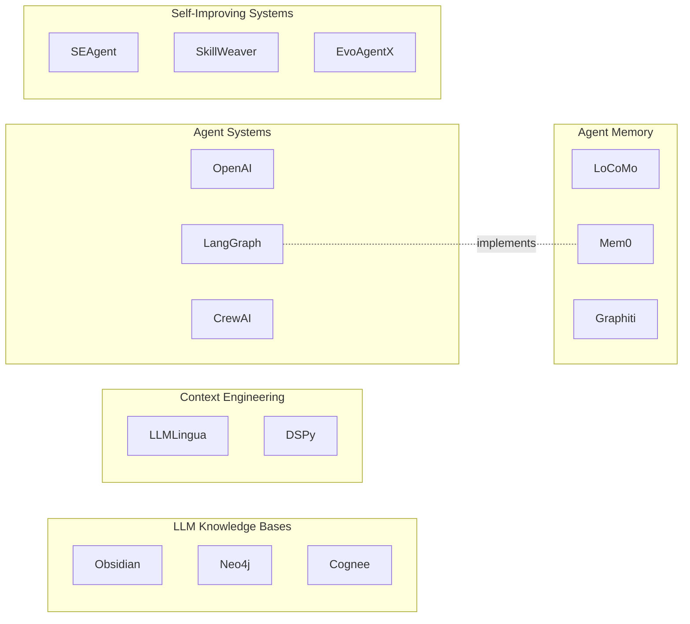

# The Landscape of LLM Knowledge Systems

Five areas have converged into a single engineering stack. At the bottom sits the knowledge base: a corpus of facts, documents, and structured data that agents need to reason about. Above that, agent memory manages which facts persist across sessions and how they get updated. Context engineering decides which of those facts load into the finite context window, in what form, at what moment. Agent systems run the actual tasks, calling tools and acquiring skills as they go. Self-improving systems close the loop by measuring what worked and feeding that signal back into every layer below. Strip any one layer out and the others degrade in predictable ways.

The [Knowledge Bases](knowledge-bases.md) synthesis covers the central question: what data structure lets agents retrieve facts reliably, at scale, as those facts change? The [Agent Memory](agent-memory.md) synthesis covers persistence: how do you store what an agent learned in session N so it matters in session N+47? The [Context Engineering](context-engineering.md) synthesis covers the window problem: how do you decide, in real time, which knowledge and instructions to load into the 128K tokens the model can actually see? The [Agent Systems](agent-systems.md) synthesis covers execution: how do agents acquire and compose skills, coordinate with each other, and avoid breaking what they already fixed? The [Self-Improving Systems](self-improving.md) synthesis covers feedback: how do you build a measurement loop that turns agent failures into permanent gains rather than repeated mistakes?

---

## Knowledge Graph

## The Unifying Architectural Idea

These five layers are a write-path / read-path pair running in parallel, not a simple pipeline.

The read path runs at task time: knowledge feeds memory, memory shapes context, context enables the agent to act. The write path runs at feedback time: agent actions produce outputs, outputs get evaluated, evaluations rewrite the knowledge base, update memory, and refine the context-loading rules. Both paths use the same underlying stores. The same markdown files that BM25 retrieves on the read path get agent-authored updates on the write path. The same temporal knowledge graph that answers "what do I know about user X" on the read path gets new edges written into it after every session.

This bidirectionality is what separates mature stacks from toy prototypes. A system that only reads from its knowledge base is a fancy search engine. A system that only writes is a logger. The compounding gains Andrej Karpathy demonstrated with [AutoResearch](projects/autoresearch.md) came from closing that loop: the agent's own outputs became inputs to the next iteration, accumulated in a git-backed store that neither the agent nor the human had to curate manually.

The finite context window is the constraint that makes all of this necessary. Every architectural decision in this space is downstream of one fact: you cannot load everything into the model at once. Chunking strategies, compression hierarchies, progressive disclosure tiers, temporal invalidation, skill routing -- all of these are responses to the same pressure. Build your system assuming the window is always too small, even when it currently isn't.

---

## Integration Points: Where One Layer Feeds the Next

**Knowledge Bases to Agent Memory**

A knowledge base stores facts about the world. Agent memory stores facts about the agent's interactions with the world -- user preferences, past decisions, errors, what was tried. The interface between them is extraction and deduplication: when a conversation ends, a memory system like [Mem0](projects/mem0.md) extracts factual assertions from the session, deduplicates them against existing stored memories, and writes survivors back into a persistent store. The resulting structure can be flat (a vector store of extracted facts), temporal (a knowledge graph with validity windows like [Graphiti](projects/graphiti.md)), or typed (specialized stores for episodic vs. semantic vs. procedural knowledge like MIRIX).

When this interface breaks, agents repeat themselves. A user tells the agent their timezone on Monday. The agent asks again on Thursday because the preference was never extracted, or was extracted but stored in a format retrieval cannot surface. The failure is invisible to the user until it accumulates into an impression that the agent is inattentive.

**Agent Memory to Context Engineering**

Memory stores know what the agent has learned. Context engineering decides what fraction of that knowledge loads into the active window. The interface is retrieval selection: given a query and a context budget, which memories are worth the tokens? [Hipocampus](projects/hipocampus.md) addresses the hardest case here -- the things the agent needs to know but doesn't know to search for. Its ROOT.md, a ~3K-token compressed topic index always loaded in context, gives the model a map of what exists before it issues any search query. On the MemAware benchmark, this produces 21x better implicit recall than no memory and 5x better than search alone.

When this interface breaks, you get retrieval that's technically correct but contextually useless. The memory system surfaces documents that are semantically related to the query but don't contain what the agent actually needs for the current task. Or the agent spends tokens on stale context because the system has no mechanism to recognize that a stored preference from six months ago has been superseded.

**Context Engineering to Agent Systems**

Context engineering determines what the agent knows and what tools it can see. Agent systems determine what the agent does with that. The interface is skill routing: loading the right instructions and capabilities for the current task. [Claude Code's four-mechanism decomposition](context-engineering.md) makes this concrete -- rules fire by file pattern, hooks run deterministic code on events, skills load on demand when task descriptions match, and sub-agents get their own models and isolation. This replaces the monolithic prompt with a composable stack where only relevant instructions are ever loaded.

When this interface breaks, agents ignore available capabilities because the skill's self-description doesn't match how the agent phrases its task. A skill for "Python data analysis" never fires when the task is "make a chart from this CSV." The [Agent Skills survey](agent-systems.md) documents a phase transition: beyond a critical skill library size, routing accuracy collapses. Flat registries don't scale past a few dozen entries.

**Agent Systems to Self-Improving Systems**

Agent systems produce outputs: code, answers, tool results, errors. Self-improving systems measure those outputs and feed the signal back upstream. The interface is the evaluation harness: a function that takes an agent's output and returns a scalar (or structured) judgment of quality. auto-harness mines production traces for failures, clusters them by root cause, and converts clusters into regression test suites automatically. [GOAL.md](projects/goal-md.md) adds the dual-score pattern -- separate scores for "did the agent solve the problem" and "can we trust the measurement instrument itself," preventing the failure mode where agents optimize for a broken metric.

When this interface breaks, gains don't compound. Fixed bugs get reintroduced. Successful strategies get forgotten. The agent that solved a hard task last week starts from scratch next week because nothing wrote the solution into a form the next run can access.

---

## Paradigm Fragmentation: Routing Logic for Retrieval

Three retrieval paradigms coexist because they solve different problems. The question isn't which is better -- it's which fits your query structure and corpus size.

**Use BM25 keyword search** when your corpus is well-organized markdown, queries use domain-specific terminology that appears verbatim in documents, and you need zero-infrastructure deployment. [Napkin](projects/napkin.md) scores 91% on LongMemEval-S with BM25 on markdown, beating the best embedding-based systems. The ceiling: BM25 cannot bridge vocabulary gaps. "Authentication" won't match "login" unless both terms appear in documents. For corpora under a few million words with controlled vocabulary, this ceiling rarely matters.

**Use embedding-based vector search** when queries require semantic similarity across vocabulary variations, when the corpus is heterogeneous (code, prose, structured data mixed together), and when you can afford the infrastructure. Vector search handles synonyms and paraphrase but retrieves by similarity to the query, which fails on unknown unknowns -- content the agent needs but doesn't know to search for.

**Use graph-structured retrieval** when queries require multi-hop reasoning across documents, when facts change over time and you need to query what was true at a specific moment, or when relationships between entities matter as much as the entities themselves. [GraphRAG](projects/graphrag.md) wins on sensemaking queries (72-83% comprehensiveness over naive RAG) but misses ~34% of answer-relevant entities during extraction, creating a hard accuracy ceiling. [Graphiti](projects/graphiti.md)'s temporal model wins when your data updates frequently and you need invalidation, not overwriting.

The practical answer for most production systems: hybrid retrieval combining BM25 with embeddings (Graphiti does this internally), with graph traversal reserved for queries that explicitly require relationship reasoning. Simple concatenation of BM25 and graph results yields +6.4% on multi-hop tasks over either alone.

---

## Implementation Maturity

**Production-ready, with caveats:**

[Mem0](projects/mem0.md) (51,880 stars) ships as a managed API with a clear three-call interface. The self-reported LOCOMO benchmarks (26% accuracy improvement, 90% token reduction) should be treated as directional, but the architecture is sound and in active production use. Caveat: memory poisoning from LLM extraction errors has no built-in correction mechanism.

[Graphiti](projects/graphiti.md) / [Zep](projects/zep.md) (24,473 stars) runs in production at enterprise scale with Neo4j, FalkorDB, Kuzu, and Amazon Neptune backends. The ingestion pipeline of 4-5 LLM calls per episode makes it unsuitable for real-time paths -- run ingestion as background tasks. The reliability caveat from the docs: non-OpenAI/Gemini models produce unreliable structured output for entity extraction, corrupting the graph.

[Letta](projects/letta.md) (21,873 stars, formerly MemGPT) ships a stable API with explicit memory blocks as first-class primitives. Memory behavior is inspectable and debuggable, unlike vector stores. The tradeoff is that memory quality depends entirely on the agent's own judgment about what to store.

**Maturing, not yet production-default:**

[GraphRAG](projects/graphrag.md) from Microsoft Research works for corpus-scale sensemaking but requires substantial infrastructure (community detection, embedding pipelines, managed graph stores) and the ~34% entity extraction miss rate makes it unsuitable as a sole retrieval method for fact-critical applications.

[Anthropic's skills](projects/anthropic-skills.md) (110,064 stars) specification has become the de facto standard for Claude Code and several other agent frameworks. The SKILL.md format is stable. The security problem -- 26.1% of community-contributed skills contain vulnerabilities in the survey data -- makes untrusted skill registries dangerous.

[CORAL](projects/coral.md) and [Darwin Gödel Machine](projects/darwin-godel-machine.md) work in controlled experimental settings. DGM's jump from 20% to 50% on SWE-bench is striking but self-reported. Neither is at a stage where you'd run it on production infrastructure unsupervised.

**Research-stage:**

RL-trained memory retrieval policies (the mem-agent training approach), multi-agent evolution with open-ended archive growth, and automatic metric construction for arbitrary tasks. The concepts are proven in papers; the tooling for applying them to arbitrary production problems doesn't exist yet.

---

## What the Field Got Wrong

The dominant assumption from 2023 through mid-2024: the retrieval problem is the memory problem. Build a good vector store, embed your documents, tune your chunking strategy, and agents will have access to what they need.

The assumption turned out to be wrong in a specific way. Retrieval only surfaces what you know to look for. The harder problem is the agent knowing what it doesn't know -- and therefore never issuing the right search query. Hipocampus's benchmark result makes this precise: on questions requiring implicit cross-domain knowledge (zero keyword overlap with stored content), vector search scores 0.7%. The ROOT.md approach scores 8.0%. Not because search is bad at retrieval, but because search requires the agent to already know what topic is relevant. For content the agent has no reason to look for, search structurally cannot help.

The replacement assumption: memory architecture needs both a retrieval layer (for known-unknown queries) and a map layer (for unknown-unknown navigation). The map is cheap -- a ~3K token compressed index loaded automatically -- but it's what makes the retrieval layer actually useful for the hardest questions.

---

## The Practitioner's Flow: A Real Task, End to End

Say a developer asks their coding agent to fix a performance regression in a Python service. The agent hasn't worked on this codebase in three weeks.

**Step 1 -- Map loading.** The agent's ROOT.md (managed by Hipocampus or a similar compaction system) loads automatically. It contains a ~3K-token index showing that this codebase has notes on database connection pooling, a past incident involving N+1 queries, and a profile from two weeks ago. The agent knows these exist before it searches for anything.

**Step 2 -- Memory retrieval.** Mem0's `search()` call pulls the most relevant session memories for this project: the user's preference for SQLAlchemy over raw psycopg2, the fact that the last migration changed the ORM version, a note that profiling showed 80% of latency in the `get_user_orders()` function.

**Step 3 -- Knowledge retrieval.** Based on the task description and the ROOT.md map, the agent issues BM25 searches via Napkin against the project's markdown knowledge base, pulling the architecture overview and the past incident postmortem. For the cross-document question "what changed between the previous and current ORM version that affects query patterns," it runs a graph traversal via Graphiti, which has tracked the ORM version as a temporal entity with validity windows.

**Step 4 -- Context assembly.** The context engineering layer (following Claude Code's decomposition) loads: the base coding rules, the Python-specific style rules (triggered by file path), the performance-debugging skill folder (loaded because the task matches "diagnose regression"), and the assembled knowledge from steps 1-3. Total: roughly 15K tokens, well within the window. The profiling skill contains its own instructions for running cProfile and interpreting flamegraphs.

**Step 5 -- Execution.** The agent runs, calls tools, writes code, runs tests. It finds an N+1 query introduced by the ORM version change.

**Step 6 -- Write-back.** After the session: Mem0's `add()` call extracts and stores the finding ("N+1 in get_user_orders, fixed by adding select_related in ORM v2"). The auto-harness pipeline converts the test that caught the regression into a permanent regression gate. The agent updates the postmortem markdown in the knowledge base. Graphiti writes a new edge: ORM v2 → N+1 risk in nested queries, valid from the migration date.

Three weeks later, when a different agent touches a related function, the ROOT.md index shows the postmortem exists, Graphiti surfaces the ORM v2 warning, and Mem0 returns the stored finding. The second agent doesn't rediscover what the first agent already learned.

---

## Cross-Cutting Themes

**Markdown as universal substrate.** Across all five layers, markdown is the format that works. Knowledge bases store content as markdown files. Memory systems extract facts to markdown notes. Skills are markdown documents with YAML frontmatter. Agent outputs get filed as markdown. Git diffs on markdown are human-readable. LLMs both read and generate markdown reliably. Every time a team has tried to use a more structured format (JSON knowledge graphs, XML agent state, binary embeddings as the primary store), they've added tooling overhead and lost human inspectability. Markdown won not because it's optimal but because it's the lowest-friction common format across all participants: humans, agents, and version control systems.

**Git as infrastructure, not just version control.** The autoresearch loop uses git as agent memory: `git log` is history, `git revert` is undo, branches are experiment namespaces. CORAL uses git worktrees to isolate parallel agents. GOAL.md uses commit messages as structured progress logs. The pattern works because git provides atomic writes, merge semantics, diff visibility, and rollback -- properties that ad-hoc file systems and databases don't offer by default. Agents that write to git get auditable, reversible, parallelizable memory for free.

**Context as a budget, not a container.** The 2025 survey covering 1,400+ papers formalizes this: C = A(c_instr, c_know, c_tools, c_mem, c_state, c_query), subject to |C| <= L_max. Every token has opportunity cost. The [meta-harness research](context-engineering.md) shows up to 6x performance gaps on identical models from context assembly differences alone. The practical consequence: every layer of the stack should ask "what's the cheapest way to represent this information" before "what's the most complete way." Hipocampus's ROOT.md, Napkin's progressive disclosure tiers, and Anthropic's skill-loading-on-demand all express the same budget discipline.

**Agents as authors of their own knowledge.** The Karpathy wiki pattern -- agents write articles, compile indexes, file outputs back into the knowledge base -- has become a design principle, not just a demo. In mature stacks, the distinction between "the knowledge base" and "what the agents produced" collapses. Agents are readers and writers of the same store. The implication for architecture: writes need to be as carefully designed as reads. Naive agent writes produce index drift, entity duplication in graphs, and contradictory stored memories. Mature stacks run a separate validation step (the Hermes supervisor pattern, Graphiti's edge contradiction resolution, GOAL.md's instrument-health check) before writes become permanent.

**The emergence of structured forgetting.** Every persistent memory system eventually confronts the question: what do you delete, and when? Supermemory implements automatic forgetting as a first-class feature. Graphiti's temporal model implicitly forgets by invalidating superseded facts while preserving history. Hipocampus's compaction tree (Raw -> Daily -> Weekly -> Monthly -> Root) progressively summarizes and discards detail. The naive approach -- keep everything forever -- breaks for two reasons: retrieval degrades as stores grow, and stale information actively harms quality when it contradicts current reality. The engineering problem is forgetting the right things: specifics that have been superseded, not patterns that generalize.

**Evaluation as a first-class engineering problem.** Self-improvement doesn't work without measurement, and measurement is harder than it looks. GOAL.md's dual-score pattern (task health + instrument health) addresses the failure mode where agents game a broken metric. auto-harness's regression-gate pattern addresses the failure mode where fixed bugs get reintroduced. The mem-agent RL training paper addresses the failure mode where format rewards (points for including `<think>` blocks) dominate task rewards and the agent farms turns rather than solving problems. In every case, the metric is as important as the system it measures. Teams that define evaluation as an afterthought consistently end up with systems that optimize for the wrong things.

---

## Reading Guide

**Building a retrieval system for a corpus of documents:** Start with [Knowledge Bases](knowledge-bases.md). If your corpus is under a million words and well-organized markdown, read the [Napkin](projects/napkin.md) project card first. If your data has complex relationships or changes frequently, read [Graphiti](projects/graphiti.md).

**Building an agent that remembers across sessions:** Start with [Agent Memory](agent-memory.md). [Mem0](projects/mem0.md) for conversational history at scale. [Graphiti](projects/graphiti.md) for temporally-structured facts. [Letta](projects/letta.md) if you want memory as an inspectable API primitive.

**Getting the most out of your context window:** Start with [Context Engineering](context-engineering.md). Read the [Hipocampus](projects/hipocampus.md) card for the unknown-unknowns problem. Read the [OpenViking](projects/openviking.md) card for filesystem-paradigm context management.

**Building multi-agent systems or skill-based agents:** Start with [Agent Systems](agent-systems.md). Read [Anthropic's skills](projects/anthropic-skills.md) specification first -- it's become the standard. Read [CORAL](projects/coral.md) if you're considering parallel agent architectures.

**Making a system that improves itself without babysitting:** Start with [Self-Improving Systems](self-improving.md). Read [autoresearch](projects/autoresearch.md) for the core loop pattern. Read [GOAL.md](projects/goal-md.md) for metric construction when no natural metric exists. Read [Darwin Gödel Machine](projects/darwin-godel-machine.md) if you want to understand where architectural self-modification is heading.

If you're not sure where to start, read the Knowledge Bases and Context Engineering syntheses in order. The retrieval architecture and context assembly problems are the load-bearing walls. Every other layer rests on how well you've solved those two.
