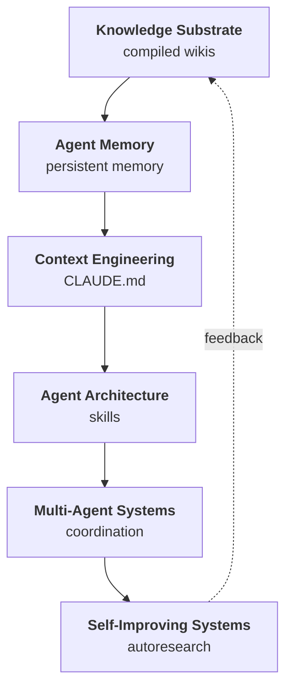

# The Landscape of LLM Agent Infrastructure

Six distinct engineering problems have been converging into a single stack. Build in any one area long enough and you run into the others. A memory system needs to compress context. A self-improving agent needs to route work across specialized sub-agents. A knowledge substrate needs to know what to write back when the agent learns something new. The boundaries between these areas are real but porous, and the connections between them matter more than the areas themselves.

This knowledge base covers the six core areas:

[Knowledge Substrate](knowledge-substrate.md) asks how agents represent and retrieve what they know. The central problem is that retrieval architecture determines what the agent can reason about, and the wrong choice at this layer corrupts everything downstream. [Agent Memory](agent-memory.md) asks how agents remember across sessions. Every architectural choice that improves one type of recall degrades another, and no single system navigates all the tradeoffs without cost. [Context Engineering](context-engineering.md) asks how agents manage the finite window between what they know and what they can act on. The window is the binding constraint the rest of the stack exists to serve. [Agent Architecture](agent-architecture.md) asks how you structure the scaffolding around a fixed model to maximize what it can accomplish. Harness changes alone produce up to 6x performance gaps on identical models and benchmarks. [Multi-Agent Systems](multi-agent-systems.md) asks how agents divide work, share state, and improve each other without a human in the loop. The hard problem has moved from coordination to self-improvement. [Self-Improving Systems](self-improving-systems.md) asks how agents measure their own performance and compound it over time. The prerequisite, building a reliable ruler before you can measure, turns out to be harder than the optimization loop itself.

---

## Knowledge Graph

## The Unifying Insight

The unifying architectural idea across all six areas is: **the agent is both a consumer and a producer of its own context.**

This sounds obvious. It has non-obvious consequences.

In a traditional software system, the program reads inputs and writes outputs. The data and the logic are separate. In an LLM agent stack, the agent reads context that was written by previous agent runs, decides what to remember, compresses what won't fit, routes subtasks to other agents, and writes structured outputs that future agents will treat as context. The agent is authoring for itself and for its successors. Every design decision in every layer of the stack either supports or undermines that authorship loop.

This is why a flat markdown file that an agent writes can outperform a vector database that a developer configures. The agent wrote the markdown for an agent to read. The format, the vocabulary, the structure, all optimized for the consumer. The vector embedding was optimized for a retrieval metric. These are different optimization targets, and the former wins more often than the field expected.

---

## Integration Points

### Knowledge Substrate feeds Context Engineering

Knowledge lives somewhere. Context is what you pull into the window before each inference. The interface between these two layers is the retrieval query, and what breaks when it's missing is relevance.

Napkin makes this interface explicit: four disclosure levels from a 200-token summary to a full file read, each triggered by different query confidence. [Graphiti](projects/graphiti.md) makes it richer: hybrid retrieval combining cosine similarity, BM25, and breadth-first graph traversal, filtered by bi-temporal edge validity. The difference matters when the knowledge base contains facts that have changed. A vector store returns the most semantically similar fact regardless of when it was true. A temporal graph returns the fact that was true as of the query timestamp.

When the knowledge-to-context interface is weak, the agent retrieves plausible content instead of relevant content, and plausible-but-wrong context is harder to recover from than no context at all.

### Context Engineering feeds Agent Memory

Whatever the agent processes in a session, some of it should survive. The interface between context engineering and memory is the write-back decision: what from this context window is worth persisting, in what form, at what granularity?

Acontext handles this with a three-stage distillation pipeline. A Task Agent extracts what happened. A Distillation phase classifies outcomes (success, failure, factual content, skip). A Skill Learner writes structured markdown. The distillation step is the interface: it transforms ephemeral context into durable memory.

Without this interface, agents either remember everything (expensive, noisy) or nothing (no learning across sessions). Lossless-claw demonstrated the failure mode: a production bug where content survived storage perfectly but became inaccessible because three formatting normalization layers stripped it between storage and retrieval. Perfect compression, broken retrieval, zero memory.

### Agent Memory feeds Agent Architecture

An agent's architecture determines what tools and skills it has access to. Its memory determines which tools it knows work in which contexts. The interface is the skill or instinct file: a persistent record of learned capability.

Everything Claude Code implements this with an Observer Agent running every five minutes, analyzing tool-call patterns, and converting them into "instincts" with confidence scores that decay over time. A skill the agent stops using loses confidence and eventually stops loading. A skill it uses successfully gains confidence and loads more readily. The architecture adapts to what memory says works.

When this interface is missing, agents have static capability sets regardless of accumulated experience. The architecture gets better with model upgrades, not with usage.

### Agent Architecture feeds Multi-Agent Systems

A single agent's architecture determines what it can do. Multi-agent architecture determines how agents compose. The interface is the task handoff: what information travels between agents, in what format, with what trust assumptions.

[MetaGPT](projects/metagpt.md) makes this interface typed: each role declares which `cause_by` action types it subscribes to, and the environment routes messages accordingly. [CORAL](projects/coral.md) makes it informal: a shared filesystem directory where agents write findings as markdown files. Typed interfaces give you auditability and structured payloads. Filesystem interfaces give you zero infrastructure and human-readable state.

When the inter-agent interface is undefined, you get silent failures. MetaGPT's `Environment.publish_message` drops messages when no subscription matches, with no trace of what was lost.

### Multi-Agent Systems feed Self-Improving Systems

Self-improvement requires evaluation, and evaluation at scale requires parallel agents running variants simultaneously. The interface is the experiment: a harness change proposed by one agent, evaluated by others, accepted or rejected based on holdout performance.

Meta-agent runs this loop explicitly: an LLM judge scores production traces, a proposer writes one targeted harness update, and a holdout evaluator decides whether the update survives. On tau-bench airline tasks, this loop moved accuracy from 67% to 87%. The multi-agent structure is what makes the evaluation trustworthy: the proposer and the judge are separate.

Without multi-agent evaluation, self-improvement collapses into self-reinforcement. The agent that proposes also evaluates, which means it grades its own homework.

### Self-Improving Systems feed Knowledge Substrate

Self-improvement produces knowledge: what worked, what failed, what the domain requires that the agent didn't know before. The interface is the write-back to the knowledge base. What did this optimization cycle learn that future cycles should know?

GOAL.md formalizes this with a dual-score pattern: one score for the thing being optimized, another for the quality of the measurement instrument. The second score feeds back into the knowledge substrate as metadata about trustworthiness. Future retrieval can filter by measurement quality, not just relevance.

Without this feedback loop, each self-improvement cycle starts from the same baseline. The agent gets better at individual tasks but doesn't accumulate knowledge about how to get better.

---

## Paradigm Fragmentation

Several areas have multiple valid approaches that coexist. The question is when to use which.

**Flat files vs. knowledge graphs for memory.** Use flat markdown when your knowledge base is under a few hundred articles, changes frequently, and you want zero infrastructure overhead. Napkin at 264 stars scores 91% on LongMemEval-S with no embeddings and no preprocessing. Use a temporal graph like [Graphiti](projects/graphiti.md) when you need to track how facts change over time, when multiple agents share the same knowledge, or when your domain requires multi-hop reasoning across entities. Graphiti makes 4-5 LLM calls per ingested episode and requires Neo4j or FalkorDB. That cost is justified for temporal reasoning. It is not justified for a personal coding assistant.

**Infrastructure-managed vs. agent-managed memory.** [Mem0](projects/mem0.md) manages memory extraction automatically; you pass messages and it decides what to keep. [Letta](projects/letta.md) (formerly MemGPT) lets the agent edit its own memory blocks through tool calls. Use infrastructure-managed when you want simple integration and don't need the agent to reason about its own memory state. Use agent-managed when the agent's beliefs about what it knows are themselves relevant to its behavior, for example, when the agent needs to express uncertainty about its own recall.

**Centralized orchestrator vs. decentralized coordination.** A centralized orchestrator routes tasks to specialized agents and aggregates results. Decentralized coordination (CORAL's shared filesystem, MetaGPT's pub-sub) lets agents self-select work. Use centralized orchestration when you need strict ordering, typed handoffs, and auditability. Use decentralized coordination when you want horizontal scaling and fault tolerance, accepting that you lose strong ordering guarantees.

**Harness optimization vs. self-modification.** Meta-agent rewrites prompts, hooks, and tool configurations. SICA rewrites the agent's own Python source code. Use harness optimization when you want low-risk, reversible changes that don't touch the execution engine. Use self-modification when harness changes have hit a ceiling and you're willing to accept higher variance and path dependence risk.

---

## Implementation Maturity

**Production-ready:** [Mem0](projects/mem0.md) (51,880 stars) is in production at multiple companies. [Graphiti](projects/graphiti.md) (24,473 stars) powers Zep in production deployments. [Anthropic's skills system](projects/anthropic.md) (110,064 stars) is the basis for Claude Code's own architecture. Everything Claude Code (136,116 stars) is widely deployed. [Obsidian Skills](projects/obsidian.md) (19,325 stars) has production users. These systems have real usage, documented failure modes, and maintainers who fix bugs.

**Early production / validated research:** Lossless-claw (~4,000 stars) has the DAG summarization approach validated in production but the bug history reveals the integration surface is brittle. [MetaGPT](projects/metagpt.md) (66,769 stars) is deployed but the silent message-drop failure mode is unresolved. Napkin (264 stars) has a reproducible benchmark but limited production deployment data. Acontext (3,300 stars) has the architecture validated; the distillation quality depends heavily on prompt engineering that is not yet standardized.

**Research / emerging:** SICA (299 stars) achieved 17% to 53% on SWE-Bench across 14 iterations but path dependence makes results hard to reproduce across runs. Meta-agent (20 stars) has strong benchmark results but minimal production exposure. [Memento](projects/memento.md) has compelling results on KV cache compression but requires fine-tuning and the training curriculum is not publicly released. Hipocampus (145 stars) shows strong benchmark numbers on MemAware but the benchmark is self-reported and the project is early.

---

## What the Field Got Wrong

The field assumed that semantic similarity search was the prerequisite for effective knowledge retrieval. Embeddings became the default. Vector databases proliferated. RAG became the standard architecture for grounding agents in external knowledge.

Napkin broke this assumption cleanly. BM25 on plain markdown files, with the LLM making the final relevance judgment from surfaced snippets, scored 91% on LongMemEval-S against an 86% prior best. No embeddings. No vector database. No preprocessing. The LLM, not a smaller embedding model, made the relevance call, and the LLM is better at that job.

The replacement assumption: the relevance judgment should happen at the model layer, not the retrieval layer. Retrieval narrows the candidate set. The model decides what's actually relevant. This changes the optimization target from "embedding that captures semantic similarity" to "retrieval that surfaces enough plausible candidates for the model to judge." BM25 surfaces plausible candidates well. Embeddings are not obviously better at that task, and they add significant infrastructure complexity.

This doesn't mean embeddings are wrong. It means they were over-deployed as a default before anyone had measured whether they outperformed the alternative.

---

## The Practitioner's Flow

A concrete example: a software agent receives a task to debug a production regression in a payments service it has worked on before.

The agent starts by loading its pinned context note from Napkin: 200 tokens summarizing the payments service architecture and recent relevant work. It runs a BM25 search against its knowledge base with the regression description, pulling the top-ranked snippets into context. Cost so far: under 2,500 tokens.

The task requires recalling a specific API contract change from three weeks ago. Napkin surfaces a markdown file with that change. The agent loads it at Level 3 (full file read, ~3,000 tokens). It now has relevant context without loading anything irrelevant.

The agent opens a [Graphiti](projects/graphiti.md) query for the service's entity graph, filtered to facts valid in the past month. The bi-temporal filter excludes a stale fact about a deprecated endpoint that would have appeared in a vector search. The graph returns the correct current state.

The agent writes a fix candidate and runs it against the test suite. It logs the execution trace to the session store. Lossless-claw compresses earlier turns in the conversation into a depth-1 summary, keeping the last 64 messages as a protected tail. The agent retains access to recent context without the window filling up.

The fix passes. Acontext's Task Extraction stage classifies the session as a success. The Distillation stage writes a SKILL.md file describing the pattern: how to identify this class of regression, what to check in the graph, what the fix looks like. That SKILL.md enters the knowledge substrate, available to future sessions.

A week later, the agent's meta-agent loop identifies that the payments service tasks have a systematic failure pattern in the trace logs. The proposer rewrites the harness to load payments-specific context earlier. Holdout accuracy improves. The update commits.

Total infrastructure: a markdown file system, Neo4j, SQLite for session storage, and two running agent loops. No vector database required for the retrieval layer. The complexity lives in the agents themselves, not the infrastructure.

---

## Cross-Cutting Themes

**Markdown as universal interchange format.** Skill files, memory outputs, knowledge bases, harness configurations, experiment logs: everything in this stack serializes to markdown. This is not accidental. Markdown is human-readable, diff-able, writable by LLMs without special tooling, and loadable into context without parsing. It is the format in which agents author for agents. The implicit assumption underlying the entire stack is that if you can represent it as markdown, you can share it across any boundary in the system.

**Git as infrastructure.** [CORAL](projects/coral.md) uses git worktrees as agent isolation. SICA uses git history to avoid repeating failed experiments. pi-autoresearch uses `git checkout` with staged file protection for auto-revert on failure. GOAL.md assumes git as the state store for improvement loops. Git gives you branching, history, diffing, merging, and atomic commits without any additional infrastructure. Self-improving agents need exactly these properties.

**Finite attention budget.** The context window is the binding constraint the rest of the stack exists to serve. Every system in this knowledge base is ultimately answering one question: given that inference scales with context length and context is finite, how do you put the right tokens in front of the model at the right time? Progressive disclosure, hierarchical summarization, BM25 pre-filtering, temporal graph retrieval: all of these are resource allocation strategies for a single shared resource.

**Agent as author.** Agents write for agents. [Anthropic's skills repo](projects/anthropic.md) documents this explicitly: the agent reads skill descriptions and decides what to load. Acontext's Skill Learner writes markdown that future agent sessions read. Napkin's benchmark advantage comes partly from knowledge bases written by LLMs, in vocabulary LLMs retrieve well. The optimization target for human-authored documentation (readability for humans) diverges from the optimization target for agent-authored documentation (retrievability and interpretability for LLMs).

**Emergence of forgetting.** Every memory system in this stack eventually confronts the question of what to delete. Graphiti invalidates edges rather than deleting them, preserving temporal history at the cost of storage growth. Lossless-claw compresses but never discards raw messages. Everything Claude Code's instinct system decays confidence scores, letting low-utility instincts fade without explicit deletion. Mem0 has no native expiration mechanism, which is why stale facts coexist with updated ones in vector space. Forgetting turns out to be architecturally harder than remembering.

**Binary evaluation.** Self-improving systems require scalar feedback. The default is binary pass/fail: the test suite passes or it doesn't, the holdout accuracy improves or it doesn't. Binary evaluation is easy to compute and hard to game, but it creates cliff edges in the optimization landscape. GOAL.md introduces the dual-score pattern to address this: one score for the artifact, one for the measurement instrument. When your metric is binary, your agent optimizes for the boundary, not for the interior.

**Passive telemetry over active contribution.** The best self-improvement systems in this stack collect data from what agents do, not from what developers explicitly annotate. Meta-agent uses unlabeled production traces. Everything Claude Code's Observer Agent watches tool calls without interrupting the workflow. SICA evaluates candidates against benchmarks that run automatically. Active contribution (asking developers to rate outputs, annotating failures) doesn't scale. The systems that compound are the ones that learn from the work, not from the annotation of the work.

**Trust as emergent property.** Multi-agent systems require agents to act on outputs from other agents without being able to verify them directly. [Graphiti](projects/graphiti.md)'s bi-temporal model builds trust through auditability: every fact carries a provenance timestamp, so the system can reconstruct what it believed and when. CORAL's shared filesystem builds trust through transparency: every agent's notes are readable by every other agent. Trust in these systems comes from legibility, not from cryptographic verification or access control. The agent trusts what it can read and inspect.

**Patterns that scale from single-agent to multi-agent.** BM25 retrieval over markdown works the same whether one agent or twenty maintain the knowledge base. Git worktrees isolate agents without requiring a coordination protocol. Progressive disclosure loads context on demand whether one agent or a pipeline of agents makes the request. The patterns that have proliferated across this stack are the ones that compose without modification. Architectures requiring central coordination, shared mutable state, or synchronization protocols fail to scale horizontally without redesign.

---

## Reading Guide

If you're building a knowledge base for agents to read and write: start with [Knowledge Substrate](knowledge-substrate.md). Read the Napkin benchmark carefully before committing to a vector database. Evaluate whether your use case needs temporal reasoning before paying the Graphiti ingestion cost.

If you're building persistence across sessions: read [Agent Memory](agent-memory.md) with the tradeoff table in mind. Vectors, graphs, and files each fail in different ways. Know which failure mode your application can tolerate.

If you're fighting context window limits in a single agent: [Context Engineering](context-engineering.md) covers the current state of compression and progressive disclosure. The Memento results on KV cache compression are worth watching even if you can't use them yet.

If you're designing how an agent uses tools and skills: [Agent Architecture](agent-architecture.md) covers the SKILL.md ecosystem and the harness optimization results. The Meta-Harness ablation study (50.0 median accuracy with full traces vs. 34.9 with summaries) should change how you think about what feedback you give an agent.

If you're coordinating multiple agents: [Multi-Agent Systems](multi-agent-systems.md) covers both coordination patterns and the shared memory approaches. Start with the routing question (typed message bus vs. filesystem) before the memory question.

If you're building loops where agents improve over time: [Self-Improving Systems](self-improving-systems.md) covers the autoresearch pattern, harness optimization, and literal self-modification. The prerequisite reading is the dual-score pattern in GOAL.md. Build the ruler before you run the loop.
