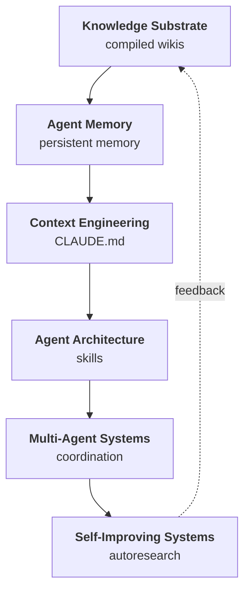

# The Landscape of LLM Agent Infrastructure

Six areas define how LLM agents work in production today: [Knowledge Substrate](knowledge-substrate.md), [Agent Memory](agent-memory.md), [Context Engineering](context-engineering.md), [Agent Architecture](agent-architecture.md), [Multi-Agent Systems](multi-agent-systems.md), and [Self-Improving Systems](self-improving-systems.md). Each has a synthesis article. Each has a central engineering problem.

**Knowledge Substrate** asks how you represent and retrieve information for agents to use. The central tension: flat markdown with keyword search versus temporal knowledge graphs. Napkin's BM25 approach beat infrastructure-heavy RAG pipelines on LongMemEval; [Graphiti](projects/graphiti.md)'s temporal graph tracks how facts change over time. Neither is universally better.

**Agent Memory** asks how agents accumulate and reuse information across sessions. The failure mode that defines the field: [Zep](projects/zep.md)'s temporal graph scored 17.7% *worse* than baseline on questions about the assistant's own prior reasoning, because the extraction pipeline was tuned for user-stated facts and dropped assistant-generated content.

**Context Engineering** asks what goes in the prompt window and how to assemble it. The budget is fixed. Every token spent on one thing cannot be spent on another. The architecture choices here determine what the agent can know at any given moment.

**Agent Architecture** asks how a single agent acquires capabilities, improves its performance, and structures its own reasoning. [Meta-Harness](concepts/agent-harness.md) demonstrated that the scaffolding around a model can matter more than the model itself: Haiku 4.5 with an agent-discovered harness beat hand-engineered harnesses that had months of human iteration.

**Multi-Agent Systems** asks how multiple agents coordinate without collapsing into confusion. The coordination layer (message bus, filesystem, pub-sub) determines what information flows between agents, and what gets silently dropped.

**Self-Improving Systems** asks how agents get better over repeated runs without human intervention. Three failure modes bound the field: no natural metric to optimize, modification space narrower than the space of useful changes, no institutional memory across sessions.

---

## Knowledge Graph

## The Unifying Insight

All six areas are solving the same problem: **how to route information to the right computational process at the right time, at bounded cost**.

Every architectural decision in this stack is a routing decision. Which facts get extracted into memory (and which get dropped)? Which context items sit in every prompt (and which load on demand)? Which agent handles which task? Which improvements survive to the next session?

The context window is the choke point. Everything else is an answer to the question of what deserves to pass through it. Knowledge substrate determines what's available. Memory determines what persists. Context engineering determines what gets loaded. Agent architecture determines what the agent does with it. Multi-agent systems distribute the load across multiple windows. Self-improvement modifies the routing rules themselves.

This is not six separate markets. It is one resource allocation problem at six different levels of abstraction.

---

## Integration Points

### Knowledge Substrate feeds Context Engineering

The knowledge substrate produces retrievable artifacts. Context engineering decides which artifacts to retrieve, when, and how to assemble them into a prompt.

The interface between them is the retrieval query: a search string, an embedding vector, a graph traversal, or a Cypher query. The quality of that interface determines whether the right knowledge reaches the context window.

When this interface breaks, the agent halves its effective knowledge base without knowing it. Lossless-claw's production bug illustrates the failure mode precisely: content survived storage intact but three formatting normalization layers stripped it between storage and retrieval. Perfect storage plus broken retrieval equals zero memory. The substrate and the assembly layer must agree on format, or everything downstream degrades silently.

The routing logic here: use BM25 (Napkin) when queries have clear keywords and the knowledge base is under ~100 articles. Use graph traversal (Graphiti) when facts evolve over time and you need temporal queries. Use always-resident indexes (Hipocampus's ROOT.md) when the agent must surface context the user did not explicitly ask about.

### Agent Memory feeds Knowledge Substrate

Memory systems produce the persistent facts, extracted episodes, and accumulated observations that populate the knowledge substrate. Memory determines what gets written. The substrate determines how it's stored and found.

The interface is the extraction pipeline: what gets pulled from a conversation, how it gets structured, and what metadata attaches to it. [Mem0](projects/mem0.md) extracts facts as flat strings. [Graphiti](projects/graphiti.md) runs 4-5 LLM calls per episode to extract typed triples with temporal bounds.

When this interface breaks, you get memory pollution: bad extractions accumulate and contaminate future retrievals. The Zep/Graphiti failure on assistant-generated content shows what extraction bias looks like in practice. The pipeline was tuned for user facts; assistant reasoning dropped out. The knowledge substrate faithfully stored exactly what the extraction pipeline gave it, which turned out to be a systematically incomplete record.

### Context Engineering feeds Agent Architecture

Context engineering assembles the prompt. Agent architecture determines what the agent does with it: which tools to call, which sub-agents to spawn, which skills to activate.

The interface is the loaded context itself: the system prompt, skill descriptions, retrieved facts, conversation history. Agent architecture reads this and makes decisions. When context engineering loads the wrong things, the agent makes decisions from bad premises.

[Anthropic](projects/anthropic.md)'s three-tier progressive disclosure (metadata always loaded, instructions on trigger, resources on demand) was designed specifically to make this interface tractable. The agent sees 100-token skill descriptions for everything it knows how to do, then pays full context cost only for the skills it's actively using. Without this gating, a large skill registry would consume the entire context window before the agent could do any work.

The failure mode: skill triggering depends on description quality. Anthropic's own documentation warns that Claude tends to under-trigger skills, and that making descriptions "a little bit pushy" to compensate creates false-positive triggering. The context engineering layer and the agent's routing logic are coupled, and tuning one changes the behavior of the other.

### Agent Architecture feeds Multi-Agent Systems

Individual agent capabilities and harness design determine what multi-agent systems can do. A multi-agent system is only as capable as its component agents.

The interface is the agent's API surface: what it accepts as input, what it produces as output, how it signals completion or failure. Multi-agent coordination works by routing tasks to agents and assembling their outputs.

[MetaGPT](projects/metagpt.md)'s subscription-based architecture makes this interface explicit: each role defines what message types it watches (`_watch()`) and what it publishes. Adding a new agent means defining its subscriptions. The coordination topology is a design artifact, not an emergent property.

When this interface breaks, tasks vanish. MetaGPT's `Environment.publish_message()` silently drops messages when no role's `member_addrs` matches the routing. In a pipeline with dynamic role addition, there is no error signal when a task disappears. The agent completed its work; it just published to nowhere.

### Multi-Agent Systems feed Self-Improving Systems

Multi-agent systems generate the execution traces, benchmark scores, and comparative performance data that self-improving systems use to update harnesses, playbooks, and skills.

The interface is the trace: a record of what the agent did, what succeeded, what failed, and at what cost. [Meta-Agent](concepts/meta-agent.md) reads these traces, scores them with an LLM judge, and proposes targeted harness updates. The quality of the trace determines the quality of the improvement.

The Meta-Harness ablation makes this quantitative: full execution trace access yields 50.0 median accuracy. Scores only: 34.6. Scores plus summaries: 34.9. Compressed feedback destroys the causal signal. The self-improvement system needs the raw trace, not a summary of it, to understand why something failed and what to change.

### Self-Improving Systems feed Knowledge Substrate

Self-improvement produces artifacts: updated playbooks, new skill files, revised harness configurations, extracted lessons. These artifacts feed back into the knowledge substrate as persistent, queryable knowledge.

The interface is the skill file or playbook entry: a structured markdown document that encodes what the agent learned. Acontext converts execution traces into skill files with YAML frontmatter through a three-stage pipeline: task extraction, LLM-as-judge distillation, and skill agent writing. Autocontext's Coach agent writes playbook entries delimited by `<!-- PLAYBOOK_START/END -->` markers.

When this interface breaks, learning doesn't persist. Autocontext's Curator agent exists because ungated learning pollutes the knowledge base faster than good lessons accumulate. The self-improvement loop without a curator is a memory pollution machine.

---

## Paradigm Fragmentation

Several areas have multiple valid approaches with no clear winner. The right choice depends on constraints that vary by deployment.

**Retrieval: keyword search vs. embeddings vs. graphs.** Use BM25 (Napkin) when your knowledge base has consistent terminology, stays under ~100 articles, and you want zero infrastructure. Use embeddings (Mem0, most RAG systems) when vocabulary varies and you can tolerate preprocessing cost. Use temporal graphs (Graphiti) when facts change over time and you need queries like "what did we believe about X in January?" Flat markdown beats all three on setup time. Graphs beat all three on temporal reasoning (+48.2% on temporal questions in LongMemEval). The wrong choice here causes silent degradation: vocabulary mismatch in BM25, embedding drift in vector stores, ingestion cost spikes in graphs.

**Context assembly: always-resident vs. retrieval-only vs. hybrid.** Always-resident indexes (Hipocampus's ROOT.md at ~3K tokens) win when the agent needs to surface context the user didn't request. Search-only (Napkin) wins when queries have clear keywords and you want minimal overhead. Hybrid wins on both dimensions at the cost of maintaining a compaction pipeline. The crossover point: when your knowledge base exceeds ~100 articles or ~400K words, Karpathy's flat LLM wiki pattern starts requiring more active curation, and tiered approaches pay off.

**Multi-agent coordination: subscription-based vs. conversational vs. filesystem.** MetaGPT's subscription routing works when pipelines are deterministic and repeatable. AutoGen's conversational routing works for exploratory workflows where you can't predict the interaction pattern. CORAL's filesystem coordination works for optimization loops where agents share knowledge across long-running experiments without any message queue infrastructure.

**Self-improvement target: harness vs. scaffold vs. knowledge vs. memory architecture.** Harness optimization (meta-agent, Meta-Harness) is lowest risk with clear rollback. Scaffold modification (SICA) has higher leverage but path-dependent failures. Knowledge accumulation (Autocontext, Acontext) produces persistent, human-readable artifacts but requires curator logic to prevent pollution. Memory architecture evolution (MemEvolve) is the most ambitious and the least production-ready.

---

## Implementation Maturity

**Production-ready:**
- [Mem0](projects/mem0.md) (51,880 stars): flat fact storage with vector search, used in production applications
- [Graphiti](projects/graphiti.md) / [Zep](projects/zep.md) (24,473 stars): temporal knowledge graphs with peer-reviewed benchmark results
- [MetaGPT](projects/metagpt.md) (66,769 stars): subscription-based multi-agent coordination
- [AutoGen](projects/autogen.md) (42,000+ stars): conversational multi-agent patterns
- [DSPy](projects/dspy.md) (23,031 stars): algorithmic prompt optimization
- [Anthropic Skills](projects/anthropic.md) (110,064 stars): skill-as-file architecture with progressive disclosure
- Everything Claude Code (136,116 stars): large-scale skill registries

**Mature but specialized:**
- Lossless-claw: DAG-based hierarchical summarization, solid on OOLONG benchmark but single-conversation scope
- Napkin (264 stars): BM25 on markdown, production-quality results on LongMemEval, minimal adoption
- Acontext (3,264 stars): trace-to-skill conversion pipeline
- gstack (63,766 stars): skill composition into sequential pipelines

**Research-grade, running in experiments:**
- SICA (299 stars): scaffold self-modification, 17%→53% on SWE-Bench but path-dependent
- [Meta-Harness](concepts/agent-harness.md): agent-driven harness search, published results but no public production deployment
- Autocontext (695 stars): five-agent improvement loop, works in controlled settings
- CORAL (120 stars): filesystem-coordinated multi-agent evolution

**Early / conceptual:**
- [MemEvolve](projects/memevolve.md): memory architecture evolution, no public benchmark results
- [EvoAgentX](projects/evoagentx.md) (2,697 stars): unified optimization framework, promising but unvalidated at scale
- meta-agent (20 stars): strong early results (67%→87% on Tau-bench) but very new

---

## What the Field Got Wrong

The dominant assumption through 2024 was that semantic similarity search was a prerequisite for effective knowledge retrieval. The reasoning seemed solid: BM25 fails on vocabulary mismatch, embeddings capture meaning rather than surface form, therefore embeddings are strictly better.

Napkin falsified this with a reproducible benchmark. BM25 on plain markdown files scored 91% on LongMemEval-S, beating the previous best system at 86% and GPT-4o with full context stuffing at 64%. No embeddings, no preprocessing, no vector database. The reason the assumption failed: when the LLM itself makes the relevance judgment from BM25-surfaced snippets, the model's reading comprehension compensates for BM25's vocabulary limitations. The embedding model was doing relevance ranking that a much more capable model could do from keyword-matched candidates.

This changes the architecture. Vector databases are not a prerequisite for memory. They may still be the right choice in specific circumstances (large corpora, high vocabulary variance, multilingual content), but they are not the default foundation. The field spent significant infrastructure investment on a layer that turns out to be optional in many cases.

The replacement assumption: retrieval quality depends on who makes the relevance judgment, not just how candidates are selected. BM25 with LLM reranking often beats embedding-only pipelines because the reranker is orders of magnitude more capable than the embedding model.

---

## The Practitioner's Flow

A mature stack processing a real task looks like this.

A user asks a coding agent to refactor a payment processing module to handle a new currency. The task arrives with no context about prior decisions, existing conventions, or known failure modes.

**Step 1: Context assembly.** The harness runs before the agent sees the task. Lossless-claw assembles the session context: protected fresh messages from the tail of conversation history, budget-constrained summaries from the DAG for older context, and a dynamic system prompt injection calibrated to compaction depth. If the session is heavily compacted (depth >= 2), the agent gets an explicit uncertainty checklist. Simultaneously, the skill registry loads metadata for all available skills (100 tokens per skill, always resident). The agent knows what it can do before it knows what it needs to do.

**Step 2: Knowledge retrieval.** The agent recognizes it needs context about the codebase's payment conventions. It queries the knowledge substrate. If the team uses Napkin, this is a BM25 search over markdown files in the project wiki, returning the top-ranked snippets about payment handling. If they use Graphiti, it's a temporal graph query returning the current state of facts about the payment module plus the history of changes. The retrieval results load into context alongside the task.

**Step 3: Memory lookup.** [Mem0](projects/mem0.md) or [Zep](projects/zep.md) queries for prior facts about this user and project: past decisions, stated preferences, known constraints. These surface as a few hundred tokens of retrieved facts. If the agent has worked on this codebase before and logged lessons through Acontext, those skill files load on trigger from the skill registry.

**Step 4: Task execution.** The agent works. It uses tools. It reads files, modifies code, runs tests. Every action produces a trace entry: what was called, what was returned, what decision followed.

**Step 5: Memory writing.** After the task, Mem0 extracts new facts from the session. Graphiti ingests the conversation as an episode, running its entity extraction pipeline to update the temporal knowledge graph with any new facts about the payment module. If the team runs Acontext, the execution trace feeds a three-stage distillation pipeline: task extraction, LLM-as-judge classification, skill agent writing. New skill files land in the knowledge substrate, available for future sessions.

**Step 6: Improvement loop (if configured).** If meta-agent or Autocontext is running, the trace joins a batch for overnight processing. A proposer reads failed traces, writes targeted harness updates, and tests them against a holdout set. Survivors merge into the harness configuration for tomorrow's sessions. The agent that runs tomorrow has a slightly better system prompt than the agent that ran today, based on what today's agent got wrong.

The entire flow is a routing problem: information moving from storage to context to execution to storage again, with each stage making decisions about what passes through.

---

## Cross-Cutting Themes

**Markdown as universal interchange format.** Skill files, playbook entries, memory extracts, wiki pages, context indexes, README files: the entire stack writes and reads markdown. This is not a design choice any single project made. It emerged because markdown is human-readable, LLM-readable, git-diffable, and filesystem-portable. The format became infrastructure.

**Git as infrastructure.** CORAL puts each agent in a git worktree. Meta-Harness tracks harness candidates with version control. SICA commits each scaffold modification before evaluating it. Autocontext maintains playbook history as a versioned artifact. Git provides rollback, diff, history, and branch semantics for free. The agent ecosystem runs on version control.

**Finite attention budget as the organizing constraint.** Every architectural decision in this stack is a consequence of the context window being finite and expensive. Progressive disclosure exists because of token budgets. Hierarchical summarization exists because conversation histories overflow windows. Knowledge graphs exist partly because they retrieve fewer tokens than full documents. Multi-agent systems exist partly because no single context window can hold everything a complex task requires. The constraint generates the architecture.

**Agents writing for agents.** Karpathy's wiki pattern has an LLM maintain index files for other LLM sessions. Autocontext's Coach writes playbook entries that the agent reads next session. Acontext converts traces into skill files that future agents load. The primary consumer of LLM-generated text, in these systems, is other LLM sessions. This changes what "good writing" means: density, structure, and searchability matter more than readability.

**Forgetting as a design problem.** Every memory system must decide what to drop. Lossless-claw's DAG compresses old content into progressively abstract summaries. Hipocampus's ROOT.md budget forces aggressive compression as knowledge grows. Graphiti expires contradicted facts rather than deleting them. The question is not whether the system forgets, but what it forgets and whether the forgetting is recoverable. "Lossless" in Lossless-claw's name is aspirational: the DAG preserves structure, but compression is lossy by definition.

**Binary evaluation as a bottleneck.** Self-improving systems need metrics. Most real tasks don't have natural scalar metrics. Meta-Harness works on benchmarks with clear scoring. Meta-agent uses an LLM judge to generate scores on unlabeled traces. Autocontext uses Elo/Glicko backends plus Pareto optimization. The field is building increasingly sophisticated proxies for "did the agent do a good job," because the ground truth is usually absent or expensive to obtain.

**Passive telemetry over active contribution.** Memory systems extract facts from conversations without the user doing anything. Trace logging captures agent behavior without the agent deciding to log it. Skill files get generated from execution histories automatically. The knowledge accumulation that matters in these systems happens as a side effect of normal operation, not through deliberate curation. This is architecturally important: active contribution systems have low adoption because users don't contribute. Passive extraction scales.

**Trust as an emergent property.** Multi-agent systems have no central authority verifying that agents are doing what they claim. CORAL agents write to shared directories that other agents read without validation. Autocontext's Analyst diagnoses failures that the Coach encodes as lessons without verification. A misdiagnosis propagates through the knowledge layer because trust flows from position in the pipeline, not from verification. Trust in these systems is a function of pipeline design, not cryptographic guarantees.

**Single-agent patterns that scale to multi-agent.** Progressive disclosure works for one agent choosing which skills to load; it also works for an orchestrator choosing which sub-agents to spawn. BM25 retrieval works for one agent searching a knowledge base; it also works for agents searching shared knowledge. The DAG summarization in Lossless-claw handles one agent's conversation history; the same structure could handle a multi-agent session log. The patterns that work at single-agent scale tend to compose naturally because they're solving the same routing problem at a different level of aggregation.

---

## Reading Guide

**You're building a chatbot or assistant with memory across sessions.** Start with [Agent Memory](agent-memory.md). [Mem0](projects/mem0.md) gives you a working API in an afternoon. Read the Zep/Graphiti section if you need temporal reasoning or fact evolution. Then read [Knowledge Substrate](knowledge-substrate.md) for the retrieval layer underneath.

**You're building a coding agent or autonomous task executor.** Start with [Agent Architecture](agent-architecture.md). The Meta-Harness result is the most important thing to internalize: your harness matters as much as your model. Then read [Context Engineering](context-engineering.md) for prompt assembly, and [Self-Improving Systems](self-improving-systems.md) if you want the agent to improve over repeated runs.

**You're building a multi-agent system.** Start with [Multi-Agent Systems](multi-agent-systems.md) for coordination patterns. Then read [Agent Architecture](agent-architecture.md) for individual agent design, because your multi-agent system's ceiling is the capability of its component agents.

**You're building infrastructure: a memory layer, a retrieval system, a skill registry.** Start with [Knowledge Substrate](knowledge-substrate.md) and [Context Engineering](context-engineering.md). The Napkin benchmark result and Graphiti's temporal model are the two most important data points in the field right now. Read both synthesis articles before making architectural choices.

**You want agents that improve without human intervention.** Start with [Self-Improving Systems](self-improving-systems.md). Be honest about whether your task has a natural metric before reading anything else. If it doesn't, you'll spend most of your time building the measurement system, not the improvement loop.

**You're trying to understand the whole field before making any decisions.** You just read the right article. The synthesis articles go one level deeper on each area. The project cards go deeper still on specific tools.
