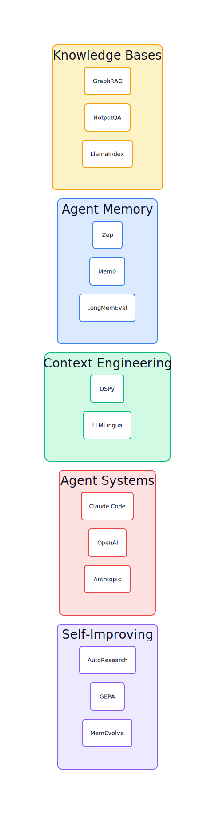

# The Landscape of LLM Knowledge Systems

Five areas of active development sit in every serious practitioner's reading list: knowledge bases, agent memory, context engineering, agent systems, and self-improving systems. Most people encounter them as separate topics. They are five layers of the same stack, and the interfaces between them are where most production systems break.

The unifying idea: knowledge feeds memory, memory shapes context, context enables agents to act, and agent actions create the feedback loops that let systems improve. Remove any layer and the stack degrades in a specific, predictable way.

## The Five Layers

**Knowledge bases** are the raw substrate. Documents, facts, structured records, conversation histories. The central engineering problem is retrieval: given a query at runtime, which pieces of knowledge are relevant? The answer depends on whether knowledge is stored as vector embeddings, graph edges, or plain text files, and whether it is static or continuously updated. See [The State of LLM Knowledge Bases](knowledge-bases.md).

**Agent memory** is knowledge personalized and temporalized. Where a knowledge base stores what is true in general, agent memory stores what is true for this user, in this context, as of this moment. The central engineering problem is persistence: how does information cross the session boundary, and how does the system handle contradictions between what it "knew" last week and what it learns today? See [The State of Agent Memory](agent-memory.md).

**Context engineering** is the runtime assembly problem. Given all the knowledge and memory available, what goes into the context window for a specific task? At 1 million tokens of capacity, naive approaches still fail because attention is not uniform and cost is not zero. The central engineering problem is selection: what to include, at what level of detail, in what order. See [The State of Context Engineering](context-engineering.md).

**Agent systems** are where knowledge, memory, and context combine into something that takes actions. An agent without good memory repeats mistakes. An agent without good context engineering hallucinates from incomplete information. An agent without a knowledge substrate cannot ground its actions in facts. The central engineering problem is coordination: how do multiple agents share state without corrupting it? See [The State of Agent Systems](agent-systems.md).

**Self-improving systems** close the loop. Agent actions produce outcomes; outcomes generate training signal; training signal updates skills, knowledge, and memory. The central engineering problem is the fitness function: what counts as improvement, and how do you prevent the system from gaming the metric? See [The State of Self-Improving Systems](self-improving.md).

## Integration Points

### Knowledge Bases -> Agent Memory

The interface is ingestion and extraction. A knowledge base holds raw documents. Agent memory holds extracted, structured, personalized facts. The pipeline that converts one into the other determines retrieval quality.

[Graphiti](projects/graphiti.md) (24,473 stars) makes this interface explicit: every document episode triggers entity extraction, relationship building, and fact invalidation against existing edges. The validity window `(entity -> relationship -> entity, valid_from, valid_to)` means the memory layer knows not just what is true but when it was true. [Cognee](projects/cognee.md) (14,899 stars) runs a similar `cognify()` pipeline on ingest.

When this interface is missing, you get semantic staleness: a user's preferences change, but the old high-similarity vector still scores highest. The agent acts on a fact that stopped being true six months ago. [Mem0](projects/mem0.md) (51,880 stars) handles this with LLM-driven extraction at each session boundary: the model decides what to write back, which facts to update, which to discard.

### Agent Memory -> Context Engineering

Memory stores facts. Context engineering decides which facts to surface for a specific task. The interface is retrieval routing: given a query, which memory stores get searched, by what method, and how do results get assembled?

[Hipocampus](projects/hipocampus.md) (145 stars) makes the routing problem concrete. Its ROOT.md is a 3K-token topic index loaded at every session start, giving the agent a map of what it knows before any retrieval query fires. Entries like `legal [reference, 14d]: Civil Act S750 -> knowledge/legal-750.md` let the agent jump to relevant files rather than running similarity search against unknown unknowns. On MemAware: 21% overall versus 3.4% for vector search alone.

When this interface breaks, you get the unknown-unknowns problem: the agent does not retrieve relevant context because it does not know to search for it. A decision made three weeks ago in a different domain affected today's task, but no query surfaces it.

[OpenViking](projects/openviking.md) (20,813 stars) addresses assembly. Its L0/L1/L2 tiered loading means the agent loads one-sentence abstracts for all candidates, promotes relevant ones to full content, and avoids context bloat. On LoCoMo10: 52% task completion versus 36% baseline at 83% lower token cost.

### Context Engineering -> Agent Systems

Context engineering produces the assembled input. Agent systems consume it and decide what actions to take. The interface is the system prompt and tool call schema.

[Anthropic's Skills repo](projects/anthropic.md) (110,064 stars) standardized one half: SKILL.md files with YAML frontmatter for discoverability and markdown bodies, enabling progressive disclosure. A survey found 26.1% of community skills contain vulnerabilities, making provenance and governance active problems.

[Acontext](projects/acontext.md) (3,264 stars) treats skills as the memory format: after each task, a distillation pipeline extracts what worked and writes to a SKILL.md schema. The agent recalls by calling `get_skill`, no semantic search, just tool calls and structured files.

When this interface is poorly designed, agents get brittle. A skill exists in memory but the context layer never surfaces it. Or the agent loads too many skills at startup, burning context on irrelevant capabilities.

### Agent Systems -> Self-Improving Systems

Agent execution produces outcomes. Self-improving systems turn those outcomes into capability updates. The interface is the evaluation loop: task execution -> scoring -> write-back to skills, memory, or model weights.

[Memento-Skills](projects/memento-skills.md) (916 stars) operationalizes this at the skill level: execute, reflect, assign utility scores, update the skill router. All adaptation stays in external files. [ACE](projects/agentic-context-engine.md) (2,112 stars) goes further with a Recursive Reflector that writes Python in a sandbox to extract patterns from traces. On Tau2: 15 learned strategies doubled pass^4 consistency.

[CORAL](projects/coral.md) (120 stars) handles the multi-agent variant. Each agent in its own git worktree branch. Shared state in `.coral/public/` symlinks into every worktree.

When this interface is absent, agents repeat mistakes across sessions. Every task starts cold. This is the default state of most deployed agents.

## Cross-Cutting Themes

### Markdown Won

Across all five domains, the output format is overwhelmingly markdown. Knowledge bases compile to markdown wikis. Agent memory stores to markdown files. Context architecture lives in CLAUDE.md. Skills are SKILL.md folders. Self-improving loops track changes via markdown specs.

Markdown is the one format that is human-readable, LLM-readable, version-controllable, and renderable in multiple tools. It is the lingua franca of LLM-native knowledge engineering.

### The Finite Attention Budget

The most important shared insight: **context is a finite resource that degrades with scale, not a container that expands with window size**.

Knowledge base builders discovered this when RAG systems silently degraded from context bloat. Memory system builders discovered it when full-context injection caused 90% more token waste than selective retrieval. Context engineers formalized it as "context rot." Skill system builders solved it with progressive disclosure. Self-improving systems bypassed it by offloading knowledge to git and markdown.

Every serious system converges on: **load the minimum context at the lowest resolution that answers the question**.

### The Agent as Author

Across all five domains, agents are shifting from consumers of human-authored content to authors of their own knowledge. Agents compile knowledge bases. Agents maintain their own memory. Agents evolve their own context playbooks. Agents design their own skills. Agents improve their own code.

The human's role shifts from author to editor: defining constraints, reviewing outputs, designing reward functions. The Karpathy Loop makes this explicit: the human writes `program.md` (the spec), the agent writes `train.py` (the implementation).

### Git as Infrastructure

Git appears everywhere: as the experiment ledger for self-improving loops, as the version control layer for knowledge bases, as the distribution mechanism for skills, as the session persistence layer for context management. Git provides atomicity (revert is trivial), auditability (diff any two versions), and collaboration (human reviews what the agent produced). No database or proprietary system offers all three simultaneously.

### The Emergence of Forgetting

The field is recognizing that forgetting is as important as remembering. [MemoryBank](projects/memorybank.md) (419 stars) implements Ebbinghaus-inspired forgetting curves. [Graphiti](projects/graphiti.md) invalidates facts when contradictions are detected. [MemEvolve](projects/memevolve.md) (201 stars) evolves memory architecture including what to discard. Self-healing knowledge bases prune stale data through linting loops.

Systems that only append will drown in noise. The hardest design decision in agent architecture is not what to remember. It is what to forget.

### Binary Evaluation as Universal Primitive

The most consistent practical finding across self-improving systems and skill evaluation: binary assertions beat subjective scoring. Does the response include an empathy phrase? Is the word count under 200? Does it avoid invented policies? Deterministic, comparable, debuggable. The moment you introduce a 1-7 scale, the system learns to produce outputs that score 5 but read like garbage.

## What the Field Got Wrong

The dominant assumption from 2023: retrieval quality determines agent quality. Build a better vector database, maintain better embeddings, retrieve more relevant chunks.

The assumption was incomplete in a specific way: retrieval quality determines agent quality on tasks where the agent knows what to search for. For the broader class of tasks where relevant context is not obvious from the query, retrieval does not help because no query fires for the relevant information.

The replacement insight: agents need both retrieval and disclosure. Retrieval is reactive: it answers queries. Disclosure is proactive: it surfaces context the agent did not know to ask for. Hipocampus's ROOT.md, OpenViking's tiered loading, and SKILL.md progressive disclosure are all implementations of proactive disclosure. The 5x improvement Hipocampus shows on hard cross-domain questions (8% versus 0.7% for search alone) comes from making relevant context navigable before any retrieval query fires.

A secondary error: assuming self-improvement required model fine-tuning. The autoresearch and skill accumulation work shows that keeping model weights frozen while writing improvement back to external skill files, GOAL.md loops, and knowledge bases produces substantial capability gains. Acontext and Memento-Skills both take this approach. The advantage is auditability: you can read what the system "learned," edit it, and roll back.

## The Practitioner's Flow

A concrete trace of how a mature stack handles a real task: a software agent receives a request to debug a performance regression in a service it has worked on before.

**1. Session initialization (Hipocampus / Letta)**

Before the agent reads the request, ROOT.md loads into the system prompt. It contains `performance [debugging, 3d]: profiling results -> sessions/2025-06-15.md` and `service-auth [architecture, 8d]: rate limiter change -> knowledge/auth-service.md`. The agent already knows it recently profiled this service and changed the rate limiter. No search query fired.

**2. Query-time retrieval (Graphiti / Mem0)**

The agent processes the regression report and fires two retrieval queries: one for the service's recent performance history, one for the rate limiter implementation. Graphiti returns edges with validity windows: the old rate limiter config (invalidated 8 days ago) and the new one (valid from 8 days ago to present). The agent sees both old and new state and can reason about what changed.

**3. Skill lookup (Acontext / SKILL.md)**

The agent calls `get_skill("performance-debugging")`. The skill file returns a structured guide extracted from previous debugging sessions: which profiling tools to run first, which metrics to check, a common false positive to avoid in this service's flamegraph output. One tool call, not a similarity search.

**4. Execution (CORAL / any multi-agent framework)**

If the task requires parallel investigation, CORAL spins up two agents in separate git worktree branches. Shared state lives in `.coral/public/`. Both agents see each other's findings without merge conflicts.

**5. Outcome write-back (Memento-Skills / Acontext distillation)**

The agent fixes the regression. The distillation pipeline extracts what worked (the specific flamegraph pattern that identified the issue), assigns a utility score to the relevant skill, and updates `knowledge/auth-service.md`. ROOT.md gets a new entry. Next session, this knowledge is immediately navigable.

**6. Autoresearch loop (GOAL.md, optional)**

If the team wants the agent to proactively improve its debugging approach, a GOAL.md loop runs overnight: generate hypotheses for faster debugging, run against a benchmark suite, keep improvements that score higher on both the task metric and the measurement quality score.

The whole flow uses: Hipocampus for topic indexing, Graphiti for temporal fact storage, Acontext for skill management, CORAL for multi-agent coordination, and GOAL.md for overnight self-improvement. Each tool does one job at one layer. The interfaces are files and tool calls.

## Paradigm Fragmentation: When to Use Which

Three retrieval paradigms coexist. The answer depends on query type, not technical preference.

**Vector retrieval** (Mem0, Qdrant, Weaviate) wins when queries are semantic and vocabulary is inconsistent, the knowledge domain is stable, you need sub-100ms retrieval over millions of documents, or infrastructure simplicity matters. It loses on temporal reasoning, multi-hop relationships, or systematic vocabulary mismatch.

**Temporal knowledge graphs** (Graphiti, Cognee, HippoRAG) win when facts change and you need to know when they were true, multi-hop reasoning matters, cross-session contradictions need explicit handling, or audit trails have compliance value. They lose when entity extraction LLMs make errors during ingestion. Graph construction is expensive: every episode triggers extraction, deduplication, and invalidation.

**File-system/keyword retrieval** (Napkin, OpenViking, Hipocampus) wins when knowledge fits in hundreds to low thousands of files, human inspectability matters, you want zero infrastructure overhead, or queries are broad and exploratory. Napkin achieves 91% on LongMemEval with no embeddings. It loses at scale past ~10K files.

**Routing logic:** Start with file-system approaches for anything under a few hundred documents. Add vector retrieval when document count exceeds navigability or semantic matching matters. Add graph infrastructure only when temporal validity or multi-hop traversal are genuine requirements.

## Knowledge Graph

*Architecture diagram: 5 taxonomy buckets with top projects and cross-bucket relationships. Generated from build/graph.json via D2.*

For an interactive, explorable version of the full knowledge graph (124 entities, 64 relationships), open [graph.html](graph.html) in a browser.

## Implementation Maturity

**Production-ready:**

[Mem0](projects/mem0.md) (51,880 stars) has a managed cloud offering, extensive API, and active enterprise adoption. [Graphiti](projects/graphiti.md) (24,473 stars) supports Neo4j, FalkorDB, Kuzu, and Amazon Neptune. Peer-reviewed paper (arXiv 2501.13956). [Letta](projects/letta.md) (21,873 stars) has a production API. Its `memory_blocks` abstraction is conceptually clean and operationally simple.

**Maturing, with production deployments:**

[OpenViking](projects/openviking.md) (20,813 stars) from Volcano Engine (ByteDance's cloud arm). Self-reported benchmarks but the L0/L1/L2 pattern is sound and reproducible. [HippoRAG](projects/hipporag.md) (3,332 stars) has a peer-reviewed ICML 2025 paper. [Cognee](projects/cognee.md) (14,899 stars) has cloud deployment options.

**Research-grade:**

The Darwin Godel Machine (SWE-bench 20% to 50%) is a controlled research setting. Independent reproduction not published. [Mem-alpha](projects/mem-alpha.md) (193 stars) requires retraining. Not validated at scale. [MIRIX](projects/mirix.md) (3,508 stars) with six specialized memory agents is grounded in cognitive psychology but not benchmarked against simpler alternatives at production cost.

**Stable patterns, minimal tooling:**

The Karpathy wiki pattern. [Napkin](projects/napkin.md) (264 stars) is the reference implementation. [GOAL.md](projects/goal-md.md) (112 stars) for dual-scoring autoresearch loops.

## Reading Guide

**Building a production RAG system or enterprise knowledge base:**
Start with [Knowledge Bases](knowledge-bases.md). Then read Graphiti for temporal fact management and Napkin for when simpler beats complex. HippoRAG if multi-hop retrieval matters.

**Building an agent that needs to remember users across sessions:**
Start with [Agent Memory](agent-memory.md). Then Mem0 for production deployment patterns and Letta for the memory_blocks architecture. Add Graphiti if users' situations change over time.

**Hitting context window problems or agents that miss relevant information:**
Start with [Context Engineering](context-engineering.md). Hipocampus addresses unknown-unknowns. OpenViking addresses context bloat through tiered loading.

**Building multi-agent systems or autonomous pipelines:**
Start with [Agent Systems](agent-systems.md). CORAL for multi-agent shared state. Anthropic Skills for skill architecture and the security risks in community registries.

**Agents that improve without manual intervention:**
Start with [Self-Improving Systems](self-improving.md). The autoresearch pattern first (conceptually simple, immediately deployable). Then GOAL.md for domains without natural metrics. Darwin Godel Machine for the research frontier. Treat DGM as a five-year horizon.

**Evaluating which retrieval paradigm to adopt:**
Use the Paradigm Fragmentation section above. Vector retrieval for semantic matching at scale, temporal graphs for facts that change or require multi-hop reasoning, file-system approaches for anything small enough to navigate. Most teams start with vector retrieval and add graph infrastructure only when specific requirements force it.

The field moves fast but not uniformly. Production-ready patterns (Mem0, Graphiti, SKILL.md, the Karpathy wiki pattern) are stable enough to build on today. Research-grade patterns (DGM, Mem-alpha, MIRIX routing) are worth understanding but not deploying. The practitioner's task is knowing which layer of the stack a given problem lives in, and matching the maturity of the solution to the maturity of the requirement.
